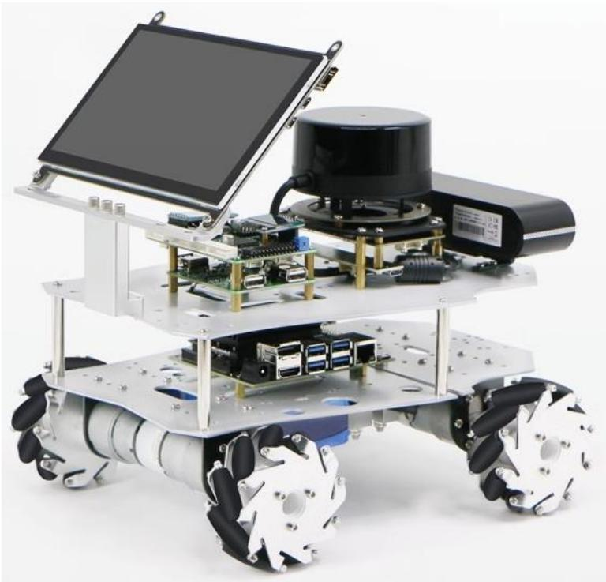

# 2. 电源、供电与接线安全

## 本章目标

沿着真实线缆分清两条链路：电从哪里来，控制与传感器数据从哪里走。完成本章后，你应能在断电状态下画出本机的供电图和信号图，并指出每个变压模块、USB 集线器和电机驱动器的作用。

本章不要求拆开控制板，也不要求测量带电电路。没有电气经验时，只做外观与标签核对；涉及万用表、裸露端子或电池直连的检查，应由熟悉低压直流系统的人完成。

## 适用范围

| 项目 | 适用情况 |
|---|---|
| 通用 ROS 机器人 | 适用，具体电压和接口以实机为准 |
| R680/C50C | 适用，车型接线差异需查看对应原图 |
| C50A/C50B 旧控制板 | 供电原则适用，接口位置不能照搬 C50C |
| ROS 版本 | 与 ROS 1/ROS 2 无关，本章处理硬件层 |

## 开始前检查

!!! danger "断电后再检查接线"
    关闭机器人电源，断开充电器，确认轮子停止。不要带电拔插电机、编码器、驱动器电源和控制板接头。锂电池短路可能引起大电流、烧毁线束或起火。

准备以下资料：

- 第 1 章填写的配置表；
- 电池、主控、雷达、相机和变压模块的电压标签；
- 与底盘类型匹配的接线图；
- 线缆当前状态的照片，便于恢复。

## 工作原理

ROS 机器人的线缆可以先分为供电和信号两类。



### 供电链路

电池是能量源。电池输出可能直接送给电机驱动器，也可能经过变压模块后再给主控、传感器或 USB 集线器供电。一个设备能否接入，取决于电压范围、持续电流能力、极性和接头，而不是“插头能插进去”。

资料给出的电压范围会随产品系列、电池化学体系和版本变化。例如通用资料曾以教育机器人约 10–12.6 V、大型科研机器人约 20–25.2 V 说明产品差异；R680 随货资料又要求特定批次在电池高于 20 V 时工作。这些数值不能替代实机电池和设备标签。

### 信号链路

ROS 主控通常通过 USB 转串口与底盘控制板通信。雷达、相机和部分 IMU 也通过 USB 传输数据；USB 在很多设备上同时承担 5 V 供电。接口不足时可以使用带独立供电的 USB 集线器，但集线器供电能力、接地和线缆质量会影响设备稳定性。

底盘内部的控制信号从 STM32 控制板进入电机驱动器，再由驱动器输出足够的电压和电流驱动电机。编码器信号反向回到控制板，用于测速和闭环控制。

## 操作步骤

### 1. 画出本机供电图

从电池正负极开始，沿每条分支记录到最终设备。

| 上游 | 中间器件 | 下游设备 | 标签电压 | 接头/极性 | 已核对 |
|---|---|---|---|---|---|
| 电池 | 分流线 | 电机驱动器 |  |  |  |
| 电池 | 变压模块 | ROS 主控 |  |  |  |
| 电池或主控 | USB 集线器 | 雷达/相机 |  |  |  |
| 控制板或变压模块 | 供电线 | 其他传感器 |  |  |  |

不要根据线色单独判断正负极。以接头标记、原接线照片和对应接线图交叉确认。

### 2. 画出本机信号图

另画一张信号图，至少包含：

```text
ROS 主控
  ├─ USB/串口 ─ 底盘控制板
  ├─ USB ─ 雷达
  ├─ USB ─ 相机
  └─ USB/其他接口 ─ 外置 IMU、语音或其他传感器

底盘控制板
  ├─ 控制信号 ─ 电机驱动器 ─ 电机
  ├─ 编码器输入 ─ 电机编码器
  ├─ CAN/串口 ─ 扩展设备
  └─ 遥控输入 ─ PS2、蓝牙或航模接收机
```

给 USB 端口编号，尤其是主控通过集线器连接多个相同串口设备时。以后出现 `/dev/ttyUSB*` 编号变化，可以用这张图核对物理连接。

### 3. 核对变压模块

对每个变压模块记录输入、输出和负载。重点检查：

1. 输入范围是否覆盖电池从满电到低电量的实际电压。
2. 输出电压是否符合下游设备标签。
3. 输出持续电流是否覆盖设备峰值需求。
4. 模块是否有散热、保险或过流保护。
5. 调压模块的电位器是否有防误触措施。

不要在连接主控或传感器时尝试调压。需要测量输出时，先断开下游设备，由有经验的人确认测量方式。

### 4. 核对底盘内部接线

按第 1 章识别出的底盘类型，打开对应接线资料。R680 的阿克曼、差速/四轮两驱、麦轮/四驱、全向轮分别有接线说明，电机编号和转向结构并不相同。

逐项核对：

- 控制板到编码器的线序；
- 控制板到驱动器的控制线；
- 驱动器到电机的输出；
- 电池到驱动器和控制板的电源分支；
- 阿克曼舵机、滑轨电位器或其他转向反馈；
- 急停、使能和电源开关。

如果接头有松动、烧蚀、压伤或反插迹象，保持断电并拍照记录。不要靠反复上电“试出来”。

### 5. 核对主控与传感器

USB 线既可能是数据线，也可能只有供电功能。对需要通信的设备使用确认可传数据的线缆。高功耗相机、雷达或多个串口设备集中在同一无源集线器上时，容易出现反复重连、设备号变化或负载一高就掉线。

初次验收时，保持原厂端口分配。不要同时更换线缆、集线器和系统配置，否则一旦出现问题无法判断是哪项变化造成的。

## 结果验收

在重新上电前，至少完成以下检查：

- 供电图中的每个设备都有明确电压依据，没有“看起来能接”的分支。
- 电池、变压模块和设备之间的正负极方向已核对。
- 信号图能说明主控如何连接底盘控制板、雷达和相机。
- 底盘类型与接线图匹配，电机和编码器线没有跨车型套用。
- 急停可触及，使能开关位置已确认。
- 拔插过的接头已压紧，线缆不会卷入轮子或转向机构。

资料核对可以证明线路符合文档，但不能代替带载实机验证。本章状态为“资料核对通过，实机未验证”，直到第 3 章完成首次上电基线。

## 常见故障与处理

| 现象 | 优先检查 | 说明 |
|---|---|---|
| 主控反复重启 | 主控输入电压、变压模块容量、接头压降 | 电机启动造成电池压降时更容易暴露 |
| 雷达或相机时有时无 | USB 数据线、集线器供电、端口接触 | 先恢复原厂端口和单设备连接 |
| 主控有电但底盘无反应 | 底盘使能、急停、控制板供电、主控到控制板信号线 | 主控供电和底盘驱动可能是不同分支 |
| 某个轮子方向相反 | 电机输出线、编码器方向、车型配置 | 不要只交换电机线；编码器闭环方向也要匹配 |
| 一运动 USB 设备就掉线 | 共地、供电压降、电磁干扰、线缆松动 | 先停止运动，分开检查供电和信号链 |
| 接头或模块发热 | 过流、接触电阻、极性/电压错误 | 立即断电，不继续带载测试 |

## 章节导航

[上一章：识别你的机器人配置](01-identify-configuration.md) · [返回本卷](index.md) · [下一章：首次上电与基线检查](03-first-power-on.md)
