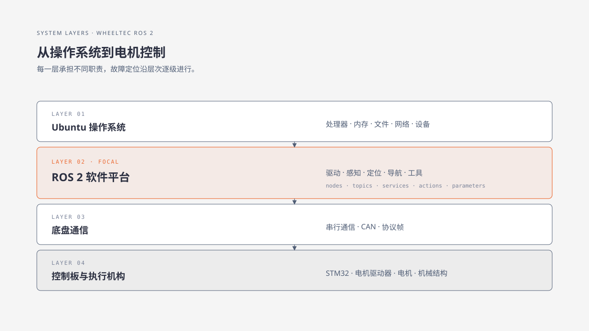

# 1. 认识 ROS 与 ROS 2

机器人要同时处理传感器数据、运动控制、定位、导航和人机交互。若每种设备都采用自己的接口，程序之间就很难复用，调试也会变成逐个适配硬件的工作。机器人操作系统（Robot Operating System, ROS）正是为这类协作问题提供的一套开源软件框架与工程约定。

理解第二代 ROS 平台，需要依次弄清三个问题：ROS 是什么，为什么平台需要重新设计，以及它在机器人软硬件系统中处于哪一层。

## 1.1 从机器人软件的难题说起

设想一台机器人需要完成“看到障碍物后减速”的任务。摄像头或激光雷达负责采集环境，定位程序估计自身位置，导航程序计算速度目标，底盘控制程序再把目标交给电机控制器。每个环节都产生数据，也都依赖其他环节的结果。

如果所有功能写在一个程序里，设备更换、功能升级和故障定位都会牵动整份代码。更易维护的组织方式是把任务拆成职责清楚的程序单元，并为它们约定：

- 数据怎样命名，字段怎样解释；
- 程序怎样发现彼此并交换数据；
- 多个程序怎样一起启动和停止；
- 运行时怎样查看节点、数据流和日志。

ROS 把这些重复出现的基础工作整理成可复用的软件包、工具和接口。应用开发者可以把精力放在感知、控制或导航逻辑上，再通过约定好的接口接入其他模块。

## 1.2 ROS 的名称与定位 {#ros-platform}

ROS 的英文全称是 Robot Operating System。名称沿用了早期项目的叫法，但它的实际角色更接近机器人软件开发平台：提供通信库、常用工具、消息接口、启动组织方式和社区共享的软件包。

操作系统管理处理器、内存、文件、网络和设备。Ubuntu 是 WHEELTEC 主控上常见的操作系统，ROS 运行在 Ubuntu 提供的环境之中。ROS 负责机器人程序之间的协作，Ubuntu 负责让这些程序获得稳定的计算和设备资源。

机器人操作系统 2（Robot Operating System 2, ROS 2）是 ROS 的第二代软件平台。它延续了“用模块化程序组合机器人功能”的思路，并针对多平台、复杂网络、实时控制和产品化部署重新设计了通信与运行机制。

## 1.3 ROS 的发展历程

ROS 的发展可以用四个节点理解：

| 时间 | 事件 | 对学习者的意义 |
|---|---|---|
| 2007 年 | 项目在斯坦福大学 STAIR 项目与 Willow Garage Personal Robots Program 的合作中启动。 | 研究人员开始共享机器人软件组件和实验经验。 |
| 2010 年前后 | ROS 1 随开源软件平台和 PR2 研究平台进入更广泛的机器人研究社区。 | 驱动、算法和工具可以在不同项目之间复用。 |
| 2015 年 | ROS 2 发布 Alpha 1，开始验证新的通信、跨平台和实时能力。 | 项目开始面向更复杂的网络与部署场景演进。 |
| 2017 年 | Ardent Apalone 成为 ROS 2 首个非 Beta 版本。 | ROS 2 形成了可供应用开发者持续采用的版本基线。 |

这条时间线反映了 ROS 的角色变化：它从研究团队间共享代码的工具，逐步发展成机器人软件生态；应用走向多设备、复杂网络和长期运行后，平台随之扩展了工程能力。

## 1.4 从 ROS 1 到 ROS 2

ROS 1 让机器人研究者能够快速组合驱动、算法和可视化工具，但它的设计主要面向实验室局域网和单一计算环境。机器人应用扩大后，工程人员开始关心跨平台部署、网络质量、实时性和长期维护，于是 ROS 2 重新审视了通信和运行管理方式。

| 关注点 | ROS 1 的典型使用环境 | ROS 2 的演进方向 |
|---|---|---|
| 运行平台 | 以 Linux 工作站和机器人主控为主。 | 覆盖 Linux、Windows、macOS 以及嵌入式设备。 |
| 网络条件 | 常假定程序位于同一局域网。 | 适应多机通信、网络波动和更细的发现与权限需求。 |
| 实时与可靠性 | 研究原型优先，实时约束依项目处理。 | 提供可配置的可靠性、时延和实时支持。 |
| 工程部署 | 侧重快速试验和算法复用。 | 面向产品化、长期运行和可观测性。 |

ROS 2 延续了 ROS 的模块化思想，并把通信和部署能力扩展到更广的设备与运行条件。本教材以 ROS 2 为主线，ROS 1 的旧设备维护集中在附录 A。

## 1.5 ROS 2 提供哪些基础能力

在 WHEELTEC 机器人系统中，ROS 2 主要承担四类基础工作：

1. 组织程序：把驱动、感知、定位、导航和控制拆成可以独立运行的节点。
2. 交换数据：使用约定好的话题、服务、动作和参数传递状态与指令。
3. 组合运行：通过启动文件和参数把多个程序配置成一套应用。
4. 观察状态：用命令行和可视化工具检查节点、数据流、坐标关系与日志。

这些能力构成机器人应用的公共底座。具体的雷达驱动、底盘接口和导航算法仍由对应的软件包实现，ROS 2 负责把它们连接起来。

## 1.6 ROS 2 在机器人系统中的位置

把一台 WHEELTEC 机器人按层次画出来，可以看到 ROS 2 的位置：

主控运行 Ubuntu 和 ROS 2 节点，读取传感器并计算高层目标；底盘控制板按固定周期处理编码器、惯性传感器和电机输出；电机驱动器与机械结构把控制量变成车轮运动。后续章节会分别介绍这些层次以及它们之间的数据链路。

## 1.7 本章小结

ROS 是 Robot Operating System 的简称，实际定位是面向机器人软件开发的开源平台。ROS 2 在 ROS 的模块化思想上，补充了跨平台、复杂网络、实时性和工程部署方面的能力。Ubuntu 提供主控的操作系统环境，ROS 2 组织机器人程序，底盘控制板负责接近硬件的周期控制。

## 1.8 思考与练习

1. 用一句话说明 ROS 与 Ubuntu 的分工。
2. 2007、2015 和 2017 年分别对应 ROS 发展中的哪一步？
3. 结合表格，解释 ROS 2 为什么需要重新设计通信与部署能力。
4. 在“雷达发现障碍物并让机器人减速”的任务中，分别指出 ROS 2 节点、底盘控制板和电机承担的工作。

## 章节导航

[返回本篇](index.md) · [下一章：一台 ROS 机器人如何工作](02-robot-system-overview.md)
