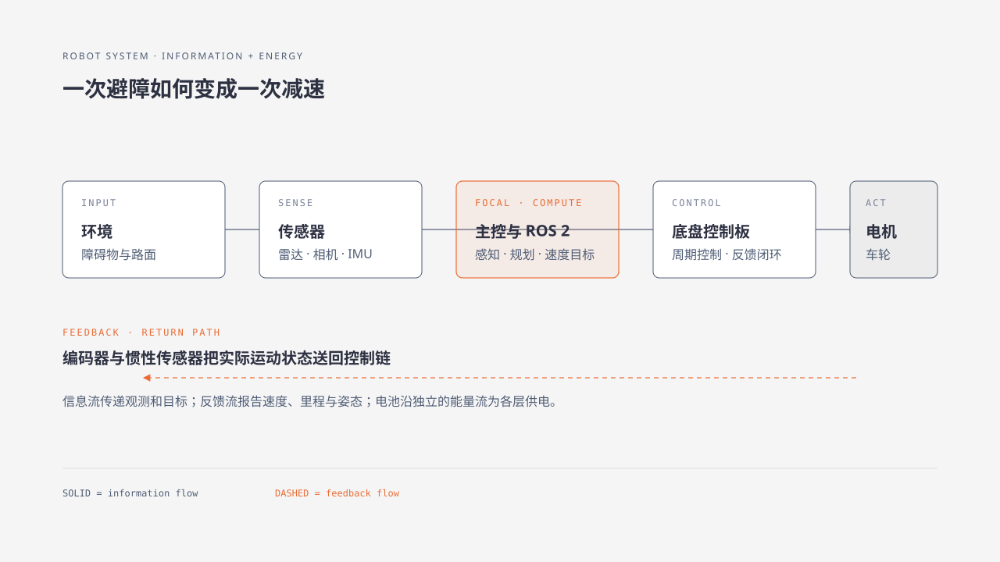

# 2. 一台 ROS 机器人如何工作

上一章把 ROS 2 放在机器人软件层中，本章沿着一次避障过程观察整台机器。传感器提供环境信息，主控运行 ROS 2 程序，控制板执行速度目标，电机与机械结构产生运动。供电系统则为这条工作链提供能量。这里的“主控”指机器人上运行 Ubuntu 和 ROS 2 的计算机；“控制板”指靠近电机、负责实时控制的电子板。两者分工不同，后文排障时要分别检查。

## 2.1 从一次避障过程看机器人系统

一台轮式机器人发现前方有纸箱并开始减速，大致经过六步：

1. 激光雷达测得前方距离变小。
2. 主控中的驱动节点把测量结果转换成 ROS 2 消息。
3. 避障或导航节点根据距离与目标路线计算新的速度。
4. 底盘节点把速度目标发送给控制板。
5. 控制板结合编码器反馈，调节各电机的输出。
6. 车轮转速下降，机械结构带动车体减速。

这条链既包含信息传递，也包含能量转换。定位故障时，先判断问题发生在哪一段，再检查对应的部件和接口。

## 2.2 感知：传感器怎样描述环境 {#sensor}

传感器（Sensor）把环境或机器人自身状态转换成程序可读的数据。它可以是一个独立模块，也可以集成在控制板或电机组件中。常见设备包括：

- 激光雷达：向周围发出光束并根据返回信号测量距离；
- 摄像头（Camera）：连续生成图像；
- 编码器：把车轮或电机轴的转动转换为脉冲或角度数据，用来估计转速和位移；
- 惯性传感器：测量加速度和角速度，部分型号还会输出姿态估计。

传感器提供观测，程序根据观测作出判断。传感器的安装位置、采样频率和坐标方向都会影响数据含义，因此接入设备时既要检查线路，也要核对软件配置。

## 2.3 计算：主控怎样运行机器人程序

主控是机器人上的计算机，常见平台包括树莓派、Jetson、RDK、Atlas 和工控机。它运行 Ubuntu、ROS 2 驱动以及定位、导航、视觉等程序，并根据传感器数据产生运动目标。它适合运行需要较多内存和计算量的程序，但不适合直接承担电机的高速电流控制。

主控的优势在于计算能力和软件扩展性。更换算法、记录日志或增加摄像头处理，通常都在这一层完成。它输出的是速度、位置或任务目标，并不直接向大功率电机供电。

## 2.4 控制：控制板怎样执行速度目标

控制板靠近底盘硬件，通常采用 STM32 系列微控制器。STM32 是 STMicroelectronics 生产的一组 32 位微控制器产品；微控制器是一种把处理器、存储器和输入输出接口集成在一块芯片上的小型计算机，适合按固定周期处理电机和传感器信号。控制板按固定周期读取编码器、惯性传感器和其他底层信号，完成底层反馈控制，再把计算结果交给电机驱动器。

主控与控制板常通过串行通信或控制器通信总线交换数据。串行通信是按顺序逐个传送数据位的通信方式；机器人中常见的串口链路使用一对收发线连接两端。主控发送期望速度，控制板返回车轮速度、里程和设备状态。两端采用相同的波特率、数据格式和校验规则，信息才能被正确解析。控制器通信总线允许多个控制器共享总线，具体接线和报文规则见第 7 章。部分控制板还配有状态显示屏，用来显示车型、自检和电机反馈。

## 2.5 执行：电机与机械结构怎样产生运动

电机驱动器根据控制信号调节流向电机的电流，电机再把电能转换成转动。减速机构降低输出转速、提高力矩，车轮和车架最终把转动变成整车运动。控制板输出的是控制信号，驱动器才是直接处理电机功率的部件。

机械结构决定机器人的运动约束。差速轮、麦克纳姆轮、全向轮和阿克曼转向底盘具有不同的速度关系，底盘控制程序必须与实际车型一致。

## 2.6 信息流与能量流

机器人内部同时存在两条方向不同的链路：

| 链路 | 典型方向 | 作用 |
|---|---|---|
| 信息流 | 传感器 → 主控 → 控制板 → 电机驱动器 | 传递观测、目标和控制量。 |
| 反馈流 | 编码器与惯性传感器 → 控制板 → 主控 | 报告实际运动与设备状态。 |
| 能量流 | 电池 → 电源模块 → 主控、传感器、电机驱动器 | 为计算、感知和运动供电。 |

电池和电源模块要满足各部件的电压、电流与接地要求。软件状态正常只说明信息链可能畅通；电源、使能或电机线路异常时，机器人仍然无法产生运动。

!!! warning "观察硬件时"
    断电后再插拔电机线、传感器线和控制板接口。仅辨认部件时保留原有接线，并记录无法确认的型号或丝印。

## 2.7 本章小结

轮式机器人的工作可以概括为“感知、计算、控制、执行”。传感器获取环境和自身状态，主控运行 ROS 2 程序，控制板完成周期性的底层控制，电机与机械结构产生运动。电源系统贯穿各层，为整条链路供能。

## 2.8 观察练习

在实物或产品照片上辨认下列部件，并画出它们之间的连接关系：

- 一种环境传感器；
- 主控与底盘控制板；
- 电机驱动器、电机和车轮；
- 电池或电源接口。

随后选择“减速”或“转弯”任务，分别写出传感器提供的数据、主控产生的目标和控制板执行的动作。

## 章节导航

[上一章：认识 ROS 与 ROS 2](01-understanding-ros.md) · [返回本篇](index.md) · [下一章：Ubuntu、终端与程序](03-ubuntu-terminal-programs.md)
