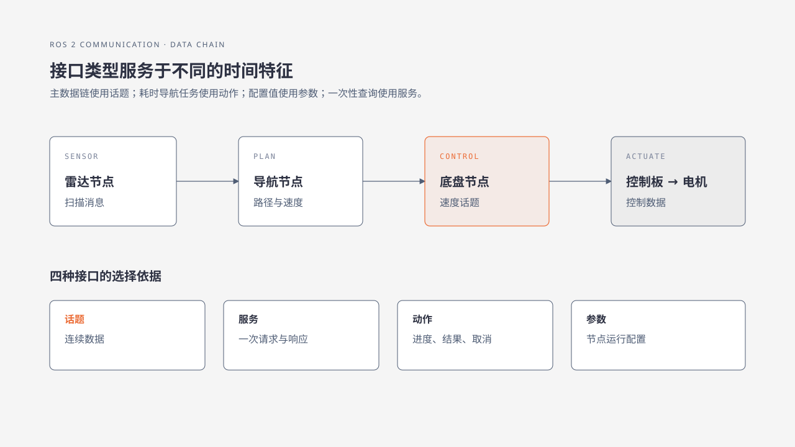

# 5. ROS 2 程序怎样协作

第 4 章中，`talker` 持续发送消息，`listener` 持续接收消息。真实机器人还会遇到一次性查询、需要等待的任务和运行参数。ROS 2 根据数据的时间特征和交互方式，提供不同的接口。

## 5.1 节点：把任务拆成独立程序

**节点（Node）**是 ROS 2 中承担一项明确工作的程序单元。雷达驱动节点负责读取扫描，定位节点负责估计位姿，底盘节点负责把速度目标交给控制板。

节点通过接口声明自己接收和产生的数据。一个进程可以承载一个或多个节点，但在排障时首先关注节点的职责、名称和接口。

## 5.2 话题：持续发布的数据流

**话题（Topic）**用于传递连续产生的数据。**发布者（Publisher）**把消息写入话题，**订阅者（Subscriber）**按需读取；发布者不必等待某个订阅者逐一回应。

激光扫描、摄像头图像、车轮里程和速度目标都适合通过话题传递。第 4 章的 `/chatter` 就是一条话题。

## 5.3 服务：一次请求与一次响应

**服务（Service）**表示一次请求和一次响应。客户端提出问题，服务端处理后返回结果。读取某项状态、触发一次保存等操作，通常可以用服务表达。

服务调用适合处理时间较短、调用方需要明确结果的事务。持续传感器数据应使用话题。

## 5.4 动作：可以反馈和取消的耗时任务

**动作（Action）**表示一个需要持续运行的任务。客户端提交目标，执行端返回接受或拒绝状态，并在执行期间报告进度，最后给出结果；客户端还可以请求取消。

“移动到地图中的某个位置”是典型动作。机器人可能需要规划路线、绕开障碍并持续更新剩余距离，一次请求响应无法表达这个过程。

## 5.5 参数：节点自己的配置

**参数（Parameter）**是节点拥有的配置值，例如速度上限、端口名称或功能开关。参数描述节点应如何工作，不承担传感器数据流的传输。

修改参数前要确认名称、类型和生效时机。部分参数可以运行时调整，部分参数需要重新启动节点后才会采用。

## 5.6 从雷达到电机的数据链

把一台轮式机器人的数据链放在一起，可以得到下面的关系：

选择接口时，可以按下表判断：

| 需求特征 | 适合的接口 | 机器人中的例子 |
|---|---|---|
| 数据连续产生，接收方按需订阅 | 话题 | 雷达扫描、摄像头图像 |
| 一次请求，需要一次明确结果 | 服务 | 查询状态、保存地图 |
| 任务持续一段时间，需要进度或取消 | 动作 | 导航到目标位置 |
| 某个节点自己的运行配置 | 参数 | 底盘最大速度 |

雷达节点持续发布扫描消息，导航节点订阅后计算速度目标；导航任务本身可以通过动作提交；底盘节点再把速度消息转换为控制板能够理解的数据。控制板读取车轮反馈并调节电机输出，形成闭环。

## 5.7 本章小结与练习

节点是承担明确职责的程序单元。话题传递连续数据，服务处理一次请求与响应，动作表达带有进度和取消能力的耗时任务，参数保存节点配置。

练习：为以下需求选择接口，并写出选择依据：摄像头连续产生图像；保存一次当前地图；导航到房间门口并显示进度；降低底盘最大速度。依据应说明需求是连续数据、一次事务、耗时任务还是节点配置。

## 章节导航

[上一章：第一次观察 ROS 2](04-first-ros2-observation.md) · [返回本篇](index.md) · [下一章：识别你的机器人配置](../02-bringup/06-identify-configuration.md)
