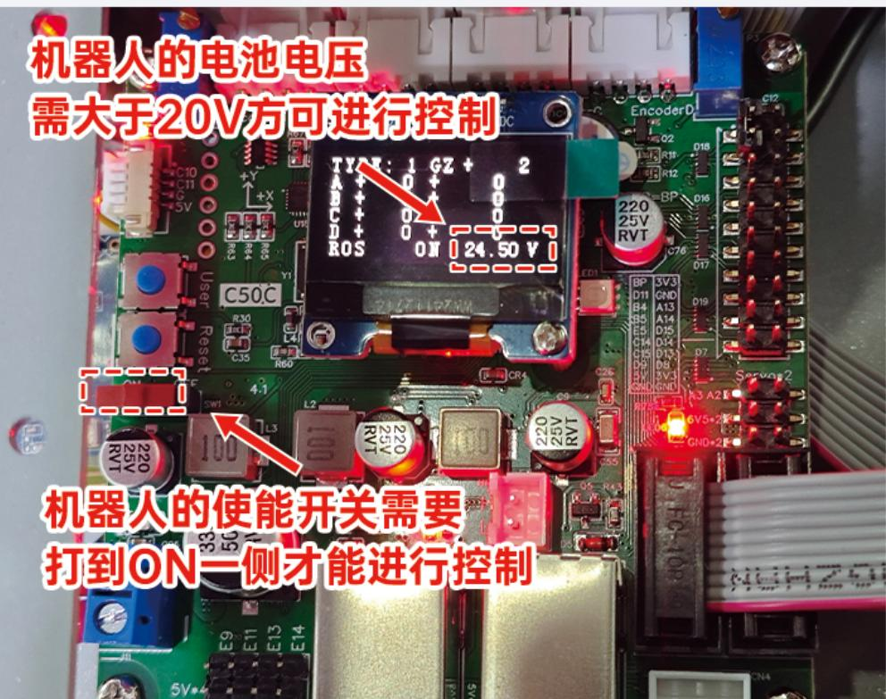
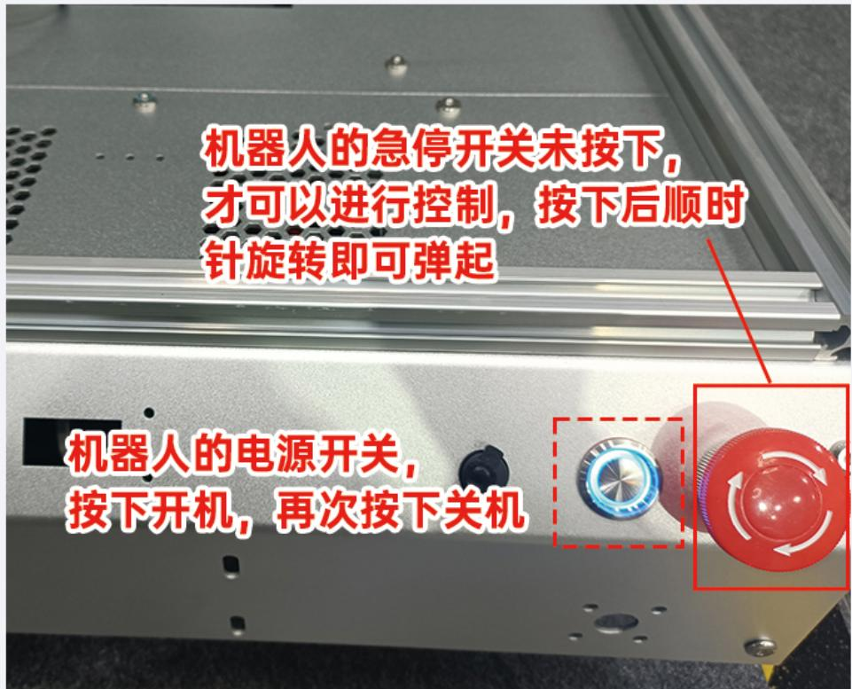
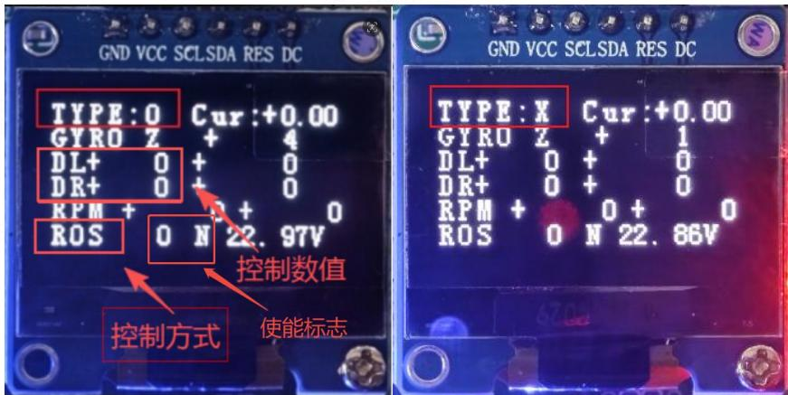

# 8. 首次上电与基线检查

## 本章目标

在不改源码、不启动导航、不烧录固件的前提下，记录机器人出厂状态。你需要观察电源、主控、底盘控制板、OLED、网络和自检行为，并把结果保存成后续修改前的基线。

首次上电不是“开机看看能不能动”。真正有用的基线会记录正常指示、启动耗时、异常信息和机器人是否发生自主运动。

## 适用范围

| 项目 | 适用情况 |
|---|---|
| 通用 WHEELTEC ROS 机器人 | 适用，指示灯和启动时序随硬件变化 |
| R680 | 适用；资料说明部分批次开机约 10 秒后会自动前移约 15 cm 进行自检 |
| 无 OLED 底盘 | 适用，通过指示灯、串口和机械现象记录基线 |
| ROS 版本 | 与 ROS 版本无关，暂不启动 ROS 功能 |

## 开始前检查

!!! danger "预留自动运动空间"
    R680 随货资料说明，某些配置开机后会短距离前移自检。机器人前后至少留出 1 m 空间，人员不要站在运动方向上。无法保证场地安全时，将驱动轮可靠架空，并确认支架不会碰到轮子、履带或转向机构。

1. 完成第 6 章配置表和第 7 章断电接线检查。
2. 取走底盘上的散落工具、线缆和包装物。
3. 确认电池没有鼓包、破损、异味或异常发热。
4. 找到电源开关、底盘使能和急停。部分车型没有急停，应在记录中注明。
5. 暂不连接充电器。除非随货资料明确支持边充边用，否则不要一边充电一边做运动测试。
6. 打开相机录像，画面同时包含轮子、控制板显示和指示灯。

## 工作原理

机器人上电后通常有几条并行启动链：

- 电池和变压模块建立各路电源；
- STM32 控制板初始化车型、编码器、IMU、遥控和电机接口；
- 底盘自检根据电压、车型和编码器反馈决定是否使能电机；
- ROS 主控启动 Ubuntu、网络和系统服务；
- 某些主控稍后发出热点，或连接预设 Wi-Fi。

这些链路完成时间不同。底盘 OLED 已亮，不代表 Ubuntu 已启动；主控能 ping 通，也不代表编码器自检通过。

R680 资料给出了较明确的底盘状态：电池电压满足条件、使能为 ON、急停弹起时可以进入控制；若自检不通过，底盘会失能电机，OLED 第一行可能显示 `TYPE X`。这类保护不能通过反复切换使能来绕过，应先查车型、接线和编码器。

## 操作步骤

### 1. 记录上电前状态

填写下表，电压以实机显示或合规测量为准：

| 检查项 | 上电前记录 |
|---|---|
| 电池显示电压 |  |
| 电池标签电压范围 |  |
| 底盘使能 | OFF / ON / 无此开关 |
| 急停 | 按下 / 弹起 / 无急停 |
| 轮子状态 | 落地 / 架空 |
| 周围净空 |  |

R680 随货资料要求其对应批次电池高于 20 V 才进行控制。其他产品不能直接使用这个阈值，应查本机资料和标签。

### 2. 确认开关位置

上图只用于说明 R680 随货资料中的位置。你的底盘如果外观或控制板版本不同，以实机标签为准。

初次上电建议先让使能处于 OFF 或按下急停，观察控制板和主控能否启动；随后再按对应手册解除急停并使能电机。若硬件逻辑要求上电前使能为 ON，应确保轮子架空或场地足够安全。

### 3. 接通电源并计时

打开电源后不要马上操作遥控器。记录：

1. 底盘控制板/OLED 何时亮起。
2. 主控风扇、网口、状态灯或显示输出何时出现。
3. 是否有蜂鸣、异常摩擦声、焦味或快速发热。
4. 轮子或阿克曼转向是否自行运动。
5. OLED 的 TYPE、控制模式、使能、电压和电机目标/反馈信息。
6. 热点或有线网络何时可见。

出现焦味、烟雾、接头快速升温、连续撞击或不可控运动时，立即断电，不继续本章。

### 4. 观察底盘自检

R680 资料描述的正常自检可能包含短距离前移。架空测试时，观察各轮是否按预期短暂动作；落地测试时，确认运动方向前方无人和障碍。

如果 OLED 显示 `TYPE X`，先保存照片并断电。不要立即调整车型电位器或烧录测试固件，因为错误固件、车型设置、编码器接线和电机故障都可能进入同一现象。第 10 章先做分层判断，R680 的具体处理见第 43 章。

### 5. 等待主控和网络稳定

主控完整启动通常比底盘控制板慢。给系统留出一段稳定时间，再观察热点或有线网络。资料中的 WHEELTEC 热点名、用户名、密码和典型 IP 只是常见出厂示例，实际值应从随货信息、显示、路由器或当前配置取得。

本章只记录网络是否出现，不切换热点/Station 模式，也不改固定 IP。网络操作放在第 9 章。

### 6. 建立出厂基线

| 项目 | 正常观察 | 实机结果 | 证据 |
|---|---|---|---|
| 电池电压 | 在本机允许范围内，启动时无异常骤降 |  | 照片/视频 |
| 底盘控制板 | 上电、完成初始化，无持续异常代码 |  | OLED/指示灯照片 |
| 自检 | 行为与车型资料一致 |  | 视频 |
| 使能/急停 | 状态与物理开关一致 |  | OLED/实物照片 |
| 主控 | 能完成系统启动，无反复重启 |  | 屏幕/网口/日志 |
| 网络 | 热点、有线或预设 Wi-Fi 至少一种出现 |  | 客户端截图 |
| 异常声热 | 无焦味、撞击声和快速发热 |  | 观察记录 |

## 结果验收

本章通过需要满足：

- 上电过程可重复两次，关键指示和耗时基本一致；
- 电池和各供电模块没有异常发热或接触不良；
- 底盘不会出现无法通过急停、使能或断电停止的运动；
- 自检结果已明确记录，异常代码有清晰照片；
- 主控完成启动，网络至少有一种可观察入口；
- 尚未通过修改配置或烧录固件“修掉”原始现象。

如果自检失败，本章仍可以结束，但基线状态必须写成“底盘自检失败，尚未进入 ROS 验收”，不能记录为正常。

## 常见故障与处理

| 现象 | 立即动作 | 下一步 |
|---|---|---|
| 开机后完全无显示 | 断电，检查电池、电源开关、保险和主供电接头 | 回到第 7 章供电图 |
| 主控反复重启 | 停止运动，观察电压和变压模块 | 分离主控供电与电机负载影响 |
| 轮子持续乱转 | 急停或断电 | 核对车型、固件、电机/编码器方向，不继续遥控 |
| R680 显示 `TYPE X` | 保存 OLED 和接线照片，断电 | 第 10 章分层诊断；第 43 章 R680 专项排查 |
| 控制板正常但看不到热点 | 等待主控完整启动，检查有线网和显示输出 | 第 9 章查 IP 和网络模式 |
| 有异常焦味或发热 | 立即断电并隔离电池 | 不再上电，检查接头、电压和短路 |

## 章节导航

[上一章：电源、供电与接线安全](07-power-and-wiring.md) · [返回本篇](index.md) · [下一章：连接主控：显示器、SSH 与远程桌面](09-connect-controller.md)
