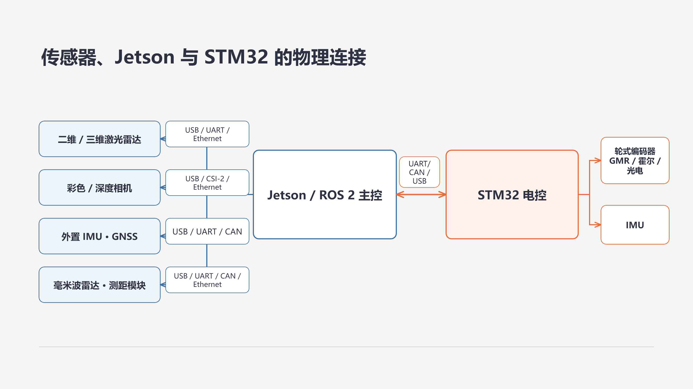

# 29. 传感器、驱动与话题自检

## 29.1 传感器部件与物理接口

市面上的传感器模块通常把敏感元件、信号调理电路、模数转换器和通信控制器装在同一块板或外壳中。把传感器装到机器人上时，先不要只按“雷达”“相机”或“IMU”分类，还要看它的物理接口最终接在底盘控制板上，还是直接接在 Jetson 等主控上。两种接法的数据入口不同。



#### 接在底盘控制板上的传感器

这类传感器先由 STM32 等控制板读取。它们通常靠近电机、车轮、电源和安全开关，控制板可以按固定周期采样，并直接用于电机闭环或底盘保护。主控一般看不到这些传感器原来的引脚或总线，而是通过控制板与主控之间的串口、CAN 或 USB 通信获得整理后的底盘数据。

| 部件 | 物理接口所在位置 | 直接测量或输出 | 在机器人中的主要作用 |
|---|---|---|---|
| 轮式编码器 | 电机尾部的 GMR、霍尔或光电编码器接到底盘控制板，由定时器或计数接口读取 | 脉冲数和方向，控制板据此计算转角或轮速 | 电机闭环控制、里程计和运动状态判断 |
| 板载或控制板外接 IMU | 芯片焊在控制板上，或通过 I²C、SPI、串口等接口接到控制板 | 加速度、角速度，部分模块还输出姿态 | 判断车体转动、倾斜和短时运动变化，辅助底盘状态融合 |
| 电压、电流和温度采样 | 分压、采样芯片或温度器件接到控制板的模数转换或数字接口 | 电池电压、工作电流或板上温度 | 低电压保护、负载判断和故障诊断 |
|  |

注：我们现有 R680 固件就是这条路径：控制板任务读取编码器和 MPU6050（陀螺仪），计算底盘运动状态，再通过串口向主控发送数据。主控接收到的是控制板整理后的数据，并不直接读取编码器引脚或 MPU6050 寄存器。

#### 接在 Jetson 等主控上的传感器

这类传感器需要较高带宽、较强计算能力或独立的厂商程序，通常通过 USB、串口或网络直接连接主控。设备数据由主控上的 Linux 设备接口、厂商提供的设备访问工具和 ROS 2 驱动节点读取。

| 部件 | 物理接口所在位置 | 直接测量或输出 | 在机器人中的主要作用 |
|---|---|---|---|
| 二维激光雷达 | USB、串口或网络接口直接连接主控 | 每个扫描角度的距离，部分设备带反射强度 | 二维建图、定位、障碍物检测和避障 |
| 三维或固态激光雷达 | 网络或 USB 接口直接连接主控 | 三维点及其强度、时间等属性 | 三维感知、障碍物检测和点云建图 |
| 彩色相机 | USB、板载相机接口或工业相机网络接口连接主控 | 按像素排列的彩色或灰度图像 | 巡线、目标识别、标签识别和视频观察 |
| 彩色-深度相机 | 常标为 RGB-D，通过 USB 或网络连接主控 | 彩色图、深度图，部分驱动还输出点云 | 近距离三维测量、人体或物体感知和视觉避障 |
| 外置 IMU | 通过 USB、串口或 CAN 直接连接主控 | 加速度、角速度，部分模块还输出姿态 | 提供独立惯性数据，或与底盘 IMU 交叉核对 |
| GNSS 接收机 | 天线与接收模块通过串口或 USB 连接主控 | 经纬度、定位状态、时间和精度估计 | 室外全局定位、航迹记录和授时 |
| 毫米波雷达 | 串口、CAN、USB 或网络接口连接主控 | 目标距离、方位、相对速度或目标列表 | 人体检测、动态目标跟踪和恶劣光照下的感知 |
|  |

同一种用途也可以由不同部件完成。例如，激光雷达、深度相机和超声波模块都能发现障碍物，但量程、视场、频率、精度和对环境的敏感程度不同。选型时应先写清需要测量什么、工作距离和更新频率，再比较接口、驱动支持和安装条件。

## 29.2 从物理接口到 ROS 2 话题

物理连接分成两条路径，软件数据链也相应分成两条。

控制板先读取传感器时：

```text
编码器 / 板载 IMU / 电压与开关
  → 控制板引脚和内部外设
  → STM32 固件读取、换算和打包
  → 控制板与主控之间的串口 / CAN / USB
  → 主控上的底盘 ROS 2 节点解包
  → 带类型的消息
  → 话题
```

这种路径中，Jetson 只需要打开控制板的通信端口。编码器计数、电压采样和板载 IMU 数据可以装在同一个上行数据帧中，再由底盘节点分别发布为里程计、IMU 和电压等话题。

传感器直接接主控时：

```text
激光雷达 / 相机 / 外置 IMU / GNSS
  → USB / 串口 / CAN / 网络
  → Linux 设备接口或厂商设备访问工具
  → 对应的 ROS 2 传感器驱动节点
  → 带类型的消息
  → 话题
```

Linux 内核驱动和厂商 SDK 只作为数据链路的背景出现，开发者无需修改内核驱动或研究 SDK 的内部实现。这里要区分三个概念：Linux 内核驱动让操作系统能够识别和访问设备；厂商 SDK 是设备厂商提供的访问库和调用接口；ROS 2 传感器驱动节点则是一个运行在 ROS 2 通信系统中的程序。

ROS 2 驱动节点可能调用厂商 SDK，也可能直接按公开协议读取串口、网络或控制板数据。它负责把读到的数据转换为 ROS 2 消息并发布话题；Linux 内核驱动和 SDK 本身通常不发布 ROS 2 话题。如果厂商已经提供 ROS 2 驱动包，那么其中的 ROS 2 节点就承担这项工作。

本章主要关注运行在 ROS 2 通信系统中的传感器驱动节点。只有这个节点会把设备数据转换为 ROS 2 消息并发布话题。因此，开发者首先应确认该节点是否正确连接设备、读取数据并提供可用的 ROS 2 接口。

若需要更换传感器，通常需要重新配置或更换对应的 ROS 2 驱动，但不一定要从头编写驱动。同型号替换一般只需修改端口、型号和采样参数；更换为不同型号时，应确认厂商是否提供兼容的 ROS 2 驱动，以及消息类型、话题名称和坐标定义是否保持一致。无论采用哪种方式，都要重点检查以下内容：

1. 设备端口、型号和驱动参数是否配置正确；
2. 节点是否持续取得设备数据，是否出现断线、丢帧或参数错误；
3. 数据单位、量程、轴方向和无效值处理是否符合设备说明；
4. 节点是否填写持续更新的时间戳和正确的 `frame_id`；
5. 节点发布的话题名、消息类型、QoS 和发布频率是否符合使用需求；
6. 上层算法节点能否订阅这些话题并得到符合预期的数据。

例如，更换二维雷达时，先选择新雷达对应的 ROS 2 驱动，在 Launch 或参数文件中修改设备端口、网络地址、波特率、扫描频率和 `frame_id`，再用 `ros2 node info` 和 `ros2 topic echo` 确认仍能得到 `sensor_msgs/msg/LaserScan`。如果新驱动使用了不同的话题名，可以通过重映射保持下游节点的接口不变；如果消息类型或数据含义改变，则还需要修改订阅它的建图、定位或避障节点。

更换摄像头时，除了启动对应的 ROS 2 相机驱动，还要检查图像分辨率、像素编码、帧率、`camera_info` 内参和相机坐标的 TF。只有图像话题和相机内参都正确发布，上层的视觉算法才可以直接使用。更换不同品牌或型号后，不能只看到“有图像”就认为替换完成，还要重新核对这些参数和坐标关系。

ROS 2 驱动节点的职责是可靠地表达传感器测到了什么，不承担建图、目标识别或路径规划。算法节点订阅驱动发布的话题，再产生地图、目标、位姿或控制结果。将驱动层与算法层分开后，可以分别验收“传感器数据是否正确”和“算法参数是否合适”。

### 常见 ROS 2 消息类型与话题名称

这里要区分“消息类型”和“话题名称”。消息类型可以理解为消息的格式定义，规定一条消息有哪些字段以及每个字段的数据结构。完整写法通常是 `功能包/msg/类型名`，例如 `sensor_msgs/msg/LaserScan` 可以拆成：功能包 `sensor_msgs`、消息类别 `msg`、类型名 `LaserScan`。话题名称则是运行时传输这些消息的数据通道名称，例如 `/scan`。同一种消息类型可以发布到多个不同话题，同一个传感器驱动也可以同时发布多个话题。

| 传感器或数据 | 常见 ROS 2 消息类型 | 常见话题名称示例 | 驱动发布的主要内容 |
|---|---|---|---|
| 二维激光雷达 | `sensor_msgs/msg/LaserScan` | `/scan`、`/lidar/scan` | 角度范围、角分辨率、距离数组、强度、量程和扫描时间 |
| 三维激光雷达 | `sensor_msgs/msg/PointCloud2` | `/points`、`/lidar/points` | 点的三维坐标以及强度、通道或时间等字段 |
| 彩色相机 | `sensor_msgs/msg/Image` | `/camera/image_raw`、`/camera/color/image_raw` | 图像宽高、像素编码、步长和像素数据 |
| 相机内参 | `sensor_msgs/msg/CameraInfo` | `/camera/camera_info`、`/camera/color/camera_info` | 相机模型、畸变参数和投影矩阵 |
| 深度相机 | `sensor_msgs/msg/Image` 或 `sensor_msgs/msg/PointCloud2` | `/camera/depth/image_raw`、`/camera/depth/points` | 每个像素的深度，或由深度换算的三维点 |
| IMU 原始数据 | `sensor_msgs/msg/Imu` | `/imu/data_raw` | 加速度、角速度及其协方差；原始消息不一定包含有效姿态 |
| IMU 处理数据 | `sensor_msgs/msg/Imu` | `/imu/data` | 校准或滤波后的加速度、角速度，部分节点还给出姿态 |
| 编码器与底盘估计 | `nav_msgs/msg/Odometry`、`sensor_msgs/msg/JointState` | `/odom`、`/joint_states` | 轮速或关节状态，以及由轮速计算的底盘速度和里程计 |
| GNSS | `sensor_msgs/msg/NavSatFix` | `/fix`、`/gps/fix` | 定位状态、经纬度、高度和协方差 |
| 单点测距模块 | `sensor_msgs/msg/Range` | `/range/front`、`/ultrasonic/front` | 辐射类型、视场、最小/最大量程和当前距离 |
| 毫米波雷达 | `sensor_msgs/msg/PointCloud2` 或厂商自定义消息 | `/radar/points`、`/radar/tracks` | 检测点或目标的距离、方向、速度和置信信息 |
| 碰撞或开关输入 | `std_msgs/msg/Bool` 或厂商自定义消息 | `/bumper`、`/safety_stop` | 开关状态、触发位置或故障原因 |

这些话题名不是统一标准。命名空间会增加前缀，重映射会替换名称，组合式驱动也可能在同一节点发布多路数据。编码器通常先由控制板读取，再由底盘节点发布 `/odom`，不一定存在独立的“编码器驱动节点”。因此应使用 `ros2 node info` 查找当前节点真正发布的接口，而不是只按表格猜测话题名。

### 排障顺序

设备层说明 Linux 能看到硬件；节点层说明 ROS 2 驱动已经运行；话题层说明数据类型、频率和内容可用。能看到设备但话题无数据时，问题通常仍在端口、权限、驱动或参数，而不是导航算法。

传感器排障保持固定顺序：设备 → 节点 → 话题 → 通信匹配 → 时间，再继续检查坐标和算法。前一层没有证据时，先不要调整后一层。设备存在不代表节点能打开它，节点存在不代表它正在发布，话题存在也不代表发布端与订阅端的通信策略兼容。消息还要带有效时间戳和正确的 `frame_id`，不同传感器的数据才能在同一时刻和坐标关系下使用。

## 29.3 操作步骤

### 建立传感器清单

先为每个部件记录以下信息：

| 项目 | 记录内容 |
|---|---|
| 硬件 | 品牌、型号、序列号和供电要求 |
| 连接 | USB 端口、串口设备名、CAN 接口或网络地址 |
| 安装 | 安装位置、朝向和对应的传感器坐标名称 |
| 软件 | 驱动包、可执行程序、Launch 文件和参数文件 |
| ROS 2 接口 | 节点名、消息类型、话题名、期望频率和订阅算法 |

### 检查设备层

先在主控上打开一个终端，确认 Linux 是否看到了传感器。下面三条命令分别检查 USB 枚举、设备文件和最近的内核日志：

```bash
# 查看 USB 设备是否被识别
lsusb

# 查看串口和摄像头设备文件
ls -l /dev/ttyUSB* /dev/ttyACM* /dev/video* 2>/dev/null

# 查看最近 100 条内核设备日志
dmesg --ctime | tail -n 100
```

例如，雷达通过 USB 转串口接入时，通常应能在第二条命令中看到 `/dev/ttyUSB0` 或 `/dev/ttyACM0`；摄像头通常对应 `/dev/video0`。设备名称会因插拔顺序而变化，实际名称应以命令输出为准。`dmesg` 中如果反复出现设备断开、重新连接或供电错误，先处理线缆、供电和接口问题，再启动 ROS 2 驱动。

网络传感器还要检查主控网卡地址、链路状态和设备地址是否处于同一可达网络。可以先执行 `ip addr` 查看地址，执行 `ip link` 查看网卡是否为 `UP`，再用 `ping <设备地址>` 验证基本连通性。设备反复出现又消失时，先排查供电、线缆、接口带宽和接触问题。

### 启动并定位驱动节点

在另一个终端启动当前传感器对应的 ROS 2 驱动（通常使用厂家提供的 Launch 文件），保持该终端运行。常见的启动格式是 `ros2 launch <功能包名> <launch文件名>`。
再打开一个终端，先列出当前正在运行的节点：

```bash
ros2 node list
```

从 `ros2 node list` 的输出中找到传感器驱动节点的完整名称，再把它填入 `ros2 node info` 命令。该命令会显示这个节点的发布者、订阅者和服务；本节重点查看其中的 `Publishers`，确认驱动节点发布了哪些话题以及每个话题使用的消息类型。
例如输出中出现 `/rplidar_node` 时（该节点名通常对应 RPLIDAR 激光雷达的 ROS 2 驱动节点），应执行：

```bash
ros2 node info /rplidar_node
```

在命令输出的 `Publishers` 部分，每一行就是该节点发布的一条话题接口。例如：

```text
Publishers:
  /scan: sensor_msgs/msg/LaserScan
```

这里的 `/scan` 是话题名称，`sensor_msgs/msg/LaserScan` 是该话题传输的消息类型。若要进一步查看这个话题的发布者、订阅者和 QoS，再执行 `ros2 topic info /scan --verbose`。

如果还想查看当前系统中所有可见的话题及其消息类型，再执行：

```bash
ros2 topic list -t
```

若找不到预期节点，先查看启动终端中的端口、权限、参数和连接错误；不要通过创建一个同名空话题来掩盖驱动没有运行的问题。

### 检查话题类型、频率和内容

对节点实际发布的每个关键话题执行：

```bash
ros2 topic info <话题名> --verbose
ros2 interface show <消息类型>
ros2 topic hz <话题名>
ros2 topic echo --once <话题名>
```

这些命令分别用于查看话题连接详情、消息格式、发布频率和实际数据：

- `ros2 topic info <话题名> --verbose`：查看该话题的发布者、订阅者和 QoS 等通信信息；
- `ros2 interface show <消息类型>`：查看消息格式中定义的字段；
- `ros2 topic hz <话题名>`：统计话题的实际发布频率；
- `ros2 topic echo --once <话题名>`：接收并打印该话题的一条消息，打印后自动退出，适合快速确认字段和数值是否正常。

例如，查看雷达话题的一条实际消息：

```bash
ros2 topic echo --once /scan
```

可能看到类似下面的输出（数值会随雷达型号、安装方式和周围环境变化）：

```text
header:
  stamp:
    sec: 1720000000
    nanosec: 123456789
  frame_id: laser_frame
angle_min: -3.14159
angle_max: 3.14159
angle_increment: 0.01745
scan_time: 0.1
range_min: 0.15
range_max: 12.0
ranges: [1.82, 1.80, 1.79, ...]
intensities: [42.0, 41.5, 40.8, ...]
```

这里的 `frame_id` 表示雷达数据所属的坐标系，`angle_min`、`angle_max` 和 `angle_increment` 描述扫描角度，`ranges` 是各角度测得的距离数组。示例中的时间戳和距离只是演示格式，不代表你的设备一定会输出相同数值；如果话题没有输出或数组始终为空，应回到设备连接、驱动参数和节点日志继续排查。

摄像头也可以用同样的方法检查。例如，查看彩色图像话题的一帧：

```bash
ros2 topic echo --once /camera/image_raw
```

可能看到类似下面的输出（图像数据通常很长，这里只保留格式和少量示意值）：

```text
header:
  stamp:
    sec: 1720000001
    nanosec: 234567890
  frame_id: camera_color_optical_frame
height: 480
width: 640
encoding: rgb8
is_bigendian: 0
step: 1920
data: [24, 31, 28, 25, 32, 29, ...]
```

这里的 `height` 和 `width` 是图像尺寸，`encoding` 表示像素编码，`step` 表示每行图像占用的字节数，`data` 是按行排列的像素数据。对于 `rgb8` 图像，`step` 通常等于 `width × 3`；实际值应以摄像头驱动输出为准。还应检查相机驱动是否同时发布匹配的 `camera_info` 话题，因为视觉节点通常需要图像和相机内参一起使用。


## 章节导航

[上一章：开机启动与进程管理](../05-ros2-development/28-autostart-and-processes.md) · [返回本篇](index.md) · [下一章：里程计、TF 与时间](30-odometry-tf-time.md)
