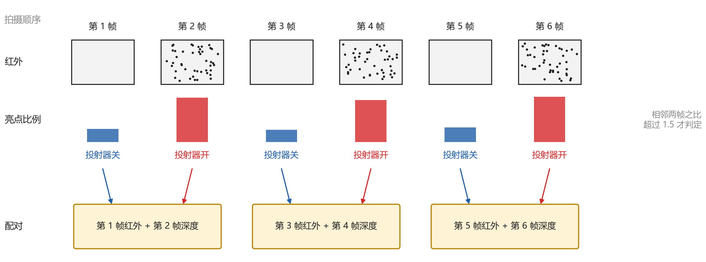
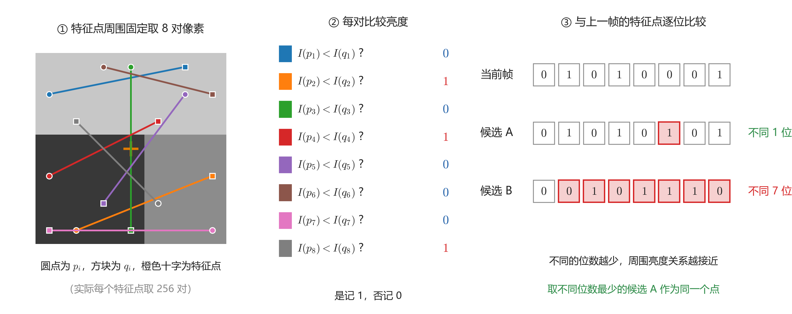
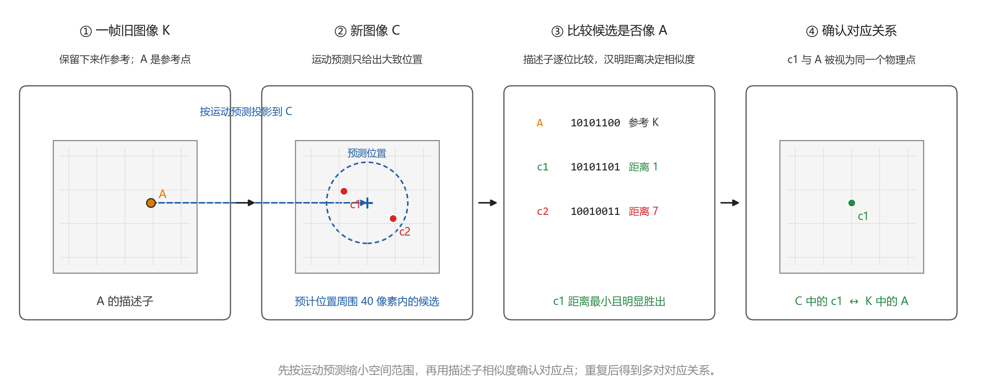
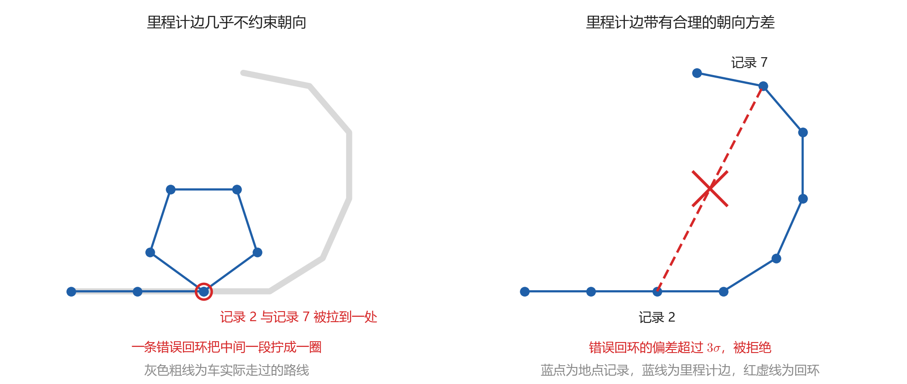
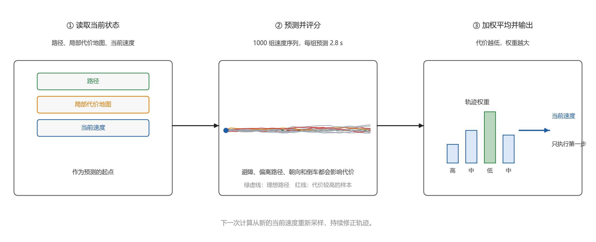
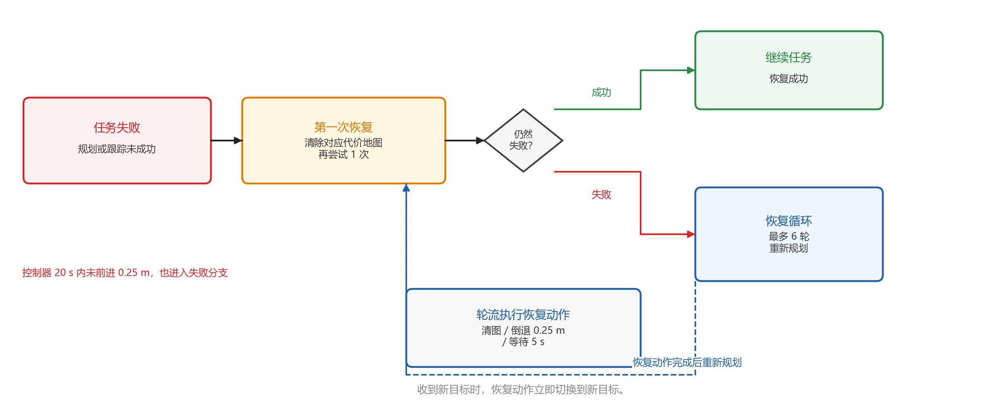

# 38. 视觉建图与导航的运行过程

本章按实际流程中数据经过的先后，描述这台 R680 如何只靠车头的深度相机在场地里建立地图，再在地图上定位并导航到目标点。

---

# 过程概要 {#vision-nav-code-resource}

深度相机先拍下左右红外图像，由两幅图像的视差算出深度图像。随后，左红外图像和深度图像被合成一条消息，供视觉里程计使用（第 1 节）。

视觉里程计根据这条消息估计车相对出发处的运动。底盘另外给出轮速和陀螺仪角速度，三者融合后得到一条平滑的运动轨迹（第 2 节）。

图像、车身和场地各有自己的坐标系。坐标变换把它们接起来，使相机看到的点能够换算到场地坐标系中（第 3 节）。

建图时，RTAB-Map 沿途保存图像和车的位置，形成地点记录，再利用深度图像中的距离生成导航所需的占用栅格（第 4 节）。

建图结束后，RTAB-Map 将当前红外图像与已有地图比较，确定车的位置和朝向（第 5 节）。

Nav2 根据地图规划到目标点的路径（第 6 节），再沿路径计算速度并交给底盘执行（第 7 节）。


!!! example "本章代码：视觉建图与导航功能包"
    仓库目录：[`ros2/navigation/vision-nav/wheeltec_vision_nav`](https://github.com/EnosElinsa/wheeltec-ros-source-reference/tree/62aacaed782091b06060ace276c64e9aaf84ae6b/ros2/navigation/vision-nav/wheeltec_vision_nav)。

---

# 1. 采集红外图像和深度图像

RealSense 驱动由左右红外图像算出深度图像，并让红外投射器逐帧交替开关。配对节点辨认每一帧的投射器状态，取无散斑的红外图像和相邻一帧的深度图像。RTAB-Map 的同步节点再把它们合成一条消息。本节依次说明深度图像从何而来、为什么要交替开关投射器，以及两幅图像怎样合成消息。

## 1.1 由左右红外图像得到深度图像

RealSense 驱动在相机内比较左右两幅红外图像，由同一个物体在两幅图像上的位置之差算出距离，得到深度图像。

### 1.1.1 双目测距的输入与原理

左红外、右红外与基线：本机深度相机型号为 D435C，机身正面从左到右是左红外镜头、彩色镜头、右红外镜头和红外投射器。投射器是一个红外光源，它把许多细小的红外光点投到车前方的物体上，左右红外镜头都能拍到这些光点。


深度图像不是某一个镜头直接拍出来的，而是由左右红外同时拍到的同一个物体算出来的。两个镜头左右分开，同一个物体在两幅图像上的水平位置因此不同。

像素：一幅图像由按行、列排列的像素组成。水平方向从左向右数，像素的序号称为列号 $u$。竖直方向从上向下数，序号称为行号 $v$。左上角的像素是第 0 列、第 0 行。


视差：要找出同一处在左右图像中的位置，驱动先在左红外图像的某一行选定一个像素，以它和周围像素组成窗口。然后在右红外图像的同一行取同样大小的窗口，比较两个窗口对应像素的亮度，并将亮度差的绝对值相加。右图窗口从左图像素所在的列开始，每次向左移动 1 列。总差值最小时，就认为两个窗口拍到了同一处。此时，左图列号减去右图列号得到的值称为**视差**（Disparity），记为 $d$，单位是像素。两个镜头中心之间的距离称为**基线**（Baseline），记为 $B$。下图中的五角星是同一个物体，左右两个平面是它在两个镜头上的成像。


由视差得到距离：视差与距离成反比。物体越近，两条视线的夹角越大，同一个物体在两幅图像上隔得越开，视差越大。物体很远时，两条视线几乎平行，视差接近 0。

相机正前方成像的平面称为像平面，它到光学中心的距离是焦距，以像素为单位记为 $f_x$。把右镜头的视线平移到左镜头，就与左视线在像平面上截出一段，长度正是视差 $d$。下图中红色小三角形的底是 $d$、高是 $f_x$，蓝色大三角形的底是基线 $B$、高是物体到光学中心的距离 $Z$。平移后的右视线与原来的右视线平行，两个三角形因此相似：


$$
\frac{d}{f_x} = \frac{B}{Z}
\qquad\Longrightarrow\qquad
Z = \frac{f_x\,B}{d}.
$$

本机红外的 $f_x = 421.374$，基线 $B = 0.050\,\mathrm{m}$。某处的视差为 $20$ 个像素时，$Z = 421.374 \times 0.050 / 20 \approx 1.05\,\mathrm{m}$。视差为 $7$ 个像素时，$Z \approx 3.0\,\mathrm{m}$。驱动把算出的距离乘以 1000，以毫米为单位的整数写入深度图像。

### 1.1.2 深度图像的生成与发布

得到深度图像：算出距离 $Z$ 后，驱动把它写入深度图像中与左红外图像相同的像素位置 $(u, v)$。右红外图像只用于计算视差，距离仍按左红外图像的像素排列。因此，深度图像与左红外图像共用左红外镜头的光学中心。计算时，所有视线都看成从这一点出发。这个点称为**光学中心**（Optical Center）。

两个镜头之间的平移和转动称为**外参**（Extrinsic Parameters）。平移是三个数 $(t_x, t_y, t_z)$，单位 m，转动是一个 $3 \times 3$ 矩阵。深度图像与左红外共用光学中心和像素位置，所以两者之间既没有平移，也没有转动：

$$
(t_x, t_y, t_z) = (0,\ 0,\ 0),
\qquad
\text{转动} = \begin{bmatrix} 1 & 0 & 0 \\ 0 & 1 & 0 \\ 0 & 0 & 1 \end{bmatrix}.
$$

主对角线为 1、其余为 0 的矩阵称为单位矩阵，它表示不转动。左红外镜头到右红外镜头的转动同样是单位矩阵，平移只在基线方向上有 $t_x = 0.050\,\mathrm{m}$，即右红外镜头在左红外镜头右侧 50 mm。

发布左红外图像与深度图像：深度图像已经按左红外图像的像素排好距离，驱动因此只打开左红外图像和深度图像两路，把它们作为两幅图像发布出去。每一路还配有一条相机信息，存放对应镜头出厂时测好的固定参数，其中就有上面用到的焦距。

```yaml
# /camera/infra1/image_rect_raw  类型 sensor_msgs/msg/Image，左红外图像，每帧一条
header:
  stamp: ...                          # 拍摄时刻
  frame_id: camera_infra1_optical_frame   # 图像所在的坐标系：左红外镜头的光学中心
height: 480                           # 行数
width: 848                            # 列数
encoding: "mono8"                     # 每个像素 1 字节，表示亮度
step: 848                             # 每行占的字节数
data: [ ... ]                         # 848 × 480 个亮度值，按行排开

# /camera/depth/image_rect_raw  类型 sensor_msgs/msg/Image，深度图像
encoding: "16UC1"                     # 每个像素 2 字节，距离，单位 mm，0 表示没有有效距离
step: 1696                            # 848 列 × 2 字节

# /camera/infra1/camera_info、/camera/depth/camera_info  类型 sensor_msgs/msg/CameraInfo
# 与对应的图像配套，存放焦距等固定参数，2.1 用到
```

下图是同一时刻的左红外图像和深度图像。左红外图像的灰度就是亮度。深度图像的像素位置与左红外图像相同，近处亮灰、远处暗灰，黑色表示没有有效距离。


## 1.2 投射器交替与配对

驱动发出的左红外图像中，相邻两帧并不一样。RealSense 驱动让投射器一帧打开、一帧关闭，本项目的配对节点再判断每一帧属于哪一种，并据此决定取哪一帧左红外图像、哪一帧深度图像。

投射器交替的原因：相机需要完成两件事：比较左右红外图像以计算距离，以及比较前后左红外图像以寻找同一个点。这两件事对投射器的要求相反。

左右比较依据的是亮度图案。白墙和地面上亮度几乎处处相同，同一行上比较不出哪里是同一处。投射器打开后，场景上多出许多细小的亮点，称为**散斑**（Speckle），左右红外图像上就有了可以比较的图案，墙面和地面也能算出距离。

前后图像寻找同一个点依据的是场景本身的亮度。投射器装在相机上，与相机一起移动，散斑落在场景上的位置随车一起变化，而不是固定在墙上。落在散斑上的特征点在前后图像中几乎停在同一个像素，视觉里程计会误以为车没有动，回环识别也会把两处不同的地方当成同一处。因此，用于前后图像匹配的左红外图像必须在投射器关闭时拍摄。

一帧不能同时打开和关闭，驱动于是逐帧交替：投射器打开的那一帧用来计算深度，关闭的那一帧用来找特征点。下图是相邻两帧左红外图像。左边投射器关闭，柜门、墙和地面是成片的灰度。右边投射器打开，同样的位置布满细碎的亮点。


投射器状态的判断：本项目的配对节点 [`vision_emitter_pair`](https://github.com/EnosElinsa/wheeltec-ros-source-reference/blob/62aacaed782091b06060ace276c64e9aaf84ae6b/ros2/navigation/vision-nav/wheeltec_vision_nav/wheeltec_vision_nav/emitter_pair_logic.py) 要先知道每一帧投射器是打开还是关闭。这台 D435C 随图像发出的元数据里没有投射器状态，配对节点因此直接从图像判断。

配对节点利用散斑形成的孤立亮点判断投射器状态。它逐个检查左红外图像的像素：若某个像素比上下左右四个相邻像素的平均亮度高出 25 个灰度级以上，就记为一个亮点。亮点占全部像素的比例称为亮点比例。投射器打开时，散斑遍布图像，这个比例是相邻关闭帧的好几倍。

配对节点把每一帧与前后相邻的图像帧比较，两帧拍摄时刻相差不超过 $0.05\,\mathrm{s}$ 才算相邻。一帧的亮点比例达到相邻帧的 1.5 倍以上时，这一帧判为打开，相邻帧判为关闭。深度图像的有效像素比例作为第二个依据：投射器打开时有效距离更多，两帧相差超过 8% 时也参与判断。两个依据得出相反的结论，或者差别都不够大，这两帧就不作判断，也不参与配对。下图画出这一过程：亮点比例一高一低交替，每一帧无散斑的左红外图像与紧挨着它、投射器打开的一帧深度图像配成一对。



配对节点每秒发布一次状态，写出这一秒收到的左红外图像帧数、配成的对数，以及投射器打开和关闭两类图像帧的亮点比例中位数。正常时配成的对数约为左红外图像帧数的一半，打开帧的亮点比例约为关闭帧的数倍。

```yaml
# /vision/emitter_pair/status  类型 std_msgs/msg/String，每秒一条，内容为 JSON
data: '{"source": "image",        # 开关状态的来源：image 表示由图像判断
        "ir_frames": 30,           # 这一秒收到的左红外图像帧数
        "paired": 15,              # 这一秒配成的对数
        "dots_off_median": ...,    # 配对所用左红外图像（投射器关闭）的亮点比例中位数
        "dots_on_median": ...}'    # 配对所用深度图像（投射器打开）的亮点比例中位数
```

## 1.3 合成一条消息

配对节点判定投射器状态之后，取最新一帧投射器关闭的左红外图像，再在 $0.12\,\mathrm{s}$ 内找投射器打开、离它最近的一帧深度图像。两帧是相邻的两次拍摄，拍摄时刻相差约 $0.033\,\mathrm{s}$，时间戳也不同。

视觉里程计需要从同一个像素读到亮度和距离，同步节点则按时间戳寻找成对的图像。配对节点因此保留深度图像的距离和像素位置，只把它的时间戳改成配对左红外图像帧的时间戳。两幅图像随后分别发布到 `/vision/paired/infra1/image_rect_raw` 和 `/vision/paired/depth/image_rect_raw`。每次发出的时间戳都比上一次晚，同一帧左红外图像不会发两次。

RTAB-Map 的同步节点订阅这两路图像，把时间戳相同的一对写进同一条消息。同时带有一幅图像和一幅深度图像的消息称为 **RGB-D**（RGB-Depth）。RGB 原指红、绿、蓝三个颜色通道，这里的图像是投射器关闭时拍下的左红外图像。

```yaml
# /rtabmap/rgbd_image  类型 rtabmap_msgs/msg/RGBDImage，每配成一对发布一条
header:
  stamp: ...                               # 这一帧左红外图像的拍摄时刻
  frame_id: camera_infra1_optical_frame    # 与红外相同
rgb:                                       # 投射器关闭时的左红外图像，亮度
  encoding: "mono8"
  width: 848
  height: 480
depth:                                     # 投射器打开时的深度图像，距离，单位 mm
  encoding: "16UC1"
  width: 848
  height: 480
  frame_id: camera_depth_optical_frame
rgb_camera_info: { ... }                   # 左红外图像的相机信息
depth_camera_info: { ... }                 # 深度图像的相机信息
```

---

# 2. 估计相对出发的运动

第 1 节合成的 RGB-D 消息，让视觉里程计能从同一个像素读到亮度和距离。要用它估计车的运动，先要把像素换成相机光学坐标系中的坐标，再确定相机相对车身的位置。视觉里程计由此估计运动，随后与底盘给出的轮速、陀螺仪角速度融合。建图和定位都依赖融合后的运动。

## 2.1 由像素和距离得到坐标

深度图像给出的距离，只说明一个点在相机前方多远。这个点向左或向右、向上或向下偏了多少，还要结合它的像素位置计算。视觉里程计需要比较同一个点在前后帧中的三维坐标，因此先要完成这一步换算。

以光学中心为原点的坐标系 $\mathcal{F}_c$ 称为**光学坐标系**（Optical Frame）。光学坐标系的 $X_c$ 轴向右，与列号增加的方向相同。$Y_c$ 轴向下，与行号增加的方向相同。$Z_c$ 轴沿相机正前方，深度图像里的距离就是一个点的 $Z_c$。相机正前方那条线打在图像上的像素称为**主点**（Principal Point），记为 $(c_x, c_y)$。下图中红线从空间中的点穿过像素 $(u, v)$，回到光学中心。


来源：[OpenCV, Camera Calibration and 3D Reconstruction](https://docs.opencv.org/4.x/d9/d0c/group__calib3d.html)。

要把像素位置和深度值换成光学坐标系中的坐标，还需要相机自身的一组固定参数，称为**内参**（Intrinsic Parameters）。测出内参的过程称为**标定**（Calibration），本机出厂时已经完成。内参写在相机信息的字段 `k` 中，排成一个 $3 \times 3$ 矩阵：

$$
K = \begin{bmatrix} f_x & 0 & c_x \\ 0 & f_y & c_y \\ 0 & 0 & 1 \end{bmatrix}.
$$

$f_x$、$f_y$ 是以像素为单位的焦距，与 1.1 视差公式里的焦距是同一个量。本机红外 $f_x = f_y = 421.374$，主点 $(c_x, c_y) = (420.745,\ 239.283)$。

从上往下看，光学中心、空间中的点和它在像平面上的像构成两个相似三角形。大三角形的两条直角边是 $X$ 和 $Z$，小三角形的两条直角边是像素偏离主点的距离 $u - c_x$ 和焦距 $f_x$，因此 $(u - c_x)/f_x = X/Z$。竖直方向同理，于是

$$
u = c_x + f_x\,\frac{X}{Z},
\qquad
v = c_y + f_y\,\frac{Y}{Z}.
$$


反过来，已知像素 $(u, v)$ 和深度图像里的距离 $Z$，就能算出这个点在光学坐标系里的坐标：

$$
X = \frac{(u - c_x)\,Z}{f_x},
\qquad
Y = \frac{(v - c_y)\,Z}{f_y}.
$$

例如第 631 列、第 276 行的像素，深度图像给出距离 $1.5\,\mathrm{m}$，则 $X = (631 - 420.745) \times 1.5 / 421.374 \approx 0.75\,\mathrm{m}$，$Y = (276 - 239.283) \times 1.5 / 421.374 \approx 0.13\,\mathrm{m}$。算出的点在相机右方 0.75 m、下方 0.13 m、前方 1.5 m。

## 2.2 相机相对车身的位置和朝向

2.1 算出的坐标以光学中心为原点，说明点相对相机在哪里。要知道它相对车身在哪里，还需要相机在车上的位置和朝向。从一个坐标系到另一个坐标系所需的平移和转动称为**变换**（Transform）。

车身坐标系 `base_footprint` 设在车身竖直投影到地面的位置，原点在左右方向的正中，$x$ 轴向前，$y$ 轴向左，$z$ 轴向上。RealSense 驱动把相机的根坐标系命名为 `camera_link`，原点就在左红外的光学中心，坐标轴方向与车身相同。`base_footprint` 到 `camera_link` 的变换为

$$
(t_x, t_y, t_z) = (0.187,\ 0.0175,\ 0.132)\,\mathrm{m},
\qquad
\text{转动} = \text{单位矩阵}.
$$

左红外的光学中心因此在车身原点前方 0.187 m、左方 0.0175 m、地面以上 0.132 m，相机朝向与车头相同。

`camera_link` 与光学坐标系原点相同，坐标轴方向不同。车身方向是 $x$ 向前、$y$ 向左、$z$ 向上，光学坐标系是 $Z_c$ 向前、$X_c$ 向右、$Y_c$ 向下。RealSense 驱动发布这一段固定的转动，把光学坐标系里的 $(X_c, Y_c, Z_c)$ 换成车身方向上的 $(Z_c,\ -X_c,\ -Y_c)$。2.1 例子里的点在车身方向上就是前方 1.5 m、右方 0.75 m、下方 0.13 m。再加上相机的安装位置，它相对车身原点在前方 1.687m、右方 0.7325m，离地约 0.00m，正是车前方地面上的一个点。

## 2.3 视觉里程计

有了像素对应的三维坐标（2.1）和相机相对车身的位置（2.2），就可以比较前后帧中同一批点的位置变化。RTAB-Map 的视觉里程计节点订阅 RGB-D 消息，由这些变化推算相机的转动和平移，再逐帧累加成车相对出发处的运动。这个由图像估计运动的过程称为**视觉里程计**（Visual Odometry, VO）。它处理一帧分四步：挑出特征点、描述并匹配特征点、求解位姿、发布位姿。

### 2.3.1 特征点提取

视觉里程计先在当前帧的左红外图像上挑出下一帧还能认出的像素。白墙和地面上相邻像素的亮度几乎相同，下一帧中很难判断原来的点在哪里。与周围亮度有明显差异的像素更容易被找回，这样的像素称为**特征点**（Feature Point）。

判断一个像素是否适合跟踪，可以观察它周围的一小块区域。以该像素为中心取一个方形窗口 $W$，将窗口平移一小段 $(\Delta u, \Delta v)$，再比较平移前后的亮度。记 $I(u, v)$ 为第 $u$ 列、第 $v$ 行像素的亮度，亮度差的平方和为

$$
E(\Delta u, \Delta v) = \sum_{(u, v) \in W} \big[\, I(u + \Delta u,\ v + \Delta v) - I(u, v) \,\big]^2 .
$$

$E$ 大，说明窗口稍微移动，亮度就会明显改变，窗口中心的像素在下一帧中容易找回。$E$ 接近 0，说明窗口移动后看起来几乎没有变化，中心像素很难找回。

为了同时检查水平方向和竖直方向的变化，在窗口内汇总水平亮度变化 $I_u$ 和竖直亮度变化 $I_v$，得到矩阵

$$
M = \begin{bmatrix} \sum_W I_u^2 & \sum_W I_u I_v \\ \sum_W I_u I_v & \sum_W I_v^2 \end{bmatrix}.
$$

对任意单位方向 $\mathbf{w}$，$\mathbf{w}^{\mathsf T}M\mathbf{w}$ 表示窗口沿这个方向移动时的亮度变化强度。矩阵 $M$ 有两个互相垂直的特征方向，对应的特征值记为较小的 $\lambda_1$ 和较大的 $\lambda_2$。$\lambda_1$ 代表最不容易被区分的方向，因此挑选特征点时主要看它：只有 $\lambda_1$ 也足够大，窗口向任何方向移动时才都有明显变化。

两张图分别说明这个判断和实机结果。第一张图中，均匀区域的两个特征值都接近 0，边缘只有一个特征值较大，角点的两个特征值都较大。只有角点在两个方向上都容易被认出，适合用作特征点。


视觉里程计按 $\lambda_1$ 从大到小挑选特征点，这一判据称为**适合跟踪的特征**（Good Features to Track, GFTT）。实际筛选时，$\lambda_1$ 小于整幅图像最大值千分之一的像素不选，两个特征点之间至少相隔 7 个像素，每帧最多保留 1500 个。距离不在 $0.20$～$3.5\,\mathrm{m}$ 内的像素也不选。距离太近时深度图像没有有效距离，距离太远时测量误差过大。

第二张图是实机一帧左红外图像的筛选结果。红点主要落在背包、饮水机和柜子的棱角上，地面和窗帘等亮度均匀的区域没有红点。


### 2.3.2 特征描述与匹配

挑出当前帧的特征点后，还要在此前的图像中找出同一个点。只记住像素位置不够，因为车移动后，同一个点会出现在图像的另一处。视觉里程计因此记录每个特征点周围的亮度关系，用来认出它。这里采用的记法称为**二进制鲁棒独立基本特征**（Binary Robust Independent Elementary Features, BRIEF）。下面先说明描述子怎样生成，再说明它怎样用于两幅图像之间的匹配。

取样时，视觉里程计先把图像稍加平滑，以减小单个像素的噪声。然后以特征点为中心取一个 $48 \times 48$ 像素的方块，按固定的位置表取 256 对像素 $(p_i, q_i)$，$i = 1, \dots, 256$。所有特征点、所有帧都使用这张表，因此两个特征点的第 $i$ 位总是取自同样的相对位置。

编码时，每一对像素比较一次亮度：$I(p_i) < I(q_i)$ 记为 1，否则记为 0。256 对比较得到一串 256 位的 0 和 1，称为这个特征点的**描述子**（Descriptor）。描述子只记录两个像素谁亮谁暗，不记录亮度本身，所以整幅图像一起变亮或变暗时，描述子保持不变。

比较两个描述子时逐位对照，取值不同的位数称为**汉明距离**（Hamming Distance）。汉明距离越小，两个特征点周围的亮暗关系越接近。这里的“最近”指汉明距离最小，不是两个像素在图像中的空间距离。

真正匹配时，比较发生在当前帧和参考关键帧之间，而不是同一帧内部。以当前帧中的特征点 A 为例，视觉里程计会把 A 的描述子与参考关键帧中候选点的描述子逐一比较，取汉明距离最小的候选作为 A 的对应点。最小距离还要明显小于第二小的距离，不超过它的 0.8 倍。否则说明两个候选看起来差不多，A 就不参与匹配。下图用 8 对像素代替 256 对，展示的是一个特征点的描述子如何与两个候选描述子比较：候选 A 只差 1 位，候选 B 差 7 位，于是选 A。



描述子比较确定了候选点之间的相似度。接下来说明候选点怎样产生，以及这些对应关系怎样交给位姿求解。视觉里程计不会把每一帧都长期保留，而是挑少数旧图像作为参考。这些被保留下来的参考帧称为关键帧，关键帧中的特征点和描述子会供后来的当前帧使用。

设某个关键帧为 $K$，其中的参考特征点为 $A$，当前正在处理的图像帧记为 $C$。在底盘已启动并能提供轮速位姿时，系统可以根据相邻两帧之间的轮速变化，预先估计当前帧的大致运动（详细过程见 2.4 节）。视觉里程计利用这个预测，把 $A$ 从关键帧坐标换算到当前帧图像上，得到一个预计的像素位置。这个换算就是投影。随后只将预计位置周围 40 个像素内的当前帧特征点列为候选。没有这项预测时，则需要在更大的范围内寻找候选。

对每个候选点，视觉里程计计算它与 $A$ 的描述子之间的汉明距离，并按上一段的判据选择距离最小且具有足够区分度的候选。例如，若候选点为 `c1` 和 `c2`，且 `c1` 的汉明距离更小，就建立当前帧中的 `c1` 与关键帧中的 $A$ 之间的对应关系。对关键帧中的其他参考特征点重复上述过程，即可获得多组跨帧对应关系，并将其交给下一小节求解当前相机的位姿。该匹配过程如图所示：



### 2.3.3 位姿求解与发布

2.3.2 节建立的对应关系，把关键帧中的参考特征点和当前帧中的像素联系起来。由于参考特征点在出发坐标系中的位置已知，视觉里程计可以利用这些对应关系反推出当前相机相对出发坐标系的位置和朝向。相机或车身的位置和朝向合称**位姿**（Pose）。

先看一组对应关系。参考特征点在出发坐标系中的三维坐标是已知的，记为 $\mathbf{x}$。这个坐标在特征点保存时已经由 2.1 的像素和深度值算出，再根据当时的相机位姿换到出发坐标系。当前帧中与它对应的像素位置也是已知的，记为 $(u, v)$。

未知量是当前相机的位姿，用一个转动矩阵 $R$ 和一个平移向量 $\mathbf{t}$ 表示。$R$ 是 $3 \times 3$ 矩阵，$\mathbf{t}$ 是三个数，单位为 m。它们共同描述怎样把出发坐标系中的点换算到当前相机坐标系中。

给定一组候选的 $R$ 和 $\mathbf{t}$，先把空间点 $\mathbf{x}$ 换算到当前相机前，再按照 2.1 的公式投影到当前图像：

$$
\begin{bmatrix} X_c \\ Y_c \\ Z_c \end{bmatrix} = R\,\mathbf{x} + \mathbf{t},
\qquad
\hat u = c_x + f_x \frac{X_c}{Z_c},
\qquad
\hat v = c_y + f_y \frac{Y_c}{Z_c}.
$$

投影得到的 $(\hat u, \hat v)$ 是当前位姿预测的像素位置。它与实际匹配像素 $(u, v)$ 之间的距离称为**重投影误差**（Reprojection Error）：

$$
e = \sqrt{(u - \hat u)^2 + (v - \hat v)^2}\, .
$$

$R$、$\mathbf{t}$ 取得正确时，每一对的重投影误差都接近 0。视觉里程计从已有的位姿预测出发，反复调整 $R$、$\mathbf{t}$，让全部对应关系的重投影误差平方和尽可能小。由空间点和图像像素反求相机位姿的问题称为**透视 n 点问题**（Perspective-n-Point, PnP）。下图在像平面上画出求解前后。红圈是当前帧中的实际匹配像素，蓝点是空间点 $\mathbf{x}$ 按当前 $R$、$\mathbf{t}$ 投影得到的像素。求解前两者分开，虚线长度表示重投影误差。求解后蓝点落到红圈上。


实际匹配中可能混有错误对应关系。错误对应会使重投影误差变大，并把位姿解拉偏。视觉里程计因此使用**随机抽样一致**（Random Sample Consensus, RANSAC）：随机取几组对应关系求出一组 $R$、$\mathbf{t}$，再检查全部对应关系。重投影误差不超过 2 个像素的对应关系称为**内点**（Inlier）。这个随机取样过程最多重复 300 次，最终选择内点最多的结果，并只用这些内点重新求解位姿。

内点不少于 10 个时，视觉里程计接受这一帧的位姿。内点不足 10 个，说明当前帧与此前保存的参考特征点无法形成足够可靠的对应关系，这一帧判为**跟丢**（Lost），不给出可用位姿。

通过 RANSAC 确认后，得到的位姿仍然描述的是相机相对出发时相机的运动。发布前，视觉里程计利用 2.2 的相机安装位置，把它换算成车身坐标系 `base_footprint` 相对出发处的运动，这就是视觉位姿。出发处的坐标系名为 `odom`，表示车刚启动时 `base_footprint` 所在的位置和朝向。视觉位姿连同车身速度一起发布在 `/odom_vo`，供 2.5 的运动融合使用。

朝向用**四元数**（Quaternion）表示，四个数 $(x, y, z, w)$ 合起来描述一次转动。车在地面上绕竖直轴转过角 $\theta$ 时，四元数是 $\big(0,\ 0,\ \sin\tfrac{\theta}{2},\ \cos\tfrac{\theta}{2}\big)$。不转时是 $(0, 0, 0, 1)$，向左转 $90^\circ$ 时是 $(0, 0, 0.707, 0.707)$。

```yaml
# /odom_vo  类型 nav_msgs/msg/Odometry，视觉里程计每处理完一帧发布一条
header:
  stamp: ...                    # 这一帧左红外图像的拍摄时刻
  frame_id: odom                # 位姿相对的坐标系：出发处
child_frame_id: base_footprint  # 被描述的坐标系：车身
pose:
  pose:
    position: { x: ..., y: ..., z: ... }              # 车身位置，单位 m
    orientation: { x: ..., y: ..., z: ..., w: ... }   # 车身朝向，四元数
  covariance: [ ... ]           # 位姿的方差，6 × 6 共 36 个数
twist:
  twist:
    linear: { x: ..., y: ..., z: ... }    # 车身坐标系下的速度，单位 m/s
    angular: { x: ..., y: ..., z: ... }   # 绕三个轴转动的角速度，单位 rad/s
  covariance: [ ... ]           # 速度的方差
```

每一帧的内点数和是否跟丢另外发布在 `/odom_info_lite`，7.3 的看门狗读取它判断视觉是否可靠。跟丢的那一帧，`/odom_vo` 仍然发出一条消息，但四元数的四个数全为 0，方差填成很大的数，表示这一帧没有可用的位姿。

```yaml
# /odom_info_lite  类型 rtabmap_msgs/msg/OdomInfo，与 /odom_vo 同步发布，下面只列两个字段
lost: false        # 这一帧是否跟丢
inliers: ...       # 这一帧的内点数，少于 10 时 lost 为 true
```

## 2.4 轮速与陀螺仪

视觉里程计只靠图像估计运动，特征点不足或相机被遮挡时就会跟丢。因此，第 2.5 节还要融合底盘提供的数据：WHEELTEC 底盘节点从控制板读回车速和陀螺仪数据，本项目的输入整理节点再扣除陀螺仪零偏。

### 2.4.1 轮速与陀螺仪输入

轮速位姿：底盘控制板由车轮上的[编码器](../02-hardware-basics/08-sensors-and-feedback.md#encoder)测出车轮转速，换算成车的前进速度 $v_x$。这台车前轮转向，转动快慢由前进速度和前轮转角按阿克曼转向的[底盘运动模型](../02-hardware-basics/09-chassis-motion-control.md#body-coordinate)算出。底盘节点把速度随时间累加，得到车相对上电处的位置和朝向，称为轮速位姿，连同速度一起发布在 `/wheel/odom`。

底盘节点用方差表示轮速数据的可信程度，车行驶和停车时取值不同。行驶时，前进速度的方差为 $10^{-3}$。由转角算出的转动快慢方差为 $10^{3}$，表示这个量几乎不可信，因为转角零位偏差和车轮打滑都会变成朝向误差。停车时，所有速度都是 0，方差降到 $10^{-9}$，表示车确实没有动。

```yaml
# /wheel/odom  类型 nav_msgs/msg/Odometry，底盘节点发布，每次读回底盘数据发布一条
header:
  frame_id: wheel_odom            # 位姿相对的坐标系：上电时车身所在处
child_frame_id: base_footprint    # 被描述的坐标系：车身
pose:
  pose: { ... }                   # 轮速位姿
twist:
  twist:
    linear: { x: ..., y: 0.0 }    # 前进速度，单位 m/s，前轮转向车没有横向速度
    angular: { z: ... }           # 由前轮转角算出的转动快慢，单位 rad/s
  covariance: [ ... ]             # 行驶时 x、y 方向为 1e-3，转动为 1e3。停车时全部为 1e-9
```

陀螺仪角速度：底盘控制板上的 [IMU](../02-hardware-basics/08-sensors-and-feedback.md#imu) 含有陀螺仪，直接测出车绕竖直轴转动的快慢。底盘节点把它发布在 `/imu/data_raw`，字段 `angular_velocity.z` 就是这个角速度，单位 rad/s，自报的方差为 $10^{-6}$。

陀螺仪在车静止时的读数并不为 0，而是一个几乎不变的小值，这个值称为**零偏**（Bias）。本机陀螺仪的零偏约为 $8 \times 10^{-4}\,\mathrm{rad/s}$。把它当成真实的转动累加起来，10 分钟后朝向就偏了 $8 \times 10^{-4} \times 600 = 0.48\,\mathrm{rad}$，约 $27^\circ$。

本项目的输入整理节点 [`vision_ekf_inputs`](https://github.com/EnosElinsa/wheeltec-ros-source-reference/blob/62aacaed782091b06060ace276c64e9aaf84ae6b/ros2/navigation/vision-nav/wheeltec_vision_nav/wheeltec_vision_nav/ekf_inputs_logic.py) 利用轮速判断车是否静止，并在静止时估计零偏。轮速里的前进速度和转动快慢都小于 $0.001$ 并且持续 $0.5\,\mathrm{s}$ 以上时，车判为静止。静止期间每收到一个陀螺仪读数 $g$，零偏估计 $b$ 就向它靠近一小步：

$$
b \leftarrow b + 0.02\,(g - b).
$$

一步只移动差值的 2%，单个读数的噪声不会让 $b$ 跳动。车一开动，$b$ 保持不变。输入整理节点把扣除零偏后的 $g - b$ 发布在 `/vision/imu`，方差改为 $10^{-5}$，称为陀螺仪角速度。方差比原来大，是因为扣除零偏之后仍留有温度变化带来的残差。

### 2.4.2 视觉位姿调整

2.3 节提到，视觉里程计在已有运动预测时，只在预测位置附近匹配特征点。底盘启动后，这个预测来自轮速位姿在两帧之间的变化。如果某一帧跟丢，视觉里程计会从当时的轮速位姿继续估计下一帧，视觉位姿因此不会跳回出发处。

视觉里程计自报的速度方差只有 $10^{-7}$ 量级，相当于速度误差只有 $0.0003\,\mathrm{m/s}$，远小于实际误差。按这个方差融合，一帧误配就能压过轮速和陀螺仪。输入整理节点因此把视觉速度的方差抬到下限：前进和横向速度不小于 $2.5 \times 10^{-3}$，对应标准差 $0.05\,\mathrm{m/s}$，转动快慢不小于 $10^{-3}$，对应标准差约 $0.03\,\mathrm{rad/s}$。调整后的视觉位姿发布在 `/vision/odom_vo`，其他内容与 `/odom_vo` 相同。

## 2.5 融合一条运动

前面得到轮速位姿、扣除零偏的陀螺仪角速度，以及视觉位姿。EKF 节点把这三份数据融合成一条运动消息，供建图、定位和控制使用。

### 2.5.1 融合方法

EKF 节点维护车在平面上的一组状态：位置 $x$、$y$，朝向 $\theta$，前进速度 $v_x$、横向速度 $v_y$ 和转动快慢 $\omega$，每个量都附有方差，表示当前估计的可信程度。每一步先做预测，按当前速度把位置和朝向向前推进一小段时间，推进后方差变大。然后做更新，每收到一个测量，就把相应的估计向测量值拉近。

对单独一个量，更新写成

$$
\hat{s} \leftarrow \hat{s} + K\,(z - \hat{s}),
\qquad
K = \frac{P}{P + R},
\qquad
P \leftarrow (1 - K)\,P .
$$

式中 $\hat{s}$ 是当前估计，$P$ 是它的方差，$z$ 是测量值，$R$ 是测量的方差。测量越可信，$R$ 越小，$K$ 越接近 1，估计就越靠近测量。以转动快慢为例，设估计的方差 $P = 10^{-4}$。陀螺仪角速度 $R = 10^{-5}$，$K \approx 0.91$，估计几乎跟随陀螺仪。行驶中轮速给出的转动快慢 $R = 10^{3}$，$K \approx 10^{-7}$，几乎不起作用。停车时轮速的 $R = 10^{-9}$，$K \approx 1$，转动快慢回到 0。

三份材料各自提供的量如下表。

| 材料                        | 融合的量                                                                                                                 | 方差        |
| --------------------------- | ------------------------------------------------------------------------------------------------------------------------ | ----------- |
| 轮速位姿`/wheel/odom`     | $v_x$、$v_y$、$\omega$ | 行驶时$v_x$、$v_y$ 为 $10^{-3}$，$\omega$ 为 $10^{3}$，停车时全部为 $10^{-9}$ |             |
| 陀螺仪角速度`/vision/imu` | $\omega$                                                                                                               | $10^{-5}$ |
| 视觉位姿`/vision/odom_vo` | $v_x$、$\omega$          | 不小于$2.5 \times 10^{-3}$ 和 $10^{-3}$                                               |             |

下图把三份输入在融合中的职责放在一起。它们都只提供速度量，EKF 节点先按速度预测，再根据各自的方差调整估计，最后把累加得到的运动发布在 `/odom`。


三份输入都只提供速度量，位置和朝向由 EKF 节点自己累加。这样，任一输入重新从零开始时，融合后的运动也不会跳变。视觉输入还要经过检查：如果一个测量与当前估计的差超过两者合起来的 3 倍标准差，EKF 节点就丢弃它。这种以标准差为单位衡量的差称为**马氏距离**（Mahalanobis Distance），用于防止一帧错误匹配拉偏融合结果。

EKF 节点把融合后的运动发布在 `/odom`，同时把同一位姿作为 `odom` 到 `base_footprint` 的变换发出，这一段变换在第 3 节接入坐标系树。

```yaml
# /odom  类型 nav_msgs/msg/Odometry，EKF 节点发布，融合后的运动
header:
  stamp: ...
  frame_id: odom                 # 出发处
child_frame_id: base_footprint   # 车身
pose:
  pose:
    position: { x: ..., y: ..., z: 0.0 }       # 平面上的位置，单位 m，高度固定为 0
    orientation: { x: 0.0, y: 0.0, z: ..., w: ... }   # 只绕竖直轴转动
  covariance: [ ... ]            # 相对出发处的累计不确定程度，随行驶时间增大
twist:
  twist: { ... }                 # 融合后的速度
```

底盘不启动时没有轮速和陀螺仪，例如建图时由人推车。此时本项目的 `vision_hold_odom_tf` 节点代替 EKF 节点，把视觉位姿直接发布到 `/odom` 和同一段变换。视觉跟丢的那一帧，它在这一帧的时间戳上重复上一个有效位姿。视觉里程计重新从零开始、位姿相对上一帧跳过 1 m 或 1 rad 时，它把新的起点接在上一个位姿之后，`/odom` 不跳回出发处。

融合后的运动以本次出发处为原点，只说明车相对出发处走了多远、转了多少。融合后的运动与相机、场地之间的关系由第 3 节接起来。

---

# 3. 连接图像、车身与场地

第 2 节得到的点坐标以相机光学中心为原点，融合后的运动则描述车身相对出发处的位置。建图需要把各帧看到的点放到同一张场地地图上。规划路径需要知道车在场地中的位置。这两项工作都要先接通这些坐标系。本节先说明 TF 怎样连接变换，再说明车身、出发处和场地之间的关系，以及各段变换由谁发布。

## 3.1 坐标变换

要把相机看到的点换到场地坐标系，需经过相机、车身和出发处之间的多段变换。这些变换由不同节点发布，ROS 2 用 [TF](../05-ros2-development/26-tf-urdf-rviz.md#model-tf-rviz) 将它们连接起来。每段变换写明父、子坐标系，以及子坐标系相对父坐标系的平移和转动，本章统一写成 `父→子`。查询时只需给出起点和终点的坐标系，TF 就会接上中间各段，不必由查询程序逐段寻找。随时间变化的变换发布在 `/tf`，安装后不再改变的变换发布在 `/tf_static`，消息类型都是 `tf2_msgs/msg/TFMessage`。

## 3.2 车身、出发处与场地

`odom→base_footprint` 就是 2.5 发布的融合后的运动。这段运动由一段段速度累加而来，每一段都带误差，走得越远，`odom` 里算出的位置偏离实际位置越多，这段偏差称为累计误差。

为了得到车在场地中的位置，还要引入固连于环境的坐标系 `map`。第 4 节的建图和第 5 节的定位会不断修正车在 `map` 中的位置。修正值单独记在 `map→odom` 中，而不写进 `odom→base_footprint`。如果每次修正都改后者，控制器读到的车身运动就会跳变。这样，`odom→base_footprint` 保持平滑，`map→odom` 记录出发处相对场地的偏差。两段接起来，才得到车在场地中的位置。

下图把两段分开画。左图只有 `odom→base_footprint`，蓝色路程从出发处开始累加，末端的蓝框偏离了灰色虚框表示的实际位置。右图加上 `map→odom`，整个 `odom` 坐标系平移并转动，蓝框落回实际位置，而路程本身没有改变。


三个坐标系的固连对象和含义如下表。

| 名称               | 固连对象             | 含义                                           |
| ------------------ | -------------------- | ---------------------------------------------- |
| `map`            | 环境                 | 车在环境中的位置，由建图和定位修正             |
| `odom`           | 本次出发时车身所在处 | 相对出发处累计的运动，平滑但带累计误差         |
| `base_footprint` | 车身在地面上的投影   | 车身坐标系，$x$ 向前、$y$ 向左、$z$ 向上 |

## 3.3 变换的发布

从 `map` 到相机的各段变换由不同的节点发布，下表按从场地到相机的顺序列出。

| 段                             | 发布者                                                                             | 话题           |
| ------------------------------ | ---------------------------------------------------------------------------------- | -------------- |
| `map→odom`                  | RTAB-Map                                                                           | `/tf`        |
| `odom→base_footprint`       | robot_localization 的 EKF 节点。底盘不启动时由本项目的`vision_hold_odom_tf` 发布 | `/tf`        |
| `base_footprint→base_link`  | 静态变换发布器                                                                     | `/tf_static` |
| `base_link→camera_link`     | robot_state_publisher，按启动时改写过的车身模型                                    | `/tf_static` |
| `camera_link→` 光学坐标系   | RealSense 驱动                                                                     | `/tf`        |
| `base_footprint→wheel_odom` | 本项目的`vision_wheel_odom_tf`（底盘启动时）                                     | `/tf`        |

下图把这些坐标系连成一棵树。箭头从父坐标系指向子坐标系，箭头旁的方框写出发布这一段的节点，粗框浅底的是本项目编写的节点。


`map→odom` 由 RTAB-Map 在处理第一帧之后开始发布，之后每次回环或定位修正时更新，第 4 节写它怎样得到修正量。`odom→base_footprint` 与 `/odom` 是同一个位姿，时间戳也相同。

`base_footprint→base_link` 与 `base_link→camera_link` 描述车身本身。`base_link` 是车身主连杆上的坐标系，相对 `base_footprint` 有一个固定高度，由出厂的车型配置给出。车身各连杆之间的位置写在 [URDF](../05-ros2-development/26-tf-urdf-rviz.md#model-tf-rviz) 车身模型里，由 robot_state_publisher 发布。

出厂模型里的相机位置是早先装在车上的另一台相机，在启动时把它改成 2.2 的 D435C 位置。经 TF 串接后，`base_footprint` 到 `camera_link` 的变换为：

```yaml
# 由 TF 查询 base_footprint→camera_link 得到的变换
header:
  frame_id: base_footprint
child_frame_id: camera_link
transform:
  translation: { x: 0.187, y: 0.0175, z: 0.132 }   # 前方 0.187 m、左方 0.0175 m、离地 0.132 m
  rotation: { x: 0.0, y: 0.0, z: 0.0, w: 1.0 }     # 不转动，相机朝向与车头相同
```

`camera_link→` 光学坐标系是 2.2 所说的固定转动，由 RealSense 驱动发布，没有平移。

轮速位姿在 `/wheel/odom` 中描述的是 `base_footprint` 相对 `wheel_odom` 的位置。如果照这个方向发布 TF，就会得到 `wheel_odom→base_footprint`。但 `base_footprint` 已有 `odom` 作为父坐标系，而 TF 中每个坐标系只能有一个父坐标系。本项目的 `vision_wheel_odom_tf` 节点于是把轮速位姿求逆，发布 `base_footprint→wheel_odom`。视觉里程计在 2.4 节查询轮速位姿时，TF 再把这段变换反过来，仍能得到 `wheel_odom` 到 `base_footprint` 的关系。

至此，任一时刻由 TF 都能查出光学坐标系到 `map` 的整段变换。第 4 节用它把每一帧看到的点放到场地上。

---

# 4. 建立地图

第 3 节接通了相机、车身和场地的坐标系，`/odom` 则给出车相对出发处的运动。RTAB-Map 利用这些信息沿途保存图像和位姿，形成地点记录。它再由记录中的深度图像生成占用栅格。车回到旧地点时，它还能识别先前的记录，修正累计误差。边确定位置边建立地图的过程就是 [SLAM](30-odometry-tf-time.md#odometry-slam)。本车使用的 RTAB-Map 全称为**实时外观建图**（Real-Time Appearance-Based Mapping），这里的外观是指它靠图像是否相似来认出旧地点。第 5 节定位时还会用到这里保存的数据库和占用栅格。

## 4.1 地点记录与数据库

RTAB-Map 订阅 `/rtabmap/rgbd_image`，每秒最多处理 2 帧。处理一帧时，它先通过 TF 查出拍摄时刻 `base_footprint` 相对 `odom` 的位姿，再与上一条记录比较。如果平移不足 $0.05\,\mathrm{m}$ 且转动不足 $0.05\,\mathrm{rad}$，这帧不写入。只要有一项超过阈值，就把红外图像、深度图像、特征点及其描述子，连同位姿写成一条记录。RTAB-Map 内部称它为 node。为避免与 ROS 2 节点混淆，本章称为地点记录。

每写入一条地点记录，RTAB-Map 还在它与上一条记录之间存下由里程计得到的相对位姿，作为两条记录之间的一条约束。这条约束带有固定的方差：平移 $0.0005\,\mathrm{m^2}$，转动 $0.0005\,\mathrm{rad^2}$，相当于两条相邻记录之间的位置误差约 $0.022\,\mathrm{m}$、朝向误差约 $1.3^\circ$。固定方差不取 `/odom` 里的方差，是因为 `/odom` 的方差描述的是相对出发处的累计不确定程度，会越来越大，而这里需要的是相邻两条记录之间的误差。4.3 会说明这个方差为什么决定了错误回环能否被识别出来。

地点记录写入磁盘上的数据库文件，扩展名为 `.db`。进程退出后文件仍保留，第 5 节定位时读取的就是它。

## 4.2 由距离得到占用栅格

规划路径需要俯视地图，标明地面上哪些格子可以通行。深度图像给出的却是相机前方各像素的距离。RTAB-Map 因此在写入每条地点记录时，把这帧深度图像换算到俯视网格中。

投影分三步。第一步，由 2.1 的公式把每个像素和距离换成光学坐标系里的点，再经 TF 换到 `base_footprint`。距离不在 $0.20$～$3.5\,\mathrm{m}$ 内的点不用，落在车身本身所占的 $0.5\,\mathrm{m} \times 0.4\,\mathrm{m} \times 0.3\,\mathrm{m}$ 空间里的点也去掉，以免把自己的车头当成障碍。

第二步按表面朝向和高度区分地面与障碍。若一个点所在的小块表面朝上，即表面法线与竖直方向的夹角不超过 $30^\circ$，且高度在 $-0.10$～$0.10\,\mathrm{m}$ 之间，就把它记为地面，所在格子记为空闲。其余高度在 $0.10$～$1.80\,\mathrm{m}$ 之间的点记为障碍，格子记为占用。高于 $1.80\,\mathrm{m}$ 的点是灯或天花板，不记。

第三步补上视线经过的格子。相机到每个地面点或障碍点之间，视线经过的格子也记为空闲，因为视线能到达说明中途没有障碍。半径 $0.05\,\mathrm{m}$ 内不足 3 个邻点的孤立点当作噪声去掉。

下图从侧面看这一归类。贴地的一层是地面，往上到 1.80 m 是障碍，再高的不记，相机到障碍之间的地面格子标为空闲。


经过这三步，每条地点记录都得到一张格子边长为 $0.05\,\mathrm{m}$ 的局部俯视图。RTAB-Map 按各条记录在 `map` 中的位姿把这些局部格子拼起来，形成整张**占用栅格**（Occupancy Grid）。拼接时再做两处清理：去掉四周都不占用的孤立占用格。把每条记录位姿周围 $0.25\,\mathrm{m}$ 内的格子标为空闲，因为车当时就停在那里。最终的占用栅格发布在 `/map`。

```yaml
# /map  类型 nav_msgs/msg/OccupancyGrid，RTAB-Map 发布，地图更新时发一条
header:
  frame_id: map
info:
  resolution: 0.05        # 格子边长，单位 m
  width: ...              # 列数，沿 x 方向
  height: ...             # 行数，沿 y 方向
  origin: { position: { x: ..., y: ... } }   # 格子 (0, 0) 左下角在 map 中的位置
data: [ ... ]             # 每格一个数：0 空闲，100 占用，-1 未知
```

`data` 按行存放，从格子 $(0, 0)$ 起沿 $x$ 方向写完一行 `width` 个格子，再增加 $y$。图像像素的 $(0, 0)$ 在左上角、行号向下，栅格的 $(0, 0)$ 在左下角、$y$ 向上，两种约定相反。一张 4 列 3 行的栅格与它的 `data` 如下：

```text
y 向上
2 |  -1    0   100    0
1 |   0    0   100    0
0 |   0    0     0    0
    +----+----+-----+----→ x
data: [0, 0, 0, 0,  0, 0, 100, 0,  -1, 0, 100, 0]
```

下图把一次建图得到的占用栅格画成图像：白色为空闲，黑色为占用，灰色为尚未看到的未知格。中间成片的白色是车走过的通道，包围它的黑色是墙和家具。


RViz 把占用栅格和车身画在同一画面里，下图的固定坐标系为 `map`。左侧是当时的左红外图像，中央是占用栅格和车身，相机正对的柜子和饮水机对应车前方的黑色格子。


## 4.3 回环

`/odom` 中的位置会逐渐积累误差。车绕场地一圈回到出发处时，按 `/odom` 算出的车身位置可能已经偏离起点。如果继续照这个位置拼接局部格子，同一堵墙就会在栅格上出现两次。RTAB-Map 会比较当前红外图像与先前写入的地点记录。认出同一地点后，就在两条记录之间加入约束。这次对旧地点的识别称为**回环**（Loop Closure）。

### 4.3.1 回环约束

为了从数据库中找出可能的旧地点，RTAB-Map 还为回环识别提取每帧最多 500 个特征点，将它们的描述子归入一本逐渐扩充的词典。词典中的一项称为一个视觉单词，每条地点记录由此对应一组单词。当前帧与某条记录共有的单词越多，越可能来自同一地点。当最有可能的那条记录的匹配可能性超过阈值 $0.11$，RTAB-Map 再按 2.3 节的方法求两帧之间的相对位姿。内点不少于 20 个，才加入回环约束。除此之外，它还检查里程计判断为空间接近、时间相隔较久的记录，直接求它们之间的相对位姿，得到近邻约束。

下图两帧红外取自同一处、不同时刻的两条地点记录。两帧看起来相同，回环才在它们之间加入约束。


### 4.3.2 图优化与错误检查

全部地点记录和它们之间的约束构成**位姿图**（Pose Graph）：每条记录是一个位姿，每条约束是一段相对位姿，并带有方差。加入回环约束后，RTAB-Map 重新求解全部位姿，使各条约束的偏差除以各自标准差后的平方和最小，这一步称为图优化。本车在平面上求解，只调整前后、左右和朝向。

回环也可能认错。重复的桌椅、相同的柜门都会让两处不同的地方看起来相同。RTAB-Map 在优化后检查每条约束：偏差超过它自身 3 倍标准差的约束说明这次回环与其余约束矛盾，这次回环被拒绝，位姿退回优化前。

这项检查是否有效，取决于里程计约束的方差。下图左边是里程计约束几乎不约束朝向的情形：若直接采用底盘上报的朝向方差 $10^{3}\,\mathrm{rad^2}$，标准差约 $32\,\mathrm{rad}$，任何朝向变化都只算很小的偏差。一条把记录 2 和记录 7 错认成同一处的回环，就能把中间一段路程拧成一圈，而每条约束的偏差仍在 3 倍标准差以内，错误回环因此被接受，地图随之扭曲。右边是 4.1 的固定方差：朝向标准差约 $1.3^\circ$，要把路程拧成一圈，里程计约束的偏差会远超 3 倍标准差，这条回环就被拒绝。



回环被接受后，全部地点记录的位姿更新，占用栅格按新位姿重新拼接。当前记录优化后的位姿与 `/odom` 上位姿之差写成 `map→odom` 发布，所以回环被接受时 `map→odom` 会跳变，而 `odom→base_footprint` 不受影响，这正是 3.2 把修正另记一段的原因。

下图把优化后的地点记录画在 `/map` 上。蓝线按时间先后把记录连起来，是车走过的路程。红线连接相隔很久又看到的同一地点，就是回环约束。绿点为第一条记录，橙箭头为最后一条记录的位置和朝向。


建图结果：建图的数据流到此完整。下图把第 1 节到第 4 节排在一起：相机发出的图像经配对和合成成为 RGB-D 消息，视觉里程计由它估计运动，与底盘的轮速和陀螺仪一起经输入整理和 EKF 融合，RTAB-Map 由 RGB-D 消息和融合后的运动写入地点记录，发布占用栅格和 `map→odom`。框内第二行是节点名，箭头旁是话题名，粗框浅底的是本项目编写的节点。


---

# 5. 在已有地图上定位

建图结束后，地点记录保存在数据库中。切换到定位时，相机、图像配对与合成、视觉里程计和运动融合仍照常运行。RTAB-Map 读取同一个数据库，载入其中的地点记录，但不再写入新记录。它还用这些记录重新拼出占用栅格，发布到 `/map`。接下来的路径规划会使用定位得到的车身位姿和这张地图。

定位沿用 4.3 节识别旧地点的办法，但要在数据库的全部记录中寻找当前红外图像对应的地点。RTAB-Map 找到记录后，按 2.3 节的方法求出当前红外图像与记录之间的相对位姿。把这段相对位姿接到记录在 `map` 中的位姿上，就得到车当前在 `map` 中的位置和朝向。它再将这次定位与 `/odom` 给出的位姿之差写成 `map→odom` 发布。两次成功识别之间，车的位置由 `odom→base_footprint` 的累计运动推进。长时间认不出旧地点时，`map→odom` 停留在上一次的值，地图中的车身位置就会随累计误差偏离。如果数据库中没有当前地点的记录，定位也无从匹配。

下图是定位时相机拍到的左红外图像，以及画在已有 `/map` 上的车身。识别得到的车身位置和朝向用橙箭头表示，蓝框是车身在地面上的投影，蓝线连接建图时的地点记录，用来对照当前位置落在原路程的哪一段。


刚启动或车被搬动后，识别可能一时找不到对应的记录。此时可以在 RViz 上用 2D Pose Estimate 指出车的大致位置和朝向，RTAB-Map 以它作为 `map→odom` 的初值，之后的识别再修正。

```yaml
# /initialpose  类型 geometry_msgs/msg/PoseWithCovarianceStamped，由 RViz 的 2D Pose Estimate 发布
header:
  frame_id: map
pose:
  pose:
    position: { x: ..., y: ..., z: 0.0 }             # 车在地图上的大致位置
    orientation: { x: 0.0, y: 0.0, z: ..., w: ... }  # 车头的大致朝向
```

---

# 6. 规划到目标的路径

定位已经给出车在地图上的位姿，建图也提供了占用栅格。Nav2 接下来将占用栅格和相机刚看到的障碍用于代价地图，再规划到目标点的路径。第 7 节会用这条路径计算速度。

## 6.1 代价地图

占用栅格只说明格子本身是否有障碍，却没有考虑车身的宽度。即使车身中心走在空闲格上，边缘仍可能擦到旁边的障碍。Nav2 因此在占用格周围加上一圈代价逐渐降低的区域：越靠近障碍，代价越高。规划和控制会避开高代价格子。这样的图称为**代价地图**（Costmap），给障碍周围增加代价的处理称为**膨胀**（Inflation）。车身占地形状由**足迹**（Footprint）表示，即以 `base_footprint` 为原点的地面多边形，顶点单位为 m：

```text
[[-0.09, -0.185], [-0.09, 0.185], [0.40, 0.185], [0.40, -0.185]]
```

即车身宽 $0.37\,\mathrm{m}$，从原点向后 $0.09\,\mathrm{m}$、向前 $0.40\,\mathrm{m}$。

Nav2 按本项目启动时生成的参数建立两张代价地图。全局代价地图覆盖整张 `/map`，坐标系为 `map`，格子边长 $0.05\,\mathrm{m}$，膨胀半径 $0.25\,\mathrm{m}$，用来规划整条路径。占用栅格在墙边常留下未知格，全局代价地图保留这些未知格，规划时允许路径穿过它们，否则路径常因一小片未知而被堵死。

下图是全局代价地图。黑色为占用，白色为空闲，灰色为未知。橙色是占用格周围的膨胀带，车身边缘会擦到的一圈。蓝框是足迹，橙箭头是当时车头的朝向。路径必须让蓝框始终留在白色区域里。


全局代价地图负责规划整条路径，局部代价地图则负责车附近的速度控制。后者只覆盖车周围 $3\,\mathrm{m} \times 3\,\mathrm{m}$，膨胀半径同样为 $0.25\,\mathrm{m}$，在 `odom` 坐标系中随车移动。它使用 `odom`，是因为 `map→odom` 会在回环和定位修正时跳变，而速度控制需要平滑的运动。局部代价地图不读取 `/map`，只使用相机当前看到的障碍。为了生成这些障碍，RTAB-Map 工具包中的两个节点从配对后的深度图像计算障碍点。

第一个节点把每一帧配对后的深度图像每隔 4 个像素取一个点，换成三维点，只保留 $0.20$～$3.0\,\mathrm{m}$ 内的点，再按边长 $0.05\,\mathrm{m}$ 的小方块合并相邻的点。第二个节点按 4.2 同样的规则把这些点分成地面和障碍：表面朝上且高度不超过 $0.05\,\mathrm{m}$ 的是地面，其余高度不超过 $1.80\,\mathrm{m}$ 的是障碍，少于 5 个点的零散点团去掉。障碍点发布在 `/vision/obstacles`，每配成一对图像更新一次，局部代价地图把它们标为占用。

## 6.2 计算路径

目标点在 RViz 上用 2D Goal Pose 指定，发布到 `/goal_pose`：

```yaml
# /goal_pose  类型 geometry_msgs/msg/PoseStamped，由 RViz 的 2D Goal Pose 发布
header:
  frame_id: map
pose:
  position: { x: ..., y: ..., z: 0.0 }              # 目标位置
  orientation: { x: 0.0, y: 0.0, z: ..., w: ... }   # 到达时车头的朝向
```

收到目标点后，Nav2 开始一次前往该目标的任务。任务以[动作](../01-foundations/05-ros2-communication.md#action)的形式运行，可以反馈进度，也可以中途取消，动作名为 `NavigateToPose`。

规划开始时，Nav2 通过 TF 查出 `base_footprint` 在 `map` 中的位姿，将其作为起点，再到全局代价地图上寻找通往目标的路径。使用的规划器称为混合 A\*（Hybrid-A\*）。它搜索时同时考虑格子和车头朝向，每一步都沿车实际能行驶的圆弧前进或倒退，圆弧半径不小于本车的最小转弯半径 $0.80\,\mathrm{m}$。倒车路段的代价乘以 3，因此路径会尽量向前行驶。规划结果发布在 `/plan`，是一串 `map` 坐标系中的位姿。任务进行中每秒重新规划一次，以跟上车的实际位置和地图变化。起点或目标落在占用格上时，这次规划找不到路径。

下图绿线是规划出的路径，红圈是目标点，蓝框是车身足迹。路径沿白色区域前进，与两侧的膨胀带保持距离。


---

# 7. 按路径控制速度

到目标的路径已经算出。这一节由 Nav2 的控制器根据路径计算发给底盘的速度，跟踪失败时按顺序恢复，最后由本项目的看门狗在定位不可靠时让车停下。

## 7.1 控制器

上一节输出的路径，是 `map` 中的一串位姿。车要沿它行驶，还需要不断计算当前该走多快、转多快。Nav2 将这一步交给控制器。本车使用**模型预测路径积分**（Model Predictive Path Integral, MPPI）控制器。

控制器每秒计算 10 次。每次从当前速度出发，随机生成 1000 组未来 $2.8\,\mathrm{s}$ 的速度序列，每组 28 步、每步 $0.1\,\mathrm{s}$。控制器按前轮转向车的运动方式，把每组速度推算成一条轨迹，再分别打分。评分考虑车身足迹碰到高代价格子的程度、轨迹偏离路径和目标的距离、车头朝向与路径的差别，以及是否倒车。倒车项的权重为 5，因此车只在必要时倒车。代价越低的轨迹权重越大。控制器把 1000 组速度按权重平均，取平均结果的第一步作为当前速度。

下图把一次计算中的三个阶段连起来：先读取当前状态，再生成并评分未来轨迹，最后按轨迹权重平均出当前要执行的第一步速度。



速度范围与输出：速度的范围限制为前进 $0.30\,\mathrm{m/s}$、倒车 $0.15\,\mathrm{m/s}$，转动快慢不超过 $1.0\,\mathrm{rad/s}$。车为前轮转向，不能原地转向，车头被障碍挡住时，控制器会给出负的前进速度，先倒车再调整方向。

```yaml
# /cmd_vel  类型 geometry_msgs/msg/Twist，控制器每秒发布 10 条
linear:
  x: ...      # 前进速度，单位 m/s，正为前进，负为倒车
angular:
  z: ...      # 绕竖直轴的转动快慢，单位 rad/s，正为向左
```

下图是同一时刻的局部代价地图：白色为空闲，黑色为不可通行，蓝框是足迹，橙箭头是车头朝向。控制器只依据这块随车移动的图和路径决定这一刻的速度。


## 7.2 跟踪失败后的恢复

本项目提供的行为树规定了 Nav2 任务失败后的恢复顺序。规划找不到路径时，先清除全局代价地图，再规划 1 次。控制器跟不上路径时，先清除局部代价地图，再跟踪 1 次。如果控制器在 $20\,\mathrm{s}$ 内没能让车移动 $0.25\,\mathrm{m}$，也算跟踪失败。清除代价地图，是为了去掉可能来自噪声、或已经离开的障碍。

整次任务仍失败时，最多再做 6 轮恢复。每轮轮流执行一项：清除两张代价地图，以 $0.08\,\mathrm{m/s}$ 倒退 $0.25\,\mathrm{m}$，或原地等待 $5\,\mathrm{s}$，然后重新规划。恢复期间收到新的目标点时，直接转向新目标。车不能原地转向，所以恢复动作里没有原地旋转，靠倒退离开被堵住的位置。

下图显示了失败后的处理顺序。第一次恢复只清除相应代价地图，仍失败后才进入最多 6 轮的恢复循环。



## 7.3 看门狗

控制器算出的速度不直接发给底盘。本项目的看门狗节点 [`vision_vo_watchdog`](https://github.com/EnosElinsa/wheeltec-ros-source-reference/blob/62aacaed782091b06060ace276c64e9aaf84ae6b/ros2/navigation/vision-nav/wheeltec_vision_nav/wheeltec_vision_nav/vo_watchdog_logic.py) 接在控制器和底盘之间，订阅 `/cmd_vel`，正常时原样转发到 `/cmd_vel_safe`，底盘订阅的是 `/cmd_vel_safe`。控制器超过 $0.5\,\mathrm{s}$ 没有发来新的速度时，看门狗改发全零速度，不会一直重复旧的速度。

除转发速度外，看门狗还读取视觉里程计的状态。只要 `/odom_info_lite` 标明跟丢、内点数连续 5 帧少于 10，或视觉位姿的四元数无效，看门狗就判为视觉跟丢。

底盘启动时，视觉跟丢本身不会让车停下，因为融合后的运动仍由轮速和陀螺仪维持。视觉跟丢期间，看门狗再检查两件事。第一，轮速超过 $0.3\,\mathrm{s}$ 没有更新，说明底盘数据中断。第二，RTAB-Map 超过 $5\,\mathrm{s}$ 没有定位成功。RTAB-Map 每认出一次地点就在 `/localization_pose` 发布一次车在地图上的位姿，长时间没有这条消息，说明车在地图上的位置已经很久没有修正。两件事有一件成立，看门狗就向 `/cmd_vel_safe` 发全零速度，并取消这次 `NavigateToPose` 任务。`map→odom` 本身不能用来判断，因为 RTAB-Map 即使没有新的修正，也会按固定周期重发上一次的 `map→odom`。底盘不启动时没有轮速可以依靠，视觉一跟丢就停车。

```yaml
# /vision/vo_status  类型 std_msgs/msg/String，看门狗发布的视觉状态
data: "ok"    # ok：正常
              # lost：视觉跟丢，底盘不启动时同时停车
              # lost_wheel_backup：视觉跟丢，但轮速正常，继续转发速度
              # recovering：刚从跟丢中恢复，下一帧正常后回到 ok
```

下图概括了看门狗的两条路径。正常时速度直接转发，控制器或定位数据异常时改发全零速度，底盘只接收看门狗输出的 `/cmd_vel_safe`。


下图把第 5 节到第 7 节连在一起。定位提供 `/map` 和 `map→odom`。占用栅格进入全局代价地图，配对后的深度图像生成障碍点云，进入局部代价地图。目标点和全局代价地图供规划器计算路径，控制器再结合路径、局部代价地图和 `/odom` 计算速度，最终经看门狗发给底盘。


---

# 8. 纯视觉方案的问题与改进方向

前面描述的方案用一台深度相机感知环境，轮速和陀螺仪提供车自身的运动。本节按传感器、运动估计与建图、定位与导航梳理实机中遇到的问题，再说明相应的改进方向及代价。

## 8.1 传感器

只有红外可用：这台 D435C 的彩色镜头与深度之间的外参读出来全为零，彩色图像无法与深度图像逐像素对应，本章因此只用左红外图像。左红外图像是灰度的，白墙、浅色地面和窗帘上几乎没有纹理，特征点稀少。

投射器交替使可用帧率减半：驱动每秒拍 30 帧左红外图像，其中只有一半没有散斑，每秒最多配成 15 对。相机元数据里没有投射器状态，只能由图像判断开关。阳光直射时散斑被淹没，两帧的亮点比例相差不到 1.5 倍，这些图像帧无法判断，只能丢弃。

距离误差随距离的平方增长：由 1.1 的公式 $Z = f_x B / d$，视差误差 $\delta d$ 带来的距离误差为

$$
\delta Z \approx \frac{Z^2}{f_x\,B}\,\delta d .
$$

取 $\delta d = 0.1$ 个像素，$Z = 1\,\mathrm{m}$ 时 $\delta Z \approx 5\,\mathrm{mm}$，$Z = 3\,\mathrm{m}$ 时 $\delta Z \approx 4\,\mathrm{cm}$。本章把特征点和栅格的距离上限定在 $3.5\,\mathrm{m}$，就是因为更远的点带来的误差多于约束。

视场有限，近处看不到：由内参算出的水平视场角为 $2\arctan\!\big(424 / 421.374\big) \approx 90^\circ$，距离小于 $0.20\,\mathrm{m}$ 时深度图像没有有效距离。车身两侧和车头正下方的矮障碍都在视野之外。前轮转向的车转弯时，车身扫过的区域有一部分从未进入过相机的视野。

反光和透明表面：抛光的地砖会在左红外图像中映出倒影，玻璃门几乎不反射红外光。两种情况下深度图像要么没有距离，要么给出倒影的距离，栅格里就会出现不存在的空洞或障碍。

## 8.2 运动估计与建图

视觉里程计的计算跟不上输入：在车载的 Jetson Orin NX 上，视觉里程计处理一帧需要 $0.1$～$0.2\,\mathrm{s}$，跟不上每秒 15 对的输入，多出的帧被丢掉。两帧相隔越久，车移动得越多，匹配越难。

纹理少的地方视觉跟丢：走廊、白墙前特征点不足 10 个内点时视觉就跟丢，这段时间融合后的运动只靠轮速和陀螺仪。轮子打滑时，这段运动的误差无法由视觉纠正。

回环可能认错：办公室里重复的桌椅、相同的柜门会让不同的地方看起来相同。4.1 的固定方差和 4.3 的 3 倍标准差检查能拒绝大部分错误回环，但一条偏差恰好不大的错误回环仍可能被接受，并在局部把地图拉歪。

栅格只有一层高度：占用栅格把 $0.10$～$1.80\,\mathrm{m}$ 之间的点压成一层。高于镜头视野的桌面边缘、比 $0.10\,\mathrm{m}$ 还矮的门槛都不会进入地图。建图时经过的行人也会被当成障碍写进地图，行人离开后，这些格子要等车再次看到那里才会被清除。

## 8.3 定位与导航

定位问题：定位完全依靠图像是否相同。灯光变化、窗外日照变化、家具换了位置，都会让当前图像与库中记录对不上。识别不出时 `map→odom` 停在旧值，车在地图上的位置随累计误差偏离。视觉同时跟丢并且超过 $5\,\mathrm{s}$ 没有定位成功时，看门狗让车停下。

不能原地转向：前轮转向的车无法原地转一圈环顾四周，定位丢失时不能主动换个角度去找熟悉的景物。狭窄处调头要多次前进倒退，每次倒车时相机朝前，看不到车后方。

计算资源紧张：相机、配对、视觉里程计、RTAB-Map 和 Nav2 都运行在同一块 Jetson 上。控制器从每秒 20 次降到 10 次，就是为了给其他过程留出计算时间。

## 8.4 改进方向

下面依次说明每项改进针对什么问题、怎样改，以及需要付出什么代价。

### 8.4.1 改善相机输入

恢复彩色与深度的外参：目前只能用左红外图像，还要让投射器逐帧交替。若用 Intel 的标定工具重新写入彩色镜头外参，就可以改用彩色图像提取特征点。彩色镜头装有红外截止滤光片，看不到散斑。投射器可以一直打开，深度图像每帧都可用，也不再需要配对，可用帧率从 15 对提高到 30 帧。这样做需要一次标定，而且彩色图像在暗处的噪声比左红外图像大。

用左右红外做双目视觉里程计：另一种办法是利用投射器关闭时的左右红外图像，直接做双目视觉里程计，以避开深度图像的距离误差。投射器打开的帧仍用于生成栅格。不过，左右图像在白墙上同样难以匹配，视觉里程计的输入仍只有每秒 15 帧。

### 8.4.2 提高视觉估计鲁棒性

把视觉计算放到 GPU 上：视觉里程计跟不上图像输入时，可以考虑把计算放到 Jetson Orin 的 GPU 上。NVIDIA 的 Isaac ROS Visual SLAM 在 GPU 上运行双目视觉里程计和回环，并支持 RealSense 投射器交替的图像。采用这一路线需要引入 Isaac ROS 软件栈，还受 JetPack 版本约束。

视觉与惯性紧耦合：纹理少或快速转弯时，可以把陀螺仪和加速度计读数直接纳入视觉估计。例如换用带 IMU 的 D435i，配合 VINS-Fusion、OpenVINS 或 ORB-SLAM3，在视觉短暂失效时由惯性数据维持估计。这样还需标定相机与 IMU 的外参，并严格同步两者的时间戳。

使用学习得到的特征点：弱纹理和光照变化会让现有特征点难以提取或匹配。RTAB-Map 支持用神经网络提取特征点（SuperPoint）并匹配（SuperGlue），在这些情况下比角点更稳，但需要 GPU 和模型部署。

### 8.4.3 扩展感知范围与地图

扩大视野：车尾和两侧处于现有相机的视野之外。可以在车尾或两侧再装一台相机，或换用视场更宽的相机，让倒车和转弯时也能看到障碍。增加相机后，USB 带宽和计算量也会随之增加。

处理行人等动态物体：为避免把路过的行人写进地图，可以在生成栅格之前检测图像中的人，并去掉对应的深度值。代价是增加一个检测网络的计算。

使用三维栅格：当前栅格把障碍压成一层，难以保留悬空障碍的高度。若改用三维体素地图保存障碍，规划时就能按车身高度取切片，避开桌面边缘等悬空障碍。代价是增加内存和计算量。

多次建图：当场地外观随时间或光照变化时，可以在同一个数据库中追加多次建图。RTAB-Map 会保留不同时段、不同光照下的记录，定位时可以匹配其中任一次记录。代价是数据库变大，识别时要比较更多记录。

加入激光雷达：若要同时改善视野和距离精度，可以利用车上已有的 Livox 激光雷达提供障碍和栅格，让相机负责回环识别。不过，方案会增加激光雷达输入，还需标定雷达与相机之间的外参。

---

# 附录：实机查询

功能包源码在 [`wheeltec-ros-source-reference`](https://github.com/EnosElinsa/wheeltec-ros-source-reference/tree/62aacaed782091b06060ace276c64e9aaf84ae6b/ros2/navigation/vision-nav/wheeltec_vision_nav) 仓库的 `ros2/navigation/vision-nav/wheeltec_vision_nav`，车上编译在 `/home/wheeltec/vision_ws/src/wheeltec_vision_nav`。工作空间是合并安装，每个终端先加载覆盖脚本。部分话题只在对应启动运行之后才出现。

```bash
source /home/wheeltec/vision_ws/source_overlay.bash
```

## 启动

```bash
# 建图，启动底盘，清空并重建数据库
ros2 launch wheeltec_vision_nav vision_mapping.launch.py start_base:=true wipe_db:=true
# 定位与导航
ros2 launch wheeltec_vision_nav vision_navigation.launch.py start_base:=true autostart:=true
# 任一启动加 capture:=true，会把图像预览和 summary.yaml 写到 ~/vision_captures/
```

## 消息类型

```bash
ros2 interface show sensor_msgs/msg/Image
ros2 interface show sensor_msgs/msg/CameraInfo
ros2 interface show rtabmap_msgs/msg/RGBDImage
ros2 interface show rtabmap_msgs/msg/OdomInfo
ros2 interface show nav_msgs/msg/Odometry
ros2 interface show sensor_msgs/msg/Imu
ros2 interface show nav_msgs/msg/OccupancyGrid
ros2 interface show geometry_msgs/msg/Twist
ros2 interface show geometry_msgs/msg/PoseStamped
```

## 图像、配对与运动

图像和视觉里程计话题的可靠性为 best effort，查询时加 `--qos-reliability best_effort`。`/map` 的持久性为 transient_local，晚加入的订阅者仍能收到最后一张地图。

```bash
ros2 topic echo --once /camera/infra1/image_rect_raw --qos-reliability best_effort --no-arr --field encoding
ros2 topic echo --once /camera/depth/image_rect_raw --qos-reliability best_effort --no-arr --field encoding
ros2 topic echo --once /vision/emitter_pair/status
ros2 topic echo --once /vision/paired/infra1/image_rect_raw --qos-reliability best_effort --no-arr --field header
ros2 topic echo --once /vision/paired/depth/image_rect_raw --qos-reliability best_effort --no-arr --field header
ros2 topic echo --once /rtabmap/rgbd_image --qos-reliability best_effort --no-arr
ros2 topic echo --once /odom_vo --qos-reliability best_effort --no-arr
ros2 topic echo --once /odom_info_lite --qos-reliability best_effort --no-arr --field inliers
ros2 topic echo --once /wheel/odom --field twist
ros2 topic echo --once /imu/data_raw --field angular_velocity
ros2 topic echo --once /vision/imu --field angular_velocity
ros2 topic echo --once /odom --no-arr
ros2 topic echo --once /map --qos-durability transient_local --field info
ros2 topic echo --once /vision/obstacles --no-arr --field header
```

`/vision/emitter_pair/status` 里 `paired` 约为 `ir_frames` 的一半、`dots_on_median` 明显大于 `dots_off_median`，说明配对正常。车静止时 `/vision/imu` 的角速度应接近 0，`/imu/data_raw` 的读数就是零偏。

## TF

`tf2_echo 父 子` 打印子坐标系相对父坐标系的平移和转动。

```bash
ros2 run tf2_ros tf2_echo map odom
ros2 run tf2_ros tf2_echo odom base_footprint
ros2 run tf2_ros tf2_echo base_footprint camera_link
ros2 run tf2_ros tf2_echo base_footprint camera_infra1_optical_frame
ros2 run tf2_ros tf2_echo wheel_odom base_footprint
```

`base_footprint` 到 `camera_link` 的平移应为 $(0.187,\ 0.0175,\ 0.132)\,\mathrm{m}$。`wheel_odom` 到 `base_footprint` 得到的是轮速位姿。

## 参数

```bash
ros2 param get /vision_rtabmap odom_frame_id
ros2 param get /vision_rtabmap odom_tf_angular_variance
ros2 param get /vision_rtabmap Mem/IncrementalMemory
ros2 param get /vision_rgbd_odometry guess_frame_id
ros2 param get /vision_ekf odom1
ros2 param get /controller_server controller_frequency
ros2 param get /controller_server FollowPath.vx_min
ros2 param get /planner_server GridBased.reverse_penalty
ros2 topic echo --once /cmd_vel_safe
ros2 topic echo --once /vision/vo_status
ros2 topic echo --once /localization_pose
```

`Mem/IncrementalMemory` 建图时为 true，定位时为 false。`vx_min` 为负数，表示允许倒车。停车时 `/cmd_vel_safe` 为全零。

## 检查地图数据库

建图结束后，用本项目的检查工具读取数据库，检查回环是否与里程计矛盾、里程计约束是否带有朝向方差、修正量是否有大的跳变：

```bash
ros2 run wheeltec_vision_nav inspect_map_db /home/wheeltec/.ros/vision_rtabmap_mapping.db
```

输出的 `result` 为 PASS 表示三项都正常。`problems` 列出不正常的项，例如里程计约束的朝向信息量远小于 1、有较多回环与里程计相差超过 $0.5\,\mathrm{m}$ 或 $20^\circ$。

---

## 章节导航

[上一章：视觉跟随、巡线、KCF、AR 标签与网页视频](37-vision-applications.md) · [返回本篇](index.md) · [下一章：视觉建图与导航操作](39-visual-operation.md)
