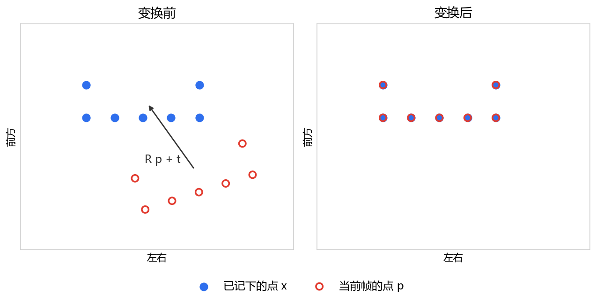

# 38. 视觉建图与导航的运行过程

本文根据车上一次建图，以及随后在这张地图上的定位和导航写成。插图来自实机抓取。

---

# 过程概要

车头深度相机采集红外图像和深度图像，并合成同一条消息。估计车相对本次出发的平移和转动时，用的就是这条消息。估计出的平移和转动再连接到车体与场地，然后建立地图。地图不再写入新地点之后，在已有地图上定位，接着在图上指定目标点，规划到目标的路径，并按路径把速度发给底盘。


---

# 1. 采集红外图像和深度图像

深度相机由左右红外得到深度图像，并分成两路发布。相邻帧的红外灯一开一关，灯关着时的亮度和灯开着时的距离不在同一帧。先说明灯为什么交替，再把亮度和距离合成一条消息。估计平移和转动时用的就是这条消息。定位和建图还要用到红外图像和深度图像。

## 1.1 由左右红外得到深度图像

用左红外和右红外的视差算出距离，得到与左红外共用镜头中心的深度图像，并分成两路发布。相邻帧的灯一开一关，灯开着的那一帧用来比较出距离，灯关着的那一帧用来做前后帧匹配。

### 左红外、右红外与基线

本机深度相机型号为 D435C，机身正面从左到右为左红外镜头、彩色镜头、右红外镜头和红外投射器。投射器是红外光源，不是镜头，它把红外光投到车前方的物体上，由左红外和右红外拍摄，视差比较的就是这两幅图像的亮度。


深度图像不是某一个镜头直接拍出来的，而是由左红外和右红外同时拍到的同一个物体计算出来的。两个镜头是分开的，所以同一个物体在两幅图像上的水平位置不同。

### 视差

一帧图像按行、列排列像素，左上角为第 0 列、第 0 行：水平方向从左向右数，这个序号称为列号；竖直方向从上向下数，这个序号称为行号。下图黄格是第 0 列、第 0 行，格内写的是列号、行号。


在左红外某一行选定一个像素，连同周围像素组成一个窗口。右红外停在同一行，以某一列为中心，取行数、列数相同的窗口。两个窗口里，相对中心位置相同的像素，亮度相减后再相加。右图的窗口从左图像素所在列开始，向左每次移动 1 列。和最小的一次，视差（Disparity）等于左图列号减去右图列号。下图中的五角星是同一个物体，左右两个平面是两个镜头上的成像。两个镜头中心之间的距离称为基线（Baseline）。


### 由视差得到距离

左镜头中心、右镜头中心和物体构成一个三角形，底边是基线 `B`，高是物体到镜头的距离 `Z`。物体越近，两条视线的夹角越大，五角星在两个平面上隔得越开，视差 `d` 越大；物体很远时，两条视线几乎平行，视差接近 0，因此距离和视差成反比。

镜头正前方用来成像的横线称为像平面。前面的视差是由左图列号减去右图列号得到，记为 `d`。把右镜头的视线平移到左镜头，与左视线组成下图里的两个三角形。两个三角形共顶点，底边都平行于像平面。红色小三角形的底边就是视差 `d`，高等于焦距 `f`。蓝色大三角形的底边等于基线 `B`，高等于距离 `Z`。由相似可得： `d / f = B / Z`，则距离 `Z` 可以由以下公式进行计算得出：


```text
Z = fx × B / d
```

`d` 是列号之差，单位像素。`fx` 是焦距，代表着 1m 对应的像素个数，本机红外为 421.374。`B = 0.050` m。写入深度图像时，米再乘以 1000，存成毫米整数。

### 得到深度图像

由视差算出的距离 `Z`，按左红外的像素写入深度图像：左红外第 `v` 行、第 `u` 列仍是亮度，算出的 `Z` 写入深度图像的同一个 `(u, v)`。右红外在同一行对上的列是 `u − d`，这一列只用来得到视差，不存放 `Z`。因此深度图像和左红外图像共用左镜头中心。计算时，各条视线都看成从这一点穿出，这个点称为光学中心（Optical Center）。右红外图像从右镜头中心看出去，两个中心相距基线。

镜头之间的平移和转动称为外参（Extrinsic Parameters），平移是三个数 `(tx, ty, tz)`，单位米，转动是 3×3 矩阵。深度图像与左红外图像共用左镜头中心和像素 `(u, v)`，所以左红外到深度图像没有平移、也没有转动：

```text
tx, ty, tz = 0, 0, 0
转动 = [[1, 0, 0],
        [0, 1, 0],
        [0, 0, 1]]
```

这个转动矩阵称为单位阵。左红外到右红外的转动仍是单位阵，只在基线方向多出平移：

```text
tx, ty, tz = 0.050, 0, 0
```

`tx = 0.050` m，就是右红外在左红外右侧 50 mm。本文使用的红外图像是左红外，右红外只用于计算视差。

### 发布左红外图像与深度图像

深度图像已经按左红外的像素放好距离，并与左红外图像共用左镜头中心。驱动因此打开左红外和深度图像，把这两幅图像发布出去。

相机节点发布左红外图像 `/camera/infra1/image_rect_raw`、深度图像 `/camera/depth/image_rect_raw`，以及两路各自的 `/camera/infra1/camera_info`、`/camera/depth/camera_info`。`camera_info` 与对应的那路图像配套，存放该镜头出厂时测好的固定参数，其中就有把视差换成距离时用的焦距。

下图是同一场景发出的左红外和深度图像。左红外的灰度就是亮度，椅子、地面越亮，像素值越大，左上角是第 0 列、第 0 行。深度图像的像素位置与左红外相同：近处亮灰，远处暗灰，黑色是没有有效距离。


两幅图像的消息类型都是 `sensor_msgs/msg/Image`。下面是实机左红外一帧的节选。像素值在 `data` 里，按行排开，一帧有 `848 × 480` 个字节，这里不展开。节选还省略了 `header.stamp`（拍摄时刻）和 `is_bigendian`（字节序，本机为 0）。

```yaml
# /camera/infra1/image_rect_raw
header:
  frame_id: camera_infra1_optical_frame
height: 480
width: 848
encoding: "mono8"
step: 848
```

`header.frame_id` 是这幅图像所在坐标系的名字。`height`、`width` 是行数和列数，本机为 480 行、848 列。`encoding` 说明每个像素怎么编码：红外是 `mono8`，每像素 1 字节亮度；深度图像是 `16UC1`，每像素 2 字节，单位毫米，0 表示没有有效距离。`step` 是每一行占多少字节，左红外等于列数 848，深度图像是列数的两倍。这两路是相机直接发出的图像，相邻帧的灯并不相同。

## 1.2 红外灯交替亮灭

相机发出的左红外里，相邻两帧并不一样：一帧灯开，一帧灯关。视差来自同一时刻左红外和右红外对亮度的比较。估计平移和转动时还要在前后两帧里找出同一个点，依据同样是亮度，但这两件事对灯的要求相反。

左右比较时，白墙和地面的亮度变化很少，同一行上往往比较不出同一处。投射器打开后，场景上多出许多小亮点，称为散斑，左右红外就更容易比较出同一处亮度图案。

前后帧匹配要的是稳定的场景亮度。散斑不属于场景，灯开着时，相机几乎没动，亮点图案也会变，匹配就不稳。所以做前后帧匹配的那些帧关掉投射器。

同一帧不能又开灯又关灯，于是按帧交替。灯开着的那一帧供左右红外比较出距离；前后帧匹配用的是灯关着的那些帧。下图是相邻两帧左红外。左边灯关，柜门、墙和地面是成片的灰度；右边灯开，同一位置布满细碎亮点。


下一张图把上面相邻两帧在同一像素上的亮度相减，再把很小的差拉大。两帧一样亮的地方差接近 0，拉大以后仍是暗的，柜子和墙的轮廓因此变淡。满幅细碎的灰白点只在灯开的那一帧里有，就是散斑，落在灯关时亮度变化很少的墙面和地面上。窗口两帧都过亮，相减后是一块黑白斑块，不是散斑。


灯开着时算出的距离，和灯关着时的亮度，还在上面两条图像里，拍摄时刻也不同。合成一条消息时，取的就是这两帧。

## 1.3 合成一条消息

灯关着时的亮度用来做前后帧匹配，灯开着时深度图像里的像素是算出的距离。灯按帧交替，亮度和距离是先后拍的，拍摄时刻不同，时间戳也就不同。

估计平移和转动时，要在同一个像素上同时读到这帧亮度和距离，因此必须把亮度和距离当成同一时刻。左红外话题 `/camera/infra1/image_rect_raw` 里取灯关着的那一帧，深度图像的话题 `/camera/depth/image_rect_raw` 里取紧挨着它、灯开着时算出的那一帧。距离和像素位置保持原样，只把深度图像的时间戳改成这帧红外的时间戳，再写入同一条消息。消息里的时刻从此相同，估计运动时就按同一时刻来用；两次拍摄本身仍是相邻的两帧。话题是 `/rtabmap/rgbd_image`，类型是 `rtabmap_msgs/msg/RGBDImage`。

这种同时带有红外图像和深度图像的消息称为 RGB-D（RGB-Depth）。RGB 原指红、绿、蓝三个颜色通道，这里的图像是灯关着时拍下的红外。深度图像每个像素是到镜头的距离。下面是一帧节选，像素值仍在各自的 `data` 里，这里不展开。

```yaml
# /rtabmap/rgbd_image
header:
  frame_id: camera_infra1_optical_frame
rgb:
  encoding: "mono8"
  width: 848
  height: 480
  frame_id: camera_infra1_optical_frame
depth:
  encoding: "16UC1"
  width: 848
  height: 480
  frame_id: camera_depth_optical_frame
```

整条消息的 `header.frame_id` 与红外相同。`rgb` 是灯关着时的亮度，`depth` 是深度图像，每个像素是灯开着时算出的距离，两条图像的时间戳已经相同。

---


# 2. 估计相对出发的运动

合成后的 RGB-D 消息里，同一个像素点上，红外图像存储的是亮度，深度图像存储的是到物体到镜头光学中心的距离。距离只是坐标里的 `Z`，还缺左右 `X`和上下 `Y`。这一节由像素和距离得到镜头前的坐标值，确定相机相对车身的位置，用视觉里程计（Visual Odometry）估计相对出发的运动，从底盘取得轮速，再把两路合成，发布在 `/odom`。建图和定位就得依赖这个运动的估计。 

## 2.1 由像素和距离得到坐标

深度图像里的距离只说明这个点离镜头多远，这是坐标里的 `Z`，还不知道它在镜头左右、上下偏了多少。估计平移和转动要比较前后帧里同一个点的坐标 `(X, Y, Z)`。

光学坐标系（Optical Frame）以镜头的光学中心为原点，图上标为 `Fc`。各条视线都看成从这一点穿出；光学中心在镜头上，不在画面里。`Xc` 向右，与列号增加的方向相同；`Yc` 向下，与行号增加的方向相同；`Zc` 沿镜头前方，就是深度图像里的距离。像平面上 `u` 向右、`v` 向下。光轴穿过光学中心，打在画面上的像素才是主点 `(cx, cy)`。红线从空间中的点穿过像素 `(u, v)`，回到光学中心。


来源：[OpenCV, Camera Calibration and 3D Reconstruction](https://docs.opencv.org/4.x/d9/d0c/group__calib3d.html)。

换算用的一组数称为内参（Intrinsic Parameters）。测出内参的过程称为标定（Calibration），本机出厂时已经完成，写在与图像配套的 `camera_info` 里。内参排成 3×3 矩阵，字段名叫 `k`：

```text
k = [[fx,  0, cx],
     [ 0, fy, cy],
     [ 0,  0,  1]]
```

`fx`、`fy` 是用像素表示的焦距，与视差公式中的焦距是同一个量。本机红外 `fx = fy = 421.374`。`(cx, cy)` 称为主点（Principal Point），是镜头正前方落在图像上的像素，本机为 `(420.745, 239.283)`。

从光学中心看出去，`X` 与 `Z` 构成的三角形，和主点到像素的偏移与 `fx` 构成的三角形共顶角、底边平行，因此 `X/Z` 等于该偏移除以 `fx`。偏移为 `fx·X/Z` 像素，行方向为 `fy·Y/Z`，于是 `u = cx + fx·X/Z`，`v = cy + fy·Y/Z`。


## 2.2 相机相对车身的位置和朝向

坐标 `(X, Y, Z)` 在光学坐标系里，原点在镜头上，还不能表示车在地面上的位置。从一个坐标系到另一个坐标系的平移和转动称为变换，因此还要一段从车身到镜头的变换。车身竖直投到地面后、左右方向的中点上设立坐标系 `base_footprint`，相机外壳的支架螺丝孔上设立坐标系 `camera_d435c_link`。镜头相对车身的位置和朝向由两段变换合起来表示：`base_footprint` 到 `camera_d435c_link` 向前 58.5 mm、左右为 0、高度 28 mm、转角为 0，`camera_d435c_link` 到光学坐标系的转动由相机驱动发布。螺丝孔与光学中心不重合，所以前一段平移不是光学中心相对车身的距离，地图尺度会因此略有偏差。

## 2.3 视觉里程计

要估计车相对出发走了多远、转了多少，就用合成后的 RGB-D 数据做视觉里程计（Visual Odometry）。视觉里程计用帧匹配确定当前帧与最近若干帧红外图像上的同一个像素，帧匹配所使用的像素称为特征点（Feature）。特征点必须与周围像素不同，下一帧才能确定与当前帧对应的是哪一个像素。

特征点在当前帧的红外图像上计算。以一个像素为中心取窗口，沿列方向相邻像素的亮度差记为 `Ix`，沿行方向相邻像素的亮度差记为 `Iy`，再对窗口内全部像素求和：

```text
M = [[Σ Ix^2,   Σ Ix·Iy],
     [Σ Ix·Iy,  Σ Iy^2]]
```

窗口平移 `(Δu, Δv)` 后，窗口内亮度差的平方和近似等于 `[Δu, Δv] M [Δu, Δv]^T`。`M` 的两个特征值 `λ1`、`λ2` 就是两个相互垂直方向上这一平方和的大小，较小的一个 `min(λ1, λ2)` 用来判断中心像素能否与周围像素区分。`min(λ1, λ2)` 较大时，窗口无论向哪个方向平移，亮度都会改变，中心像素就是特征点。`min(λ1, λ2)` 接近零而另一个特征值较大时，窗口位于边缘，沿边缘平移几乎不改变亮度，周围一串像素会得到相近的 `M`，帧匹配不能从中确定原来的中心像素。两个特征值都接近零时，窗口位于亮度均匀的墙面或地面上，平移同样几乎不改变亮度。边缘和均匀区域上的中心像素都不作为特征点。这一计算称为适合跟踪的特征（Good Features to Track, GFTT）。

下图是红外画面，红点是这一帧算出的特征点，也就是 `min(λ1, λ2)` 较大的中心像素。红点落在背包、饮水机和柜子的棱角上，地面上亮度均匀的区域没有红点。


特征点要在另一帧里被认出来，还要记下特征点周围谁更亮。在特征点周围取若干对像素，每一对记下哪一个更亮，这一串记录称为二进制鲁棒独立基本特征（Binary Robust Independent Elementary Features, BRIEF）。最近若干帧的红外图像也已经取出特征点并记下 BRIEF。帧匹配把当前帧的 BRIEF 与最近若干帧记下的 BRIEF 对照，最接近的一对当作同一个特征点。

当前帧上，用匹配得到的特征点的列号、行号和深度图像里同一像素的距离，算出镜头前的坐标，记为 `p`。车相对出发的位置和朝向合称位姿（Pose），写成转动 `R` 和平移 `t`，`R p + t` 把仍在当前镜头前的 `p` 换到出发之后的坐标系。同一个特征点在最近若干帧里得到的镜头前坐标，已经由当时的位姿换到出发之后的坐标系，记为 `x`。这一帧所求的 `R` 和 `t`，就是使 `R p + t` 靠近 `x`、各特征点偏差平方和最小的那一段转动和平移。下图把仍在镜头前的 `p` 和已经记下的 `x` 放在出发之后的坐标系里，从上方看左右和前方，用来显示 `R p + t` 怎样靠近 `x`：`p` 画成红圈，`x` 画成蓝点。红圈在变成 `R p + t` 之前与蓝点分开，变成之后落到蓝点上。



变换后仍然靠近 `x` 的特征点称为内点。内点不少于 10 个，位姿采用这段 `R` 和 `t`；不足 10 个则跟丢，这次估计不采用。

采用的位姿由节点 `vision_rgbd_odometry` 发在 `/odom_vo`，消息类型为 `nav_msgs/msg/Odometry`。父坐标系是 `odom`，子坐标系是 `base_footprint`，写的是车身相对出发原点的位置和朝向。

建图和定位读的是 `/odom`。轮速还没有到来时，写入 `/odom` 的就是 `/odom_vo` 上的这条位姿。

是否跟丢和内点数发在 `/odom_info_lite`。按路径控制速度时读 `/odom_info_lite`，跟丢就把发给底盘的速度改为零。

## 2.4 底盘

视觉里程计给出车相对出发的一条运动，底盘再按轮子转过的角度累计另一条，称为里程计（Odometry），话题为 `/wheel/odom`，坐标系名为 `wheel_odom`。

底盘启动后发布轮速位姿。建图默认不启动底盘；要让车在场地中行驶并提供轮速，启动时一并启动底盘节点和 `wheel_odom_tf`。

车为前轮转向，转向伴随纵向运动，不能原地转向。底盘把偏航角（弧度）同时写入四元数和 `pose.position.z`。

## 2.5 轮速与视觉位姿的统一

视觉里程计和轮速是相对出发的两条运动。轮速来自轮子转过的角度，短时间更稳；没开底盘或轮子打滑时，仍要靠视觉。建图和定位只读 `/odom` 上的运动，所以两条合成后发布在 `/odom`，发布者是 `vision_hold_odom_tf`。

轮速在 0.3 s 内到达时，以收到的第一帧作为出发原点，之后发布相对该原点的前后、左右和偏航，高度为 0。偏航是车头在地面上的朝向。轮速没到，就写入视觉位姿。`/odom` 的时间戳取当时采用的那一路。

轮速消息写的是车相对轮速原点的位置。发给坐标变换的是反过来的那一段：父坐标系是车，子坐标系是轮速原点，这样车身只有 `odom` 一个父坐标系。

视觉位姿若相对上一帧跳过 1 m 或 1 rad，就当作视觉里程计重新出发，把新起点接到上一帧之后，`/odom` 不跳回原来的出发处。

---


# 3. 连接图像、车体与场地

坐标 `(X, Y, Z)` 仍在光学坐标系里，车相对出发的运动在 `/odom` 上。这一节说明怎样把多段变换接成坐标变换，区分镜头、车身与场地，并发布各段变换。规划路径要用车在场地上的位置。

## 3.1 坐标变换

镜头前的点要换到场地上，中间隔着外壳、车身和出发原点，每一段是一个变换，而且由不同的节点发布。把这些带名字的变换收在一起，并能按父坐标系、子坐标系的名字把几段接起来，这个机制称为坐标变换（Transform, TF）。查询时写出两端的坐标系名，得到的是子坐标系相对父坐标系的平移和转动；两端之间还隔着别的坐标系时，TF 把中间各段接上，查询的程序不用自己知道每一段是谁发布的。随时间变化的变换发布在 `/tf`，安装之后不再改变的变换发布在 `/tf_static`。写法 `父→子` 表示子相对父的位置。

## 3.2 三种坐标系

车身坐标系记的是相机安装在车头的位置和朝向，这段关系固定，已由镜头相对 `base_footprint` 的安装给出。出发坐标系 `odom` 记的是从本次启动的停车点走过的平移和转动，由视觉里程计或轮速给出，积分会累积误差。场地坐标系 `map` 记的是车在环境中的位置和朝向，由建图和定位给出。短时误差留在 `odom→base_footprint`，车相对场地还差多少另记在 `map→odom`，墙上的位置才不会跟着短时误差一起改变。相机连接在 `base_footprint` 下。有底盘时，轮速坐标系连接在车体下，使 `base_footprint` 只有一个父坐标系。

下图从场地画到镜头。父坐标系在箭头左侧，箭头指向子坐标系。从 `map` 往下读：先到本次出发的 `odom`，再到车身，再从车身到镜头。


| 名称               | 固连对象          | 含义              |
| ---------------- | ------------- | --------------- |
| `map`            | 环境            | 车在环境中的位置        |
| `odom`           | 本次启动或重置时的出发姿态 | 相对出发的累计位移       |
| `base_footprint` | 车身在地面上的投影     | 原点在投影的左右中线、靠近后部 |


固连在相机外壳上的坐标系由驱动发布，名为 `camera_d435c_link`。`base_link` 是 URDF 里车体主连杆上的坐标系，相对 `base_footprint` 有固定高度。四轮连杆的父坐标系为 `base_link`。

## 3.3 变换的发布

光学坐标系到 `camera_d435c_link`，再到 `base_footprint`，再到出发坐标系 `odom`，再到场地坐标系 `map`，各段由不同节点发布。消息类型是 `tf2_msgs/msg/TFMessage`。安装之后不再改变的一段发在 `/tf_static`。其中 `base_footprint` 到 `camera_d435c_link` 的平移和转动，就是前面写出的向前 58.5 mm、高度 28 mm，以及无转动四元数 `(0, 0, 0, 1)`：

```yaml
# /tf_static 中的一项
header:
  frame_id: base_footprint
child_frame_id: camera_d435c_link
transform:
  translation: { x: 0.0585, y: 0.0, z: 0.028 }
  rotation: { x: 0.0, y: 0.0, z: 0.0, w: 1.0 }
```

车体各零件之间的变换由 `vision_robot_state_publisher` 根据统一机器人描述格式（Unified Robot Description Format, URDF）发布。URDF 描述车体由哪些连杆、关节组成。`vision_joint_state_publisher` 按 URDF 以零位发布轮关节，轮连杆才能变换到车体。

`odom→base_footprint` 与 `/odom` 使用同一条位姿，并再以当前时间发布一次，供显示程序按当前时刻查询。


| 段                                  | 发布者                                                             | 话题                   |
| ---------------------------------- | --------------------------------------------------------------- | -------------------- |
| `base_footprint→camera_d435c_link` | 静态发布器                                                           | `/tf_static`         |
| `camera_d435c_link→光学坐标系`          | 相机驱动                                                            | `/tf` 或 `/tf_static` |
| `odom→base_footprint`              | `vision_hold_odom_tf`                                           | `/tf`                |
| `map→odom`                         | 尚未收到占用栅格时由 `vision_hold_odom_tf` 发恒等变换，之后为建图节点 `vision_rtabmap` | `/tf`                |
| `base_footprint→wheel_odom`        | `wheel_odom_tf`（有底盘时）                                           | `/tf`                |


`base_footprint` 的父坐标系为 `odom`，`odom` 的父坐标系为 `map`。有底盘时 `wheel_odom` 的父坐标系为 `base_footprint`。两个节点对同一对父子同时发布 `/tf` 时，后到达的消息覆盖先到达的。

有底盘时树的主干为：

```text
map → odom → base_footprint → wheel_odom
                   ↓
              camera_d435c_link → 光学坐标系
```

`/wheel/odom` 消息与 `lookup(wheel_odom, base_footprint)` 同向。`wheel_odom_tf` 发布的是逆变换 `base_footprint→wheel_odom`。

尚未收到占用栅格话题 `/map` 时，`vision_hold_odom_tf` 发布恒等的 `map→odom`，显示程序把固定坐标系设为 `map` 时仍能显示车体。收到 `/map` 后停止该恒等变换，`map→odom` 改由建图节点发布。

---


# 4. 建立地图

镜头、车身和场地的位置已经连在一起。这一节把沿途图像写入地点数据库并发布占用栅格，把距离投成俯视格子，再修正车在地图上的位置。这种边写入边确定位置，称为同时定位与建图（Simultaneous Localization and Mapping, SLAM）。本车使用实时外观建图（Real-Time Appearance-Based Mapping, RTAB-Map）。定位时还要用这里留下的图像和可通行区域。

## 4.1 地点数据库与占用栅格

软件包 `rtabmap_slam` 提供的 `vision_rtabmap` 订阅合成后的 RGB-D 和 `/odom`，车体坐标系取 `base_footprint`。沿途红外要留下来，以后回到旧地点时才能对上；占用栅格是从上往下看的可通行区域，规划路径时用它。

磁盘数据库是扩展名为 `.db` 的文件，进程退出后仍保留，默认路径为 `~/.ros/vision_rtabmap_mapping.db`，沿途的红外图像保存在这个文件里。话题 `/map` 的类型是 `nav_msgs/msg/OccupancyGrid`，即占用栅格（Occupancy Grid），表示可通行区域，随进程结束停止发布，格子取空闲、占用或未知。

库中一条地点记录对应某一时刻相机获取的红外图像、深度图像和位姿。RTAB-Map 内部把这样一条记录也叫做 node，与 ROS 节点不是同一事物，本文称其为地点记录。建图时向数据库添加地点记录，相对上一关键帧约 5 cm 或 0.05 rad 才写入新关键帧；关键帧就是选来写入数据库的那些帧。

默认启动会先清空数据库再写入。再次按默认方式启动建图会再次清空。要在已有库上继续，启动时保留数据库。建图时工作内存随新建地点增长。

占用栅格 `data` 中每个格子：`0` 空闲，`100` 占用，`-1` 未知。按行存储，从格子 `(0, 0)` 沿 x 写完 `info.width` 再增加 y。`info.origin` 是格子 `(0, 0)` 左下角在 `map` 中的位姿。`info.resolution` 是边长（米）。图像像素 `(0, 0)` 在画面左上角，与栅格原点的约定不同。分辨率 0.05 m。

```text
y 向上
2 |  -1    0   100    0
1 |   0    0   100    0
0 |   0    0     0    0
    +----+----+-----+----→ x
data: [0, 0, 0, 0,  0, 0, 100, 0,  -1, 0, 100, 0]
```

下图白为空闲，黑为占用，灰为还没看到的地方。2026-09-21 该次建图得到 168×272 格，原点约 (−3.50, −5.98) m。看这张图时，白的区域车可以过，黑的区域不能过。


RViz 把这张栅格和车体画在同一个画面里。下图固定坐标系为 `map`。左侧是当时的左红外，中央是占用栅格和车体，用来对照相机看到的场景和已经记下的可通行区域。


## 4.2 把距离投成俯视格子

占用栅格已经在发布。相机给出的是前方每个像素的距离，规划要的是地面上哪一格能过，所以把每个像素的距离投到俯视格子上。距离 0.20–4.0 m 的点参与，高度 −0.10～0.10 m 记为空闲，0.10～1.80 m 记为障碍，超过 1.80 m 不记为障碍，相机到障碍之间的格子也标记为空闲。下图从侧面看：贴地的一条是空闲，往上到 1.80 m 是障碍，再高的不记。飞点按邻域点数过滤。


`vision_rtabmap` 同时发布三维障碍点云 `/cloud_obstacles`（类型 `PointCloud2`）。

参与投影的像素用内参和以毫米为单位的距离换成光学坐标系中的点，再经

```text
光学坐标系 → camera_d435c_link → base_footprint → odom → map
```

变换到地图，落在障碍高度里的格子记为 `data=100`。

本帧没有合成消息则不向 `/map` 写入。视觉跟丢时，若 `/odom` 仍由轮速更新，距离仍写入占用栅格。

格子边长 0.05 m。沿光线把相机到障碍之间标为空闲。噪声过滤半径 0.10 m，邻域至少 5 个点。栅格是二维的。

下图把前面几步按从左到右排开：左红外与深度图像、合成同一时刻、估计相对出发的运动、写入地点并投成俯视格子、得到占用栅格和磁盘数据库。框内第二行是这一步交出的话题或类型。顺着箭头读，就是从两幅图像到一张可通行地图。


## 4.3 回环

地点记录和俯视格子已经在这张地图上。当前红外图像与较早写入的图像相符时，把这条约束加入位姿图并重新优化，车在这张正在形成的地图上的位置就被修正，这一次匹配称为回环（Loop Closure）。相对出发的平移和转动只说明离开起点多远；回到已经写入的地点时，回环把车在地图上的位置修正到该地点。配准依据红外图像。图优化把地点之间的约束放在平面上求解。近邻之间只用图像配准。回环误差超过 3 个标准差则拒绝。回环被接受时 `map→odom` 可能跳变。缺少 `odom→base_footprint` 时，回环因无法完成 `odom` 到车体的变换而被拒绝。

下图两帧红外是同一处、不同时刻，取自地图里已有的图像。两帧看起来相似时，才把车在地图上的位置修正到该地点。该次库中 434 条地点记录、121 条全局回环；图中一对取自记录 98 与 330。


地点记录的位姿画在 `/map` 上。蓝线按时间先后把地点连起来，是车开过的路程。红线连接隔了很久又看到的同一地点，所以会跨过中间的路程，不是刚刚开过的那一段。绿点为第一关键帧，橙箭头为最后关键帧。


---


# 5. 在已有地图上定位

地点数据库和占用栅格已经留下。这一节在这张地图上定位，不再写入新图像。规划到目标的路径时，用的是定位得到的车在地图上的位置，以及占用栅格里的可通行区域。

定位时订阅 RGB-D 和 `/odom`，发布 `/map` 和 `map→odom`。`odom→base_footprint` 由 `vision_hold_odom_tf` 发布。

定位启动不向库中添加新地点，并把库中已有地点记录载入工作内存。数据库用建图留下的那个。库中无记录则配准没有对象。

当前红外图像与库中已有的图像匹配，匹配成功后写出 `map→odom`，把它与 `odom→base_footprint` 连起来，就是车在地图上的位置。匹配失败时 `map→odom` 停在不可靠的值上，车在地图上的位置不正确。

下图是定位时相机正在看到的红外，以及画在已有 `/map` 上的车体。橙箭头是匹配得到的车头位置和朝向，不是新画的一张地图。


可在 `/initialpose` 提供粗略初值。类型为 `geometry_msgs/msg/PoseWithCovarianceStamped`：带协方差的位姿，`frame_id` 为 `map`。定位节点订阅这个话题。回环和近邻仍可能微调 `map→odom`。

---


# 6. 规划到目标的路径

车在地图上的位置和可通行区域已经有了。这一节先做代价地图，再规划到目标点的路径。按路径控制速度时，用的就是这条路径。

## 6.1 代价地图

代价地图（Costmap）是在占用栅格上把障碍周围标成高代价的图，供规划器避开车体可能擦到的区域。代价地图订阅视觉的 `/map` 和 `/cloud_obstacles`。

局部代价地图随车体附近窗口移动，坐标系为 `odom`；全局代价地图覆盖整张图，坐标系为 `map`。车体坐标取 `base_footprint`。

局部层含静态层、体素层、膨胀层。静态层订阅 `/map` 及其更新，保留未知空间。体素层把空间划成小立方体，订阅障碍点云 `/cloud_obstacles`，高度 0.05～1.8 m，距离 0.20～4.0 m，可清除也可标记。点云暂无数据时，静态层仍使用 `/map` 中的占用栅格。

全局层含静态层、障碍层、膨胀层。局部膨胀半径 0.1 m，全局膨胀半径 0.25 m。

足迹是车体在地面上的多边形

```text
[[-0.09, -0.185], [-0.09, 0.185], [0.4, 0.185], [0.4, -0.185]]
```

规划时路径上的格子必须容得下这个多边形。单位为米，原点在 `base_footprint`。

下图橙为膨胀带，车体边缘会擦到的一圈；黑为占用，白为空闲，灰为尚未看到。蓝框为足迹，路径必须容得下这个框。橙箭头为当时车头的朝向。


## 6.2 计算路径

在图上指定的目标点发到 `/goal_pose`。规划动作 `ComputePathToPose` 每秒重新计算一次从车在地图上的位置到该目标点的路径，订阅 `/goal_pose` 和全局代价地图，并由 TF 查询车体在 `map` 中的位姿。`/goal_pose` 的 `frame_id` 为 `map`。发布的路径类型为 `nav_msgs/msg/Path`：带时间戳的位姿序列，`header.frame_id` 为 `map`。长度为 0 表示规划失败。失败时先清除全局代价地图再尝试 1 次。

```yaml
# /goal_pose
header:
  frame_id: map
pose:
  position: { x: ..., y: ..., z: 0.0 }
  orientation: { x: 0.0, y: 0.0, z: ..., w: ... }
```

规划器在全局代价地图上规划路径，按前轮转向、不能原地转向的运动方式生成路径。起点或终点位于占用格或未知格时，路径点列常为空。

目标点落在空闲格上时，`/plan` 返回位姿序列。下图绿线是规划出的路径，红圈是目标点，蓝框是车体足迹。路径贴着空闲区域走，并让蓝框留在可通行的格子里。


---


# 7. 按路径控制速度

到目标的路径已经算出。这一节沿路径计算发给底盘的速度；跟踪失败后再算一次，视觉跟丢时速度改为零。

## 7.1 控制器

沿路径跟踪的动作为 `FollowPath`。NavigateToPose 表示行驶到指定目标点的整次任务。控制器订阅 `/odom`，依据局部代价地图和路径计算速度，消息类型是 `geometry_msgs/msg/Twist`：`linear.x` 为前进或后退速度，`angular.z` 为绕竖直轴的角速度，发布到 `/cmd_vel`。`linear.x` 为正表示前进，为负表示倒车。车头方向被障碍阻挡时，`linear.x` 为负，即倒车。

局部代价地图只覆盖车周围的一小块，坐标系为 `odom`，随车滚动。下图蓝框是车体足迹，橙箭头是车头在这块局部图里的朝向。控制器根据这块图和路径决定这一刻的速度。


## 7.2 跟踪失败后的恢复

跟踪失败则清除局部代价地图再尝试 1 次。整次 NavigateToPose 失败后，外层最多再尝试 6 次：清除局部和全局代价地图，倒退 0.25 m、速度 0.08 m/s（`BackUp`），再等待 5 s（`Wait`）。恢复期间若目标更新，则跟踪新目标。

## 7.3 视觉跟丢

视觉跟丢时，底盘收到的速度改为零，并取消当前前往目标点的任务。否则控制器算出的速度原样转给底盘。跟丢指姿态无效、信息里标明跟丢，或内点连续 5 帧少于 10。内点恢复并再确认一帧仍正常之后，才继续转发速度。

节点 `vision_vo_watchdog` 订阅 `/cmd_vel`，转发到 `/cmd_vel_safe`。底盘订阅 `/cmd_vel_safe`。定位时启动该节点。

```text
FollowPath → /cmd_vel → vo_watchdog → /cmd_vel_safe → 底盘
                正常：原样转发
                跟丢：全零 Twist，并取消 NavigateToPose
```

取消这次任务使用动作的取消接口 `/navigate_to_pose/_action/cancel_goal`。动作是带目标、反馈、结果的长时间任务。状态发布到 `/vision/vo_status`。

下图从左到右是定位、栅格与目标、规划、控制、底盘。看门狗在控制器和底盘之间，跟丢时把发给底盘的速度改成零。

```text
/initialpose → RTAB-Map
/goal_pose   → bt_navigator → NavigateToPose
             → ComputePathToPose → 路径
             → FollowPath → /cmd_vel
             → vo_watchdog → /cmd_vel_safe
             → 底盘
```


---


# 附录：实机查询

功能包在 `src/wheeltec_vision_nav`。建图，或定位与导航运行时，另开终端。下列命令在已加载覆盖安装的终端执行。部分话题只在对应启动运行之后才出现。工作空间是合并安装。

```bash
source /home/wheeltec/vision_ws/source_overlay.bash
```


## 消息类型

```bash
ros2 interface show sensor_msgs/msg/Image
ros2 interface show sensor_msgs/msg/CameraInfo
ros2 interface show rtabmap_msgs/msg/RGBDImage
ros2 interface show rtabmap_msgs/msg/OdomInfo
ros2 interface show nav_msgs/msg/Odometry
ros2 interface show nav_msgs/msg/OccupancyGrid
ros2 interface show geometry_msgs/msg/Twist
ros2 interface show geometry_msgs/msg/PoseStamped
```


## 图像与里程计

图像为 Best Effort。比较配对后两路图像的时间戳。同步后的 RGB-D 消息内两条图像时间戳相同。`transient_local` 表示晚加入的订阅者仍能收到发布者保留的最后一张地图。

```bash
ros2 topic echo --once /camera/infra1/image_rect_raw --qos-reliability best_effort --no-arr --field encoding
ros2 topic echo --once /camera/depth/image_rect_raw --qos-reliability best_effort --no-arr --field encoding
ros2 topic echo --once /vision/paired/infra1/image_rect_raw --qos-reliability best_effort --no-arr --field header
ros2 topic echo --once /vision/paired/depth/image_rect_raw --qos-reliability best_effort --no-arr --field header
ros2 topic echo --once /rtabmap/rgbd_image --qos-reliability best_effort --no-arr
ros2 topic echo --once /odom --qos-reliability best_effort --no-arr
ros2 topic echo --once /odom_info_lite --qos-reliability best_effort --no-arr --field lost
ros2 topic echo --once /odom_info_lite --qos-reliability best_effort --no-arr --field inliers
ros2 topic echo --once /map --qos-durability transient_local --field info
```


## TF

`odom→base_footprint` 随 `/odom` 更新，发布者为 `vision_hold_odom_tf`。`lookup(wheel_odom, base_footprint)` 与 `/wheel/odom` 方向一致。

```bash
ros2 run tf2_ros tf2_echo odom base_footprint
ros2 run tf2_ros tf2_echo map odom
ros2 run tf2_ros tf2_echo base_footprint camera_d435c_link
ros2 run tf2_ros tf2_echo base_footprint camera_infra1_optical_frame
ros2 run tf2_ros tf2_echo wheel_odom base_footprint
ros2 run tf2_ros tf2_echo base_footprint wheel_odom
```


## 参数

```bash
ros2 param get /vision_rgbd_odometry guess_frame_id
ros2 param get /vision_rgbd_odometry publish_tf
ros2 param get /vision_rtabmap database_path
ros2 param get /vision_rtabmap Mem/IncrementalMemory
ros2 param get /vision_rtabmap Grid/Sensor
ros2 param get /camera depth_module.emitter_on_off
ros2 param get /controller_server FollowPath.plugin
ros2 param get /controller_server FollowPath.vx_min
ros2 param get /planner_server GridBased.plugin
ros2 param get /bt_navigator default_nav_to_pose_bt_xml
ros2 topic echo --once /cmd_vel_safe
ros2 topic echo --once /vision/vo_status
```

跟丢时 `/cmd_vel_safe` 为全零，`/vision/vo_status` 为 `lost`。`vx_min` 为负数，且不大于 −0.15。

```bash
ros2 topic echo --once /camera/infra1/metadata --qos-reliability best_effort
ros2 topic echo --once /camera/depth/metadata --qos-reliability best_effort
```

---


## 章节导航

[上一章：视觉跟随、巡线、KCF、AR 标签与网页视频](37-vision-applications.md) · [返回本篇](index.md) · [下一章：视觉建图与导航操作](39-visual-operation.md)