# 38. 视觉建图与导航的运行过程

本文根据车上一次建图，以及随后在这张地图上的定位和导航写成。插图来自实机抓取。

---

# 过程概要

车头深度相机采集红外图像和深度图像，并合成同一条消息。估计车相对本次出发的平移和转动时，用的就是这条消息。估计出的平移和转动再连接到车体与场地，然后建立地图。地图不再写入新地点之后，在已有地图上定位，接着在图上指定目标点，规划到目标的路径，并按路径把速度发给底盘。

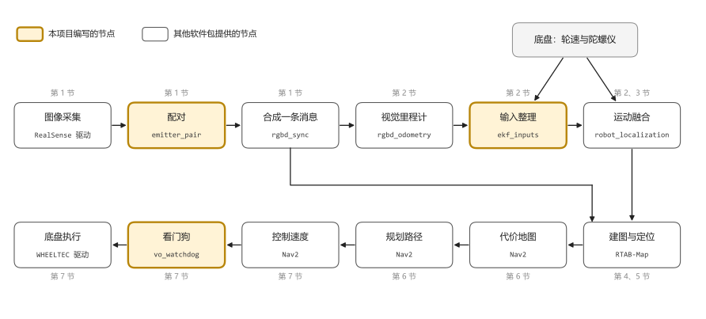

---

# 1. 采集红外图像和深度图像

深度相机由左右红外得到深度图像，并分成两路发布。相邻帧的红外灯一开一关，灯关着时的亮度和灯开着时的距离不在同一帧。先说明灯为什么交替，再把亮度和距离合成一条消息。估计平移和转动时用的就是这条消息。定位和建图还要用到红外图像和深度图像。

## 1.1 由左右红外得到深度图像

用左红外和右红外的视差算出距离，得到与左红外共用镜头中心的深度图像，并分成两路发布。相邻帧的灯一开一关，灯开着的那一帧用来比较出距离，灯关着的那一帧用来做前后帧匹配。

### 左红外、右红外与基线

本机深度相机型号为 D435C，机身正面从左到右为左红外镜头、彩色镜头、右红外镜头和红外投射器。投射器是红外光源，不是镜头，它把红外光投到车前方的物体上，由左红外和右红外拍摄，视差比较的就是这两幅图像的亮度。

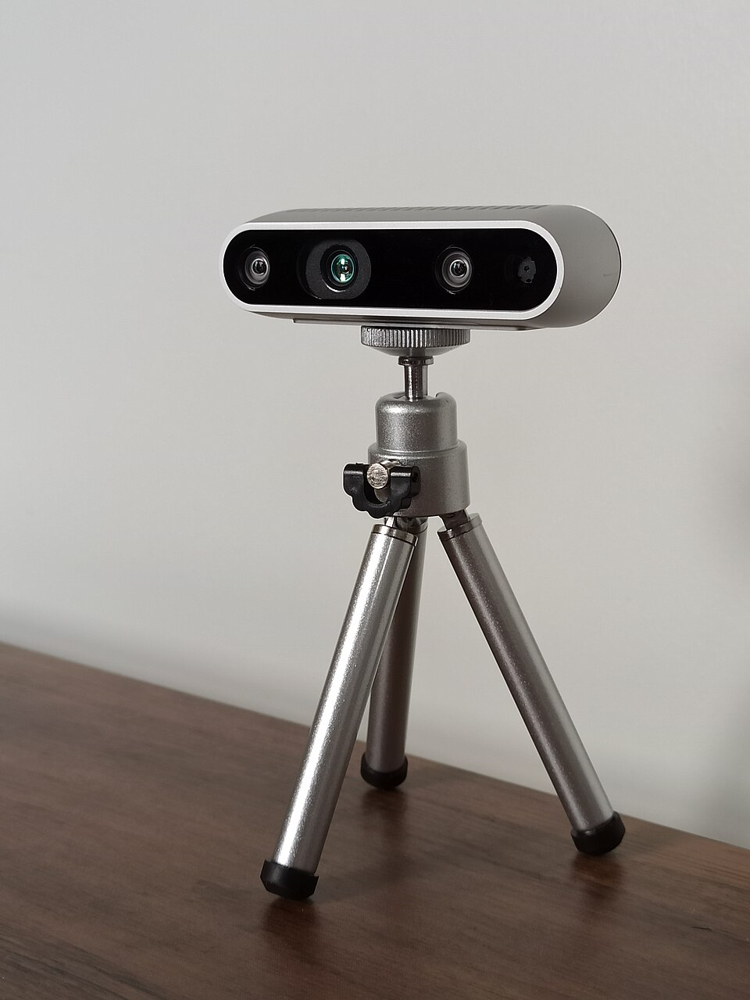

深度图像不是某一个镜头直接拍出来的，而是由左红外和右红外同时拍到的同一个物体计算出来的。两个镜头是分开的，所以同一个物体在两幅图像上的水平位置不同。

### 视差

一帧图像按行、列排列像素，左上角为第 0 列、第 0 行：水平方向从左向右数，这个序号称为列号；竖直方向从上向下数，这个序号称为行号。下图黄格是第 0 列、第 0 行，格内写的是列号、行号。

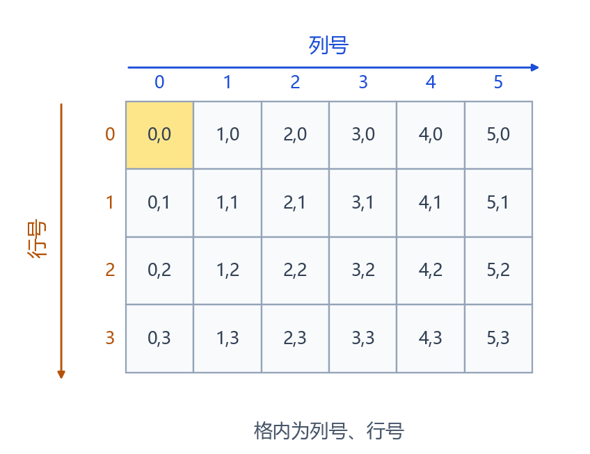

在左红外某一行选定一个像素，连同周围像素组成一个窗口。右红外停在同一行，以某一列为中心，取行数、列数相同的窗口。两个窗口里，相对中心位置相同的像素，亮度相减后再相加。右图的窗口从左图像素所在列开始，向左每次移动 1 列。和最小的一次，视差（Disparity）等于左图列号减去右图列号。下图中的五角星是同一个物体，左右两个平面是两个镜头上的成像。两个镜头中心之间的距离称为基线（Baseline）。

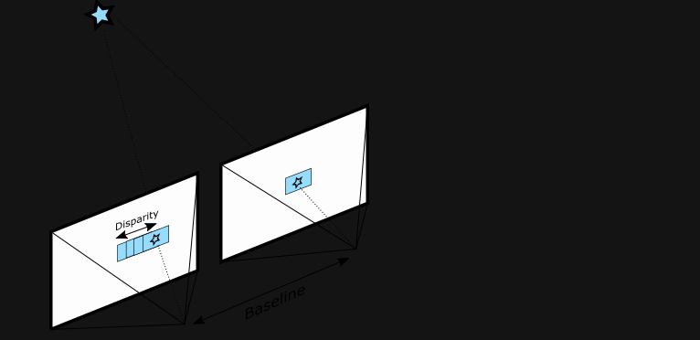

### 由视差得到距离

左镜头中心、右镜头中心和物体构成一个三角形，底边是基线 `B`，高是物体到镜头的距离 `Z`。物体越近，两条视线的夹角越大，五角星在两个平面上隔得越开，视差 `d` 越大；物体很远时，两条视线几乎平行，视差接近 0，因此距离和视差成反比。

镜头正前方用来成像的横线称为像平面。前面的视差是由左图列号减去右图列号得到，记为 `d`。把右镜头的视线平移到左镜头，与左视线组成下图里的两个三角形。两个三角形共顶点，底边都平行于像平面。红色小三角形的底边就是视差 `d`，高等于焦距 `f`。蓝色大三角形的底边等于基线 `B`，高等于距离 `Z`。由相似可得： `d / f = B / Z`，则距离 `Z` 可以由以下公式进行计算得出：

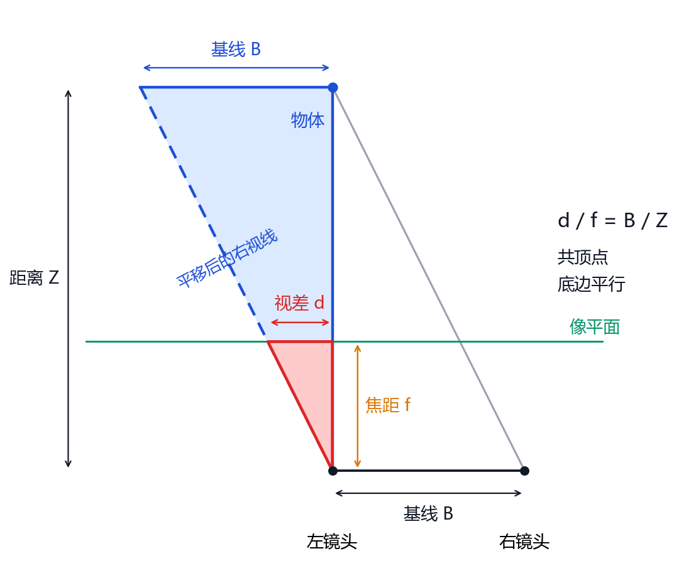

```text
Z = fx × B / d
```

`d` 是列号之差，单位像素。`fx` 是焦距，代表着 1m 对应的像素个数，本机红外为 421.374。`B = 0.050` m。写入深度图像时，米再乘以 1000，存成毫米整数。

### 得到深度图像

由视差算出的距离 `Z`，按左红外的像素写入深度图像：左红外第 `v` 行、第 `u` 列仍是亮度，算出的 `Z` 写入深度图像的同一个 `(u, v)`。右红外在同一行对上的列是 `u − d`，这一列只用来得到视差，不存放 `Z`。因此深度图像和左红外图像共用左镜头中心。计算时，各条视线都看成从这一点穿出，这个点称为光学中心（Optical Center）。右红外图像从右镜头中心看出去，两个中心相距基线。

镜头之间的平移和转动称为外参（Extrinsic Parameters），平移是三个数 `(tx, ty, tz)`，单位米，转动是 3×3 矩阵。深度图像与左红外图像共用左镜头中心和像素 `(u, v)`，所以左红外到深度图像没有平移、也没有转动：

```text
tx, ty, tz = 0, 0, 0
转动 = [[1, 0, 0],
        [0, 1, 0],
        [0, 0, 1]]
```

这个转动矩阵称为单位阵。左红外到右红外的转动仍是单位阵，只在基线方向多出平移：

```text
tx, ty, tz = 0.050, 0, 0
```

`tx = 0.050` m，就是右红外在左红外右侧 50 mm。本文使用的红外图像是左红外，右红外只用于计算视差。

### 发布左红外图像与深度图像

深度图像已经按左红外的像素放好距离，并与左红外图像共用左镜头中心。驱动因此打开左红外和深度图像，把这两幅图像发布出去。

相机节点发布左红外图像 `/camera/infra1/image_rect_raw`、深度图像 `/camera/depth/image_rect_raw`，以及两路各自的 `/camera/infra1/camera_info`、`/camera/depth/camera_info`。`camera_info` 与对应的那路图像配套，存放该镜头出厂时测好的固定参数，其中就有把视差换成距离时用的焦距。

下图是同一场景发出的左红外和深度图像。左红外的灰度就是亮度，椅子、地面越亮，像素值越大，左上角是第 0 列、第 0 行。深度图像的像素位置与左红外相同：近处亮灰，远处暗灰，黑色是没有有效距离。

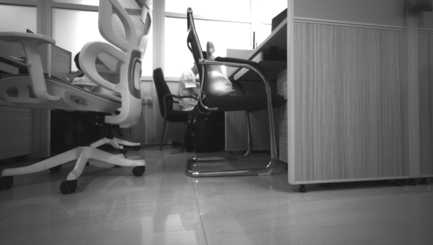

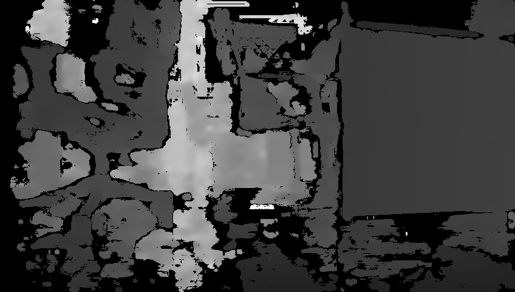

两幅图像的消息类型都是 `sensor_msgs/msg/Image`。下面是实机左红外一帧的节选。像素值在 `data` 里，按行排开，一帧有 `848 × 480` 个字节，这里不展开。节选还省略了 `header.stamp`（拍摄时刻）和 `is_bigendian`（字节序，本机为 0）。

```yaml
# /camera/infra1/image_rect_raw
header:
  frame_id: camera_infra1_optical_frame
height: 480
width: 848
encoding: "mono8"
step: 848
```

`header.frame_id` 是这幅图像所在坐标系的名字。`height`、`width` 是行数和列数，本机为 480 行、848 列。`encoding` 说明每个像素怎么编码：红外是 `mono8`，每像素 1 字节亮度；深度图像是 `16UC1`，每像素 2 字节，单位毫米，0 表示没有有效距离。`step` 是每一行占多少字节，左红外等于列数 848，深度图像是列数的两倍。这两路是相机直接发出的图像，相邻帧的灯并不相同。

## 1.2 红外灯交替亮灭

相机发出的左红外里，相邻两帧并不一样：一帧灯开，一帧灯关。视差来自同一时刻左红外和右红外对亮度的比较。估计平移和转动时还要在前后两帧里找出同一个点，依据同样是亮度，但这两件事对灯的要求相反。

左右比较时，白墙和地面的亮度变化很少，同一行上往往比较不出同一处。投射器打开后，场景上多出许多小亮点，称为散斑，左右红外就更容易比较出同一处亮度图案。

前后帧匹配要的是稳定的场景亮度。散斑不属于场景，灯开着时，相机几乎没动，亮点图案也会变，匹配就不稳。所以做前后帧匹配的那些帧关掉投射器。

同一帧不能又开灯又关灯，于是按帧交替。灯开着的那一帧供左右红外比较出距离；前后帧匹配用的是灯关着的那些帧。下图是相邻两帧左红外。左边灯关，柜门、墙和地面是成片的灰度；右边灯开，同一位置布满细碎亮点。

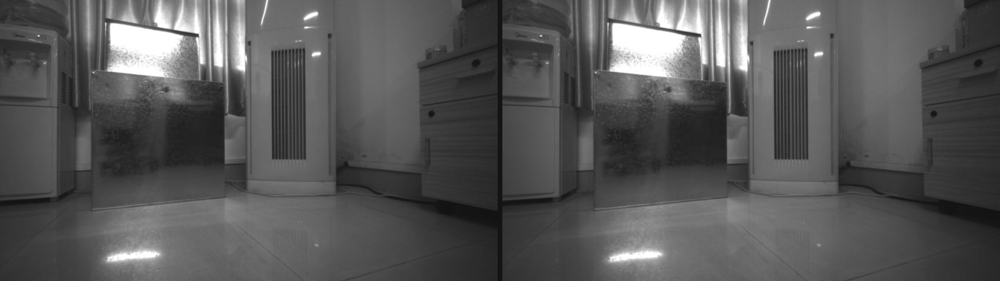

下一张图把上面相邻两帧在同一像素上的亮度相减，再把很小的差拉大。两帧一样亮的地方差接近 0，拉大以后仍是暗的，柜子和墙的轮廓因此变淡。满幅细碎的灰白点只在灯开的那一帧里有，就是散斑，落在灯关时亮度变化很少的墙面和地面上。窗口两帧都过亮，相减后是一块黑白斑块，不是散斑。

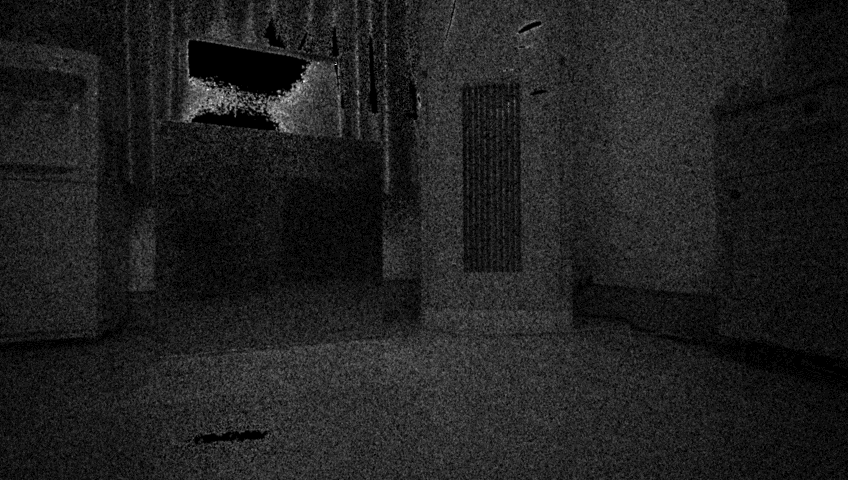

灯开着时算出的距离，和灯关着时的亮度，还在上面两条图像里，拍摄时刻也不同。合成一条消息时，取的就是这两帧。

## 1.3 合成一条消息

灯关着时的亮度用来做前后帧匹配，灯开着时深度图像里的像素是算出的距离。灯按帧交替，亮度和距离是先后拍的，拍摄时刻不同，时间戳也就不同。

估计平移和转动时，要在同一个像素上同时读到这帧亮度和距离，因此必须把亮度和距离当成同一时刻。左红外话题 `/camera/infra1/image_rect_raw` 里取灯关着的那一帧，深度图像的话题 `/camera/depth/image_rect_raw` 里取紧挨着它、灯开着时算出的那一帧。距离和像素位置保持原样，只把深度图像的时间戳改成这帧红外的时间戳，再写入同一条消息。消息里的时刻从此相同，估计运动时就按同一时刻来用；两次拍摄本身仍是相邻的两帧。话题是 `/rtabmap/rgbd_image`，类型是 `rtabmap_msgs/msg/RGBDImage`。

这种同时带有红外图像和深度图像的消息称为 RGB-D（RGB-Depth）。RGB 原指红、绿、蓝三个颜色通道，这里的图像是灯关着时拍下的红外。深度图像每个像素是到镜头的距离。下面是一帧节选，像素值仍在各自的 `data` 里，这里不展开。

```yaml
# /rtabmap/rgbd_image
header:
  frame_id: camera_infra1_optical_frame
rgb:
  encoding: "mono8"
  width: 848
  height: 480
  frame_id: camera_infra1_optical_frame
depth:
  encoding: "16UC1"
  width: 848
  height: 480
  frame_id: camera_depth_optical_frame
```

整条消息的 `header.frame_id` 与红外相同。`rgb` 是灯关着时的亮度，`depth` 是深度图像，每个像素是灯开着时算出的距离，两条图像的时间戳已经相同。

---


# 2. 估计相对出发的运动

合成后的 RGB-D 消息里，同一个像素点上，红外图像存储的是亮度，深度图像存储的是物体到镜头光学中心的距离。距离只是坐标里的 `Z`，还缺左右 `X` 和上下 `Y`。这一节由像素和距离得到镜头前的坐标值，确定相机相对车身的位置，用视觉里程计（Visual Odometry）估计相对出发的运动，从底盘取得轮速，再把两路合成，发布在 `/odom`。建图和定位就得依赖这个运动的估计。

## 2.1 由像素和距离得到坐标

深度图像里的距离只说明这个点离镜头多远，这是坐标里的 `Z`，还不知道它在镜头左右、上下偏了多少。估计平移和转动要比较前后帧里同一个点的坐标 `(X, Y, Z)`。

光学坐标系（Optical Frame）以镜头的光学中心为原点，图上标为 `Fc`。各条视线都看成从这一点穿出；光学中心在镜头上，不在画面里。`Xc` 向右，与列号增加的方向相同；`Yc` 向下，与行号增加的方向相同；`Zc` 沿镜头前方，就是深度图像里的距离。像平面上 `u` 向右、`v` 向下。光轴穿过光学中心，打在画面上的像素才是主点 `(cx, cy)`。红线从空间中的点穿过像素 `(u, v)`，回到光学中心。

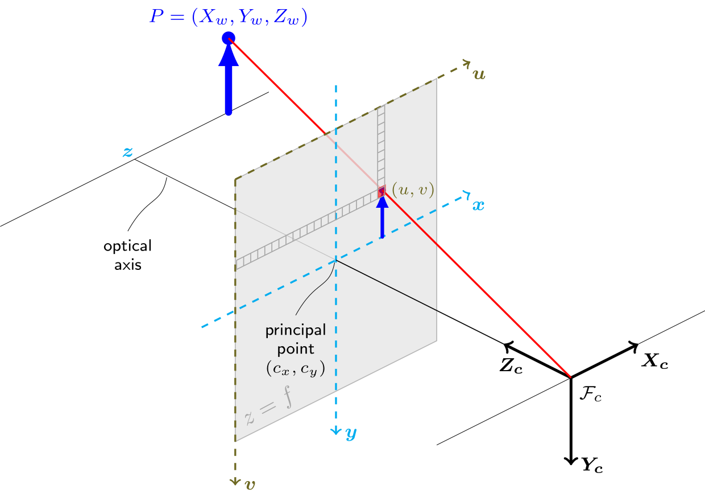

来源：[OpenCV, Camera Calibration and 3D Reconstruction](https://docs.opencv.org/4.x/d9/d0c/group__calib3d.html)。

换算用的一组数称为内参（Intrinsic Parameters）。测出内参的过程称为标定（Calibration），本机出厂时已经完成，写在与图像配套的 `camera_info` 里。内参排成 3×3 矩阵，字段名叫 `k`：

```text
k = [[fx,  0, cx],
     [ 0, fy, cy],
     [ 0,  0,  1]]
```

`fx`、`fy` 是用像素表示的焦距，与视差公式中的焦距是同一个量。本机红外 `fx = fy = 421.374`。`(cx, cy)` 称为主点（Principal Point），是镜头正前方落在图像上的像素，本机为 `(420.745, 239.283)`。

从光学中心看出去，`X` 与 `Z` 构成的三角形，和主点到像素的偏移与 `fx` 构成的三角形共顶角、底边平行，因此 `X/Z` 等于该偏移除以 `fx`。偏移为 `fx·X/Z` 像素，行方向为 `fy·Y/Z`，于是 `u = cx + fx·X/Z`，`v = cy + fy·Y/Z`。

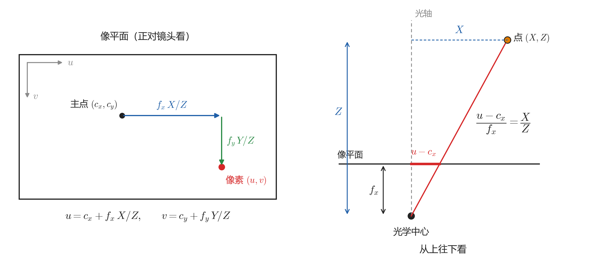

## 2.2 相机相对车身的位置和朝向

坐标 `(X, Y, Z)` 在光学坐标系里，原点在镜头上，还不能表示车在地面上的位置。从一个坐标系到另一个坐标系的平移和转动称为变换，因此还要一段从车身到镜头的变换。车身竖直投到地面后、左右方向的中点上设立坐标系 `base_footprint`，相机外壳的支架螺丝孔上设立坐标系 `camera_d435c_link`。镜头相对车身的位置和朝向由两段变换合起来表示：`base_footprint` 到 `camera_d435c_link` 向前 58.5 mm、左右为 0、高度 28 mm、转角为 0，`camera_d435c_link` 到光学坐标系的转动由相机驱动发布。螺丝孔与光学中心不重合，所以前一段平移不是光学中心相对车身的距离，地图尺度会因此略有偏差。

## 2.3 视觉里程计

合成后的 RGB-D 消息里，每个像素上同时有亮度和距离，由 2.1 的公式可以算出这个像素对应的点在光学坐标系里的坐标 `(X, Y, Z)`。车移动后，同一个点在下一帧落到另一个像素上，算出的坐标也随之改变；由若干个点在前后帧里的坐标变化，可以反推镜头在这段时间里的转动和平移，逐帧累计就是相对出发的运动。由图像估计运动的过程称为视觉里程计（Visual Odometry, VO）。视觉里程计分四步：在当前帧上选出能够在下一帧里被认出的像素；记下这些像素周围的亮度关系，据此在最近若干帧里找出同一个点；由找出的对应求出这一帧的位姿；把位姿发布出去。

### 特征点

前后帧匹配要在下一帧里认出同一个像素。亮度均匀的墙面或地面上，相邻像素几乎一样，无法确定对应的是哪一个；只有与周围像素明显不同的像素才能被认出，这样的像素称为特征点（Feature）。判断一个像素能否与周围区分，以它为中心取一个窗口，把窗口向各个方向平移一小段，看窗口内的亮度是否随之改变：平移后亮度几乎不变，说明这个像素与周围分不开。

窗口内每个像素与右侧相邻像素的亮度差记为 `Ix`，与下方相邻像素的亮度差记为 `Iy`，对窗口内全部像素求和得到矩阵 `M`：

```text
M = [[Σ Ix^2,   Σ Ix·Iy],
     [Σ Ix·Iy,  Σ Iy^2]]
```

窗口平移 `(Δu, Δv)` 后，窗口内亮度改变量的平方和近似等于 `[Δu, Δv] M [Δu, Δv]^T`。`M` 的两个特征值 `λ1`、`λ2` 分别是亮度改变最小和最大的两个方向上这一平方和的大小，所以只看较小的 `λ1`，就知道最不利的方向上亮度会不会改变。下图把三种窗口放在一起比较：均匀区域上向任何方向平移亮度都几乎不变，`λ1`、`λ2` 都接近 0；边缘上沿边缘平移亮度不变，只有跨过边缘才改变，`λ1` 接近 0 而 `λ2` 较大；角点上向任何方向平移亮度都改变，`λ1`、`λ2` 都较大。前两种窗口的中心像素在下一帧里都找不回来，只有 `λ1` 较大的像素才作为特征点。这一判据称为适合跟踪的特征（Good Features to Track, GFTT）。

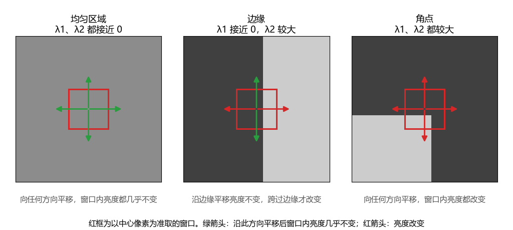

每帧最多保留 1500 个特征点。距离不在 0.20～4.0 m 内的像素不作为特征点：太近时深度图像没有有效距离，太远时距离的误差过大。下图是实机一帧左红外，红点是这一帧算出的特征点。红点落在背包、饮水机和柜子的棱角上，地面和窗帘上亮度均匀的区域没有红点，与上面三种窗口的判断一致。

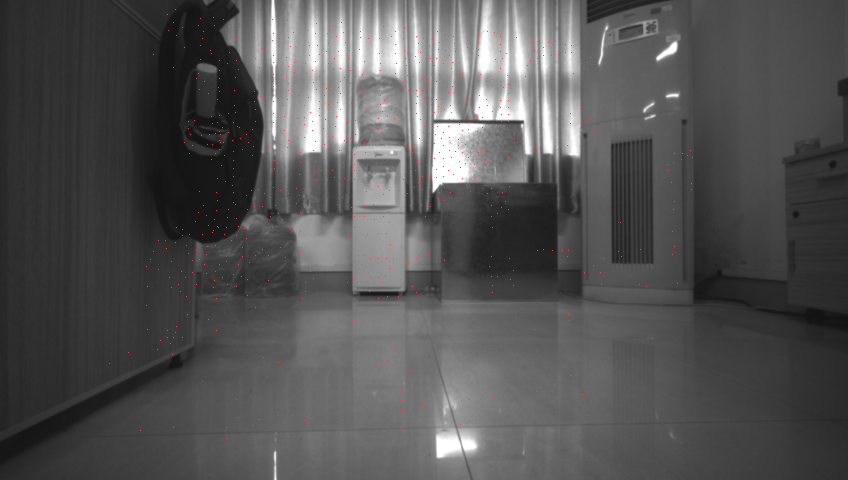

### 描述与匹配

特征点只给出位置，要在另一帧里认出它，还要记下它周围的亮度关系。在特征点周围按固定的排列取若干对像素，每一对比较哪一个更亮，记为 1 或 0，得到一串二进制数，这串数称为二进制鲁棒独立基本特征（Binary Robust Independent Elementary Features, BRIEF）。两个特征点的 BRIEF 中取值不同的位越少，两者周围的亮度关系越接近。最近若干帧的特征点连同各自的 BRIEF 已经保存下来；当前帧每个特征点的 BRIEF 与它们逐一比较，取值不同的位最少的那个当作同一个点。这一步称为匹配（Matching），匹配的结果是若干对对应：当前帧上的像素 `(u, v)`，以及它在最近若干帧里对应的那个特征点。

### 求解位姿

车的位置和朝向合称位姿（Pose），写成转动 `R` 和平移 `t`。最近若干帧的特征点在被记下时，已经用 2.1 的公式由像素和距离算出光学坐标系里的坐标，再用当时的位姿换到出发坐标系里，记为 `x`。当前帧的位姿还未知。对每一对匹配，用待求的 `R`、`t` 把 `x` 换到当前镜头前，再按 2.1 的公式 `u = cx + fx·X/Z`、`v = cy + fy·Y/Z` 投影到像素；投影得到的列号、行号与当前帧上实际匹配到的 `(u, v)` 之差称为重投影误差（Reprojection Error）。使全部匹配的重投影误差平方和最小的 `R`、`t`，就是这一帧的位姿。已知若干个点的空间坐标和它们在图像上的像素、反求相机位姿的问题称为透视 n 点问题（Perspective-n-Point, PnP）。下图在像平面上画出这一过程：红圈是当前帧上匹配到的特征点，蓝点是已记下的 `x` 按 `R`、`t` 投影到的像素。求解前蓝点与红圈分开，虚线的长度就是重投影误差；求解后蓝点落在红圈上。

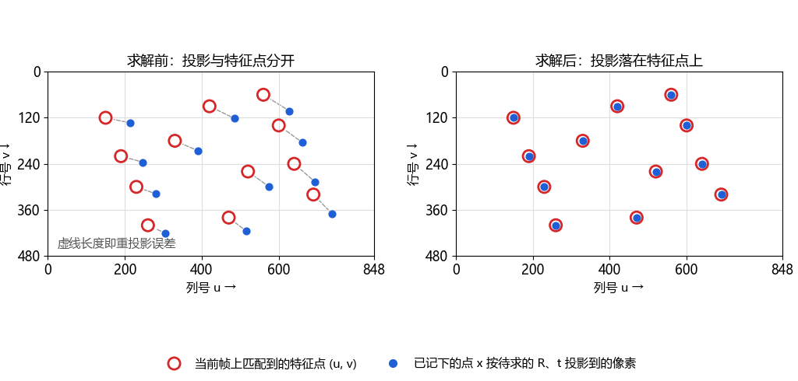

匹配里混有错配。求解时先随机取少数几对匹配算出一组 `R`、`t`，再统计全部匹配里重投影误差不超过 2 像素的有多少对，这些匹配称为内点（Inlier）；反复若干次，取内点最多的一组，再用全部内点重新求解。内点不少于 10 个时采用这个位姿；不足 10 个说明当前帧与最近若干帧对不上，判为跟丢（Lost），这一帧不给出位姿。

### 发布位姿

位姿由节点 `vision_rgbd_odometry` 发布在 `/odom_vo`，消息类型 `nav_msgs/msg/Odometry`。求出的位姿是镜头相对出发时镜头的运动；发布前用 2.2 里镜头相对车身的变换换算，写成车身坐标系 `base_footprint` 相对出发原点的位姿，出发原点上的坐标系名为 `odom`。消息里 `header.frame_id` 是 `odom`，`child_frame_id` 是 `base_footprint`，`pose.pose.position` 是位置 `(x, y, z)`，单位米；`pose.pose.orientation` 是朝向，写成四元数（Quaternion）`(x, y, z, w)`，四个数合起来表示一个转动，无转动时为 `(0, 0, 0, 1)`。

```yaml
# /odom_vo
header:
  frame_id: odom
child_frame_id: base_footprint
pose:
  pose:
    position: { x: ..., y: ..., z: ... }
    orientation: { x: ..., y: ..., z: ..., w: ... }
```

内点数和是否跟丢发布在 `/odom_info_lite`，类型 `rtabmap_msgs/msg/OdomInfo`，字段为 `inliers` 和 `lost`。跟丢时 `/odom_vo` 仍会发出消息，但四元数四个数全为 0，不是有效的朝向。实机抓取的一帧 `inliers` 为 238，`lost` 为 false。

## 2.4 轮速里程计

视觉里程计给出的运动来自图像。底盘另有一条估计：每个车轮上的编码器记录轮子转过的角度，底盘由转角算出车速，再把车速随时间累计成车相对上电时位置的前后、左右位移和偏航（Yaw，车头在地面上的朝向角）。由轮子转角累计运动的估计称为轮速里程计（Wheel Odometry），底盘节点把它发布在 `/wheel/odom`，类型同样是 `nav_msgs/msg/Odometry`，`header.frame_id` 为 `wheel_odom`，`child_frame_id` 为 `base_footprint`。车在地面上行驶，轮速里程计只有前后、左右和偏航三个量，高度为 0。

底盘不一定启动。建图时车可以由人推动，底盘不启动就没有 `/wheel/odom`；导航时速度要发给底盘，底盘必然启动。

## 2.5 合成一条运动

两条估计各有短处：视觉在特征点不足或镜头被遮挡时跟丢；轮速在轮子打滑时累计出错，而且底盘可能没有启动。建图和定位只订阅一条运动 `/odom`，所以由节点 `vision_hold_odom_tf` 把两条合成后发布在 `/odom`，消息类型和坐标系名与 `/odom_vo` 相同。

合成按以下规则进行。`/wheel/odom` 持续到达（最近一条不早于 0.3 s）时采用轮速：以收到的第一条轮速位姿为出发原点，之后每条都换成相对该原点的前后、左右和偏航写入 `/odom`。轮速不到时采用 `/odom_vo` 上的视觉位姿。视觉位姿的四元数无效，也就是跟丢时，在这一帧的时间戳上重复上一条有效位姿，`/odom` 不中断。视觉位姿相对上一条跳过 1 m 或 1 rad，视为视觉里程计重新从零出发，把新的起点接在上一条之后，`/odom` 不跳回出发处。`/odom` 的时间戳取当时采用的那一路。

`/odom` 上的运动仍以本次出发的停车点为原点，只说明车相对出发处走了多远。它与镜头、场地之间的关系由第 3 节接起来。

---


# 3. 连接图像、车体与场地

第 2 节交出了两类量：镜头前的坐标 `(X, Y, Z)` 在光学坐标系里，车相对出发的运动在 `/odom` 上，以 `base_footprint` 相对 `odom` 的位姿表示。建图要把每一帧看到的点放到同一张场地的图上，规划路径要知道车在场地上的位置，两件事都要把不同坐标系里的量换到同一个坐标系。这一节先说明 ROS 2 里保存和串接变换的机制，再区分车身、出发点和场地三个坐标系，最后写明每一段变换由谁发布。

## 3.1 坐标变换

一个点从光学坐标系换到场地，要依次经过相机外壳、车身和出发原点，相邻两个坐标系之间是一段平移和转动，而且各段由不同的节点算出：安装关系在启动时给定，相对出发的运动来自 `/odom`，相对场地的修正来自建图。ROS 2 把这些带名字的变换收在一起，并能按坐标系的名字把几段接起来，这个机制称为坐标变换（Transform, TF）。每段变换写明父坐标系和子坐标系的名字，以及子坐标系相对父坐标系的平移和转动，本文写成 `父→子`。查询时给出两端的名字，得到子相对父的平移和转动；两端之间隔着别的坐标系时，TF 把中间各段接上，查询的程序不必知道每一段由谁发布。随时间变化的变换发布在话题 `/tf`，安装之后不再改变的变换发布在 `/tf_static`，消息类型都是 `tf2_msgs/msg/TFMessage`。

## 3.2 车身、出发点与场地

2.2 已在车身竖直投到地面的位置设立了车身坐标系 `base_footprint`，相机的安装关系挂在它下面。`/odom` 上的运动是 `base_footprint` 相对出发原点的位姿，出发原点上的坐标系名为 `odom`，因此 `odom→base_footprint` 就是 `/odom` 里的位姿。运动由一段一段的估计累加而来，每段都带误差，走得越远，`odom` 里的位置偏离实际位置越多，这段偏差称为累计误差。

场地上另设坐标系 `map`，固连在环境上，车在 `map` 里的位置和朝向由建图和定位给出。修正不直接写进 `odom→base_footprint`：若每次修正都改动这段变换，车的位置会随修正跳变，按路径控制速度的程序读到的运动就不再平滑。修正另记为一段 `map→odom`：`odom→base_footprint` 保持平滑的累计运动，`map→odom` 记出发原点相对场地的偏差，两段接起来才是车在场地上的位置。下图把两段分开画：左图只有 `odom→base_footprint`，蓝色的路程从出发点起累计，末端偏离了车的实际位置；右图加上 `map→odom`，整个 `odom` 坐标系被移动和转动，蓝色路程的末端落回实际位置，而路程本身没有改变。

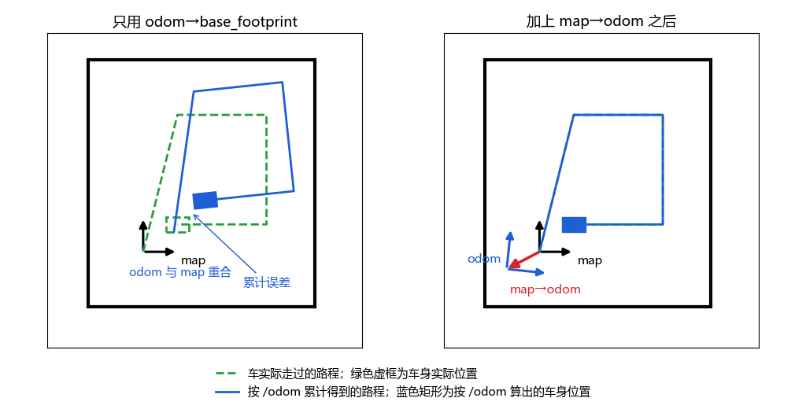

三个坐标系的名字、固连对象和含义列在下表。


| 名称               | 固连对象      | 含义                 |
| ---------------- | --------- | ------------------ |
| `map`            | 环境        | 车在环境中的位置，由建图和定位修正  |
| `odom`           | 本次出发时的停车点 | 相对出发累计的运动，平滑但带累计误差 |
| `base_footprint` | 车身在地面上的投影 | 车身坐标系，原点在投影的左右中线上  |


从 `map` 到镜头的各段坐标系在下图中连成一条链：`map` 到本次出发的 `odom`，`odom` 到车身 `base_footprint`，再从车身到相机外壳 `camera_d435c_link` 和光学坐标系。车体的其他零件和轮速里程计的原点也挂在 `base_footprint` 之下。箭头从父坐标系指向子坐标系，箭头旁是这一段变换的发布者，3.3 逐段说明。

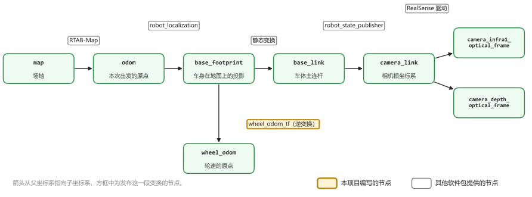

## 3.3 变换的发布

链上各段由不同节点发布，下表按从场地到镜头的顺序列出。


| 段                                          | 发布者                                                             | 话题                 |
| ------------------------------------------ | --------------------------------------------------------------- | ------------------ |
| `map→odom`                                 | 建图节点 `vision_rtabmap`；收到第一张占用栅格之前由 `vision_hold_odom_tf` 发布恒等变换 | `/tf`              |
| `odom→base_footprint`                      | `vision_hold_odom_tf`，与 `/odom` 同一条位姿                           | `/tf`              |
| `base_footprint→camera_d435c_link`         | 静态发布器                                                           | `/tf_static`       |
| `camera_d435c_link→光学坐标系`                  | 相机驱动                                                            | `/tf`              |
| `base_footprint→base_link`、`base_link→轮连杆` | 静态发布器、`vision_robot_state_publisher`                            | `/tf_static`、`/tf` |
| `base_footprint→wheel_odom`                | `wheel_odom_tf`（有底盘时）                                           | `/tf`              |


`map→odom` 在建图刚开始时还没有内容：第一张占用栅格发出之前，建图节点不发布这一段，显示程序把固定坐标系设为 `map` 时就画不出车体。`vision_hold_odom_tf` 在收到 `/map` 之前代为发布恒等变换，即无平移、无转动；收到 `/map` 后停止，这一段改由 `vision_rtabmap` 发布，第 4 节写它怎样得到修正量。

`odom→base_footprint` 与 `/odom` 是同一条位姿：`vision_hold_odom_tf` 每发布一条 `/odom`，就把同一位姿以同一时间戳写成这段变换发到 `/tf`，另以当前时间每 0.05 s 重发一次，查询当前时刻的程序总能得到这一段。

`base_footprint→camera_d435c_link` 是 2.2 给出的安装位置，由静态发布器在启动时发到 `/tf_static` 一次：平移向前 58.5 mm、高 28 mm，转动为无转动的四元数 `(0, 0, 0, 1)`。

```yaml
# /tf_static 中的一项
header:
  frame_id: base_footprint
child_frame_id: camera_d435c_link
transform:
  translation: { x: 0.0585, y: 0.0, z: 0.028 }
  rotation: { x: 0.0, y: 0.0, z: 0.0, w: 1.0 }
```

`camera_d435c_link→光学坐标系` 由相机驱动发布。车身坐标系的 x 向前、y 向左、z 向上，而 2.1 的光学坐标系 `Zc` 沿镜头前方、`Xc` 向右、`Yc` 向下，所以这一段是一个固定的转动，把光学坐标系里的 `(Xc, Yc, Zc)` 换成车身方向上的 `(Zc, −Xc, −Yc)`。这一段没有平移，驱动把光学中心放在 `camera_d435c_link` 的原点上；螺丝孔到光学中心的实际距离没有写进任何一段，这就是 2.2 所说偏差的来源。

车体各零件之间的变换由 `vision_robot_state_publisher` 按统一机器人描述格式（Unified Robot Description Format, URDF）发布。URDF 描述车体由哪些连杆（Link）和关节（Joint）组成，以及相邻连杆之间的位置和转动。`base_link` 是 URDF 里车体主连杆上的坐标系，相对 `base_footprint` 有固定高度；四个轮连杆挂在 `base_link` 下，`vision_joint_state_publisher` 把轮关节的转角固定为零，轮连杆才有确定的位置。

`base_footprint→wheel_odom` 是反过来发布的一段。`/wheel/odom` 写的是 `base_footprint` 相对 `wheel_odom` 的位姿，照原样发布就是 `wheel_odom→base_footprint`，`base_footprint` 会同时有 `odom` 和 `wheel_odom` 两个父坐标系，而 TF 里每个坐标系只能有一个父坐标系。`wheel_odom_tf` 因此把这条位姿求逆，发成 `base_footprint→wheel_odom`，`base_footprint` 仍只有 `odom` 一个父坐标系；查询 `wheel_odom` 到 `base_footprint` 时，TF 把逆变换再反过来，得到的仍是轮速位姿。

至此，任一时刻由 TF 都能查出光学坐标系到 `map` 的整段变换。第 4 节用它把每一帧看到的点放到场地上。

---


# 4. 建立地图

镜头前的点已经能经 TF 换到场地坐标系 `map`，车相对出发的运动在 `/odom` 上。这一节把沿途的图像和位姿写成地点记录存入数据库，由每条记录的距离得到俯视格子并拼成占用栅格，再在车回到旧地点时用回环修正位置。边确定车的位置边写入地图，称为同时定位与建图（Simultaneous Localization and Mapping, SLAM）。本车使用实时外观建图（Real-Time Appearance-Based Mapping, RTAB-Map），"外观"指它靠图像看起来是否相同来认出旧地点。定位时还要用这里留下的图像和占用栅格。

## 4.1 地点记录与数据库

建图节点 `vision_rtabmap` 订阅 `/rtabmap/rgbd_image` 和 `/odom`，每秒最多处理一帧。每处理一帧，先从 `/odom` 取出这帧时刻车相对出发的位姿；相对上一条记录平移不足 0.05 m 且转动不足 0.05 rad 时，这帧不写入；超过其一，就把这帧的红外图像、深度图像、由红外算出的特征点及其描述，连同这帧的位姿写成一条地点记录，并在它与上一条记录之间存下由 `/odom` 得到的相对位姿，作为两条记录之间的约束。RTAB-Map 内部把这样一条记录称为 node，与 ROS 节点不是同一事物，本文称地点记录；被选来写入的帧称为关键帧。

地点记录写入磁盘数据库，扩展名 `.db`。进程退出后文件仍保留，定位时读取的就是它。2026-09-21 这次建图共写入 434 条地点记录。视觉跟丢时若 `/odom` 仍由轮速更新，记录照常写入；`/odom` 没有更新时，这帧的位姿无从确定，不写入。

## 4.2 由距离得到占用栅格

规划路径要知道地面上哪些格子能通行，深度图像给出的却是前方每个像素的距离。每写入一条地点记录，就把这帧深度图像投到俯视的格子上：先用 2.1 的公式由列号、行号和距离算出光学坐标系里的点，再经 `光学坐标系 → camera_d435c_link → base_footprint` 换到车身坐标系。距离不在 0.20～4.0 m 内的点不参与。车身坐标系里的高度决定点的归类：−0.10～0.10 m 是地面，落到的格子记为空闲；0.10～1.80 m 是障碍，格子记为占用；高于 1.80 m 的点是天花板或灯，不记。相机到每个地面点或障碍点之间视线经过的格子也记为空闲，因为视线能到达说明中途没有障碍。半径 0.10 m 内不足 5 个邻点的孤立点当作噪声去掉。下图从侧面看这一归类：贴地的一条是空闲，往上到 1.80 m 是障碍，再高的不记，相机到障碍之间的地面标为空闲。

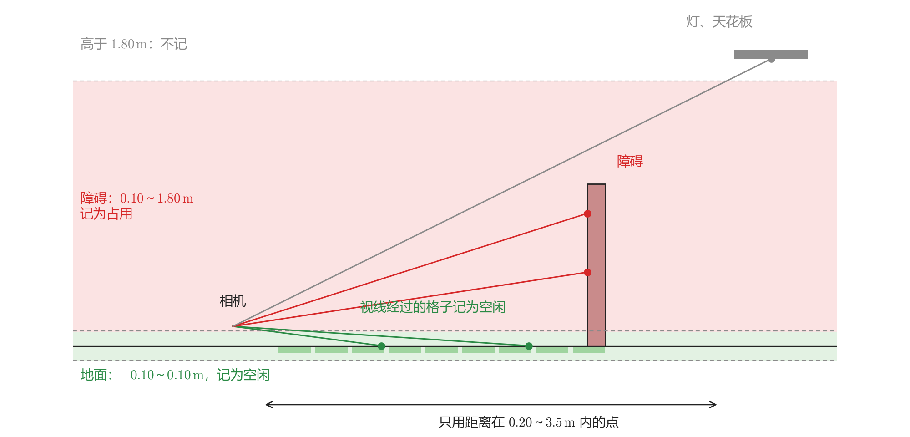

每条记录由此得到一张边长 0.05 m 的局部俯视格子，位置以这条记录的位姿为准。把所有记录的局部格子按各自在 `map` 中的位姿拼在一起，就是整张占用栅格（Occupancy Grid），发布在 `/map`，类型 `nav_msgs/msg/OccupancyGrid`。消息的 `data` 是一维数组，每个元素对应一个格子：`0` 空闲，`100` 占用，`-1` 未知；按行存放，从格子 `(0, 0)` 起沿 x 方向写完 `info.width` 个再增加 y。`info.resolution` 是格子边长，`info.origin` 是格子 `(0, 0)` 左下角在 `map` 中的位姿。图像像素的 `(0, 0)` 在左上角、行号向下，栅格的 `(0, 0)` 在左下角、y 向上，两种约定相反。下面是一张 4 列 3 行的栅格与它的 `data`：

```text
y 向上
2 |  -1    0   100    0
1 |   0    0   100    0
0 |   0    0     0    0
    +----+----+-----+----→ x
data: [0, 0, 0, 0,  0, 0, 100, 0,  -1, 0, 100, 0]
```

这次建图得到的栅格为 168 列、272 行，边长 0.05 m，即 8.4 m × 13.6 m，`info.origin` 约为 (−3.50, −5.98) m。下图把它画成图像：白色为空闲，黑色为占用，灰色为尚未看到的未知格。中间成片的白色是车走过的通道，包围它的黑色是墙和家具。

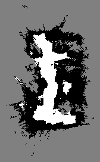

RViz 把占用栅格和车体画在同一画面里，下图固定坐标系为 `map`。左侧是当时的左红外图像，中央是占用栅格和车体，相机正对的柜子和饮水机对应车前方的黑色格子。

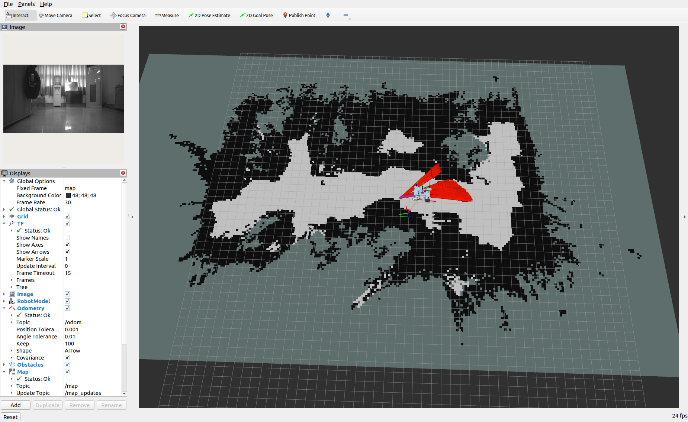

障碍点除了写入栅格，还以三维点的形式发布在 `/cloud_obstacles`，类型 `sensor_msgs/msg/PointCloud2`。按路径控制速度时用它补充栅格里尚未写入的障碍。

## 4.3 回环

`/odom` 上的运动带累计误差。车绕场地一圈回到出发处时，按 `/odom` 算出的位置已经偏离出发处，若按这个位置拼接局部格子，同一堵墙会在栅格上出现两次。回到已经写入的地点时，当前红外图像与那条地点记录的图像看起来相同，两条记录之间就可以加一条新的约束，这一次识别称为回环（Loop Closure）。

识别用的是与视觉里程计同样的特征点和描述。库中每条记录的特征点描述已经存下；当前帧的描述与各条记录比较，相同的描述越多，那条记录越可能是同一地点。最可能的那条记录可信到一定程度时，再用 2.3 求位姿的方法在两帧之间求出相对位姿并统计内点，通过后把这段相对位姿作为回环约束加入。除按图像识别外，按 `/odom` 判断在空间上靠近、而时间上隔了很久的记录，也直接尝试求相对位姿，这类约束称为近邻约束。

所有地点记录和它们之间的约束构成位姿图（Pose Graph）：每条记录一个位姿，每条约束一段相对位姿。加入回环约束后重新求解全部位姿，使各约束的偏差平方和最小，这一步称为图优化。本车限制在平面上求解，只改前后、左右和偏航。优化后若某条约束的偏差超过 3 倍标准差，这次回环被当作误匹配拒绝，位姿退回优化前。接受后，全部记录的位姿更新，占用栅格按新位姿重新拼接；当前记录优化后的位姿与 `/odom` 上位姿之差写成 `map→odom` 发布，所以回环被接受时 `map→odom` 会跳变，而 `odom→base_footprint` 不受影响，这正是 3.2 把修正另记一段的原因。

这次建图的 434 条地点记录之间有 121 条回环约束和 28 条近邻约束。下图两帧红外取自库中的记录 98 和 330，是同一处在不同时刻的图像，两帧看起来相同，回环才在它们之间加入约束。

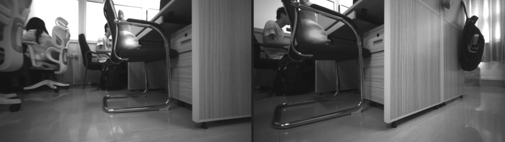

地点记录优化后的位姿画在 `/map` 上。蓝线按时间先后把记录连起来，是车走过的路程；红线连接隔了很久又看到的同一地点，跨过中间的路程，就是回环约束。绿点为第一条记录，橙箭头为最后一条记录的位置和朝向。

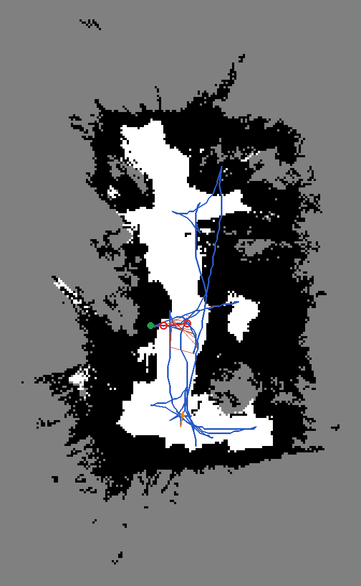

建图的数据流到此完整。下图把第 1 节到第 4 节从左到右排开：左红外图像和深度图像合成一条消息，视觉里程计由它估计运动，与轮速合成后发布在 `/odom`，建图节点由 `/rtabmap/rgbd_image` 和 `/odom` 写入地点记录、拼出占用栅格并发布修正。框内第二行是节点名或话题名。


---


# 5. 在已有地图上定位

建图留下了地点数据库和占用栅格。定位时相机、合成一条消息、视觉里程计和合成一条运动照常运行，`vision_rtabmap` 读取同一个数据库，把库中全部地点记录载入内存，但不再写入新记录；占用栅格从库中的记录重新拼出并发布在 `/map`，与建图结束时相同。规划路径时用的是定位得到的车在地图上的位姿，以及这张 `/map`。

定位做的就是 4.3 的回环识别，只是比较对象换成库中全部记录。当前红外图像的特征点描述与各条记录比较，找到同一地点并用 2.3 的方法求出相对位姿后，那条记录在 `map` 中的位姿加上这段相对位姿，就是车此刻在 `map` 中的位姿；它与 `/odom` 上位姿之差写成 `map→odom` 发布。两次识别之间，车的位置由 `odom→base_footprint` 的累计运动推进；长时间识别不出时，`map→odom` 停留在上一次的值，车在地图上的位置随累计误差偏离。库中没有记录，识别就没有对象，定位不会给出位置。

下图是定位时相机正在看到的左红外，以及画在已有 `/map` 上的车体。识别得到的车身位置和朝向用橙箭头表示，蓝框是车身在地面上的投影，蓝线是建图时记录连成的路程，用来对照当前位置落在原路程的哪一段。这次抓取时车在 `map` 中的位置为 (0.13, 0.14) m，偏航 0.28 rad。

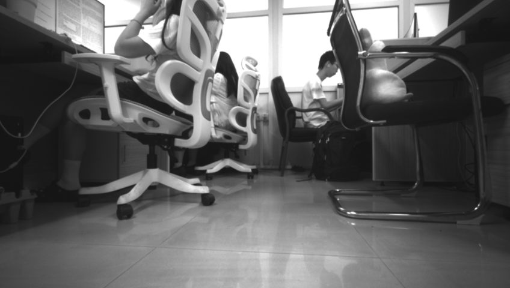

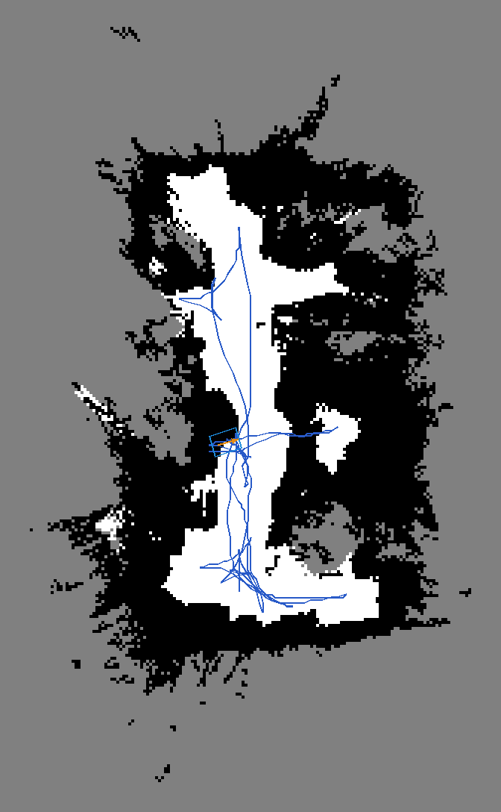

刚启动或车被搬动后，识别可能一时找不到对应的记录。此时可在 RViz 上用 2D Pose Estimate 指出车的大致位置，发布到 `/initialpose`，类型 `geometry_msgs/msg/PoseWithCovarianceStamped`，`frame_id` 为 `map`；定位节点以它作为 `map→odom` 的初值，之后的识别再修正。

---


# 6. 规划到目标的路径

车在地图上的位姿和占用栅格已经有了。这一节先由占用栅格得到代价地图，再在代价地图上计算到目标点的路径。按路径控制速度时用的就是这条路径。

## 6.1 代价地图

占用栅格只区分格子本身是否被占用，而车有宽度：车身中心走在紧贴障碍的空闲格上，车身仍会碰到障碍。因此在每个占用格周围按车身尺寸标出一圈高代价区域，规划时路径的中心线不进入这一圈；这样得到的图称为代价地图（Costmap），标出的一圈称为膨胀（Inflation）。车身尺寸由足迹（Footprint）给出，足迹是车身在地面上的多边形，顶点以 `base_footprint` 为原点，单位米：

```text
[[-0.09, -0.185], [-0.09, 0.185], [0.4, 0.185], [0.4, -0.185]]
```

即车身宽 0.37 m，从原点向后 0.09 m、向前 0.40 m。

代价地图有两张。全局代价地图覆盖整张 `/map`，坐标系为 `map`，膨胀半径 0.25 m，用来规划整条路径。局部代价地图只覆盖车周围 3 m × 3 m，坐标系为 `odom`，随车移动，膨胀半径 0.10 m，用来控制速度；除 `/map` 外，它还订阅 `/cloud_obstacles`，把相机刚看到、栅格里尚未写入的障碍放进来。局部代价地图用 `odom` 而不用 `map`，是因为 `map→odom` 在回环时会跳变，控制速度要的是平滑的运动。

下图是全局代价地图。黑色为占用，白色为空闲，灰色为未知；橙色是占用格周围的膨胀带，车身边缘会擦到的一圈。蓝框是足迹，橙箭头是当时车头的朝向；路径必须让蓝框始终留在白色区域里。

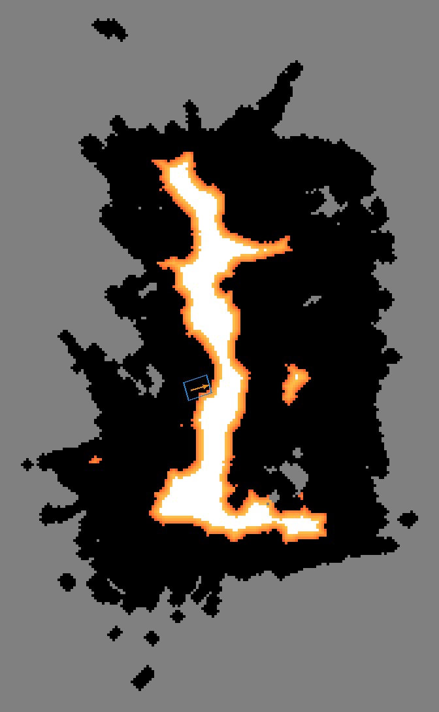

## 6.2 计算路径

目标点在 RViz 上用 2D Goal Pose 指定，发布到 `/goal_pose`，类型 `geometry_msgs/msg/PoseStamped`，`frame_id` 为 `map`：

```yaml
# /goal_pose
header:
  frame_id: map
pose:
  position: { x: ..., y: ..., z: 0.0 }
  orientation: { x: 0.0, y: 0.0, z: ..., w: ... }
```

收到目标点后，导航开始一次前往该目标的任务。任务以动作（Action）的形式运行：动作是带目标、反馈和结果、可以中途取消的长时间任务，这次任务的动作名为 `NavigateToPose`。任务里的规划步骤 `ComputePathToPose` 由 TF 查出 `base_footprint` 在 `map` 中的位姿作为起点，在全局代价地图上搜索一条从起点到目标、只经过低代价格子的路径，发布在 `/plan`，类型 `nav_msgs/msg/Path`，即 `map` 坐标系里的一串位姿。任务进行中每秒重新规划一次，使路径跟随车的实际位置和地图的变化。起点或目标落在占用格、膨胀带或未知格上时找不到路径，位姿序列为空。

下图绿线是规划出的路径，红圈是目标点，蓝框是车身足迹。路径沿白色区域走，与两侧的膨胀带保持距离。

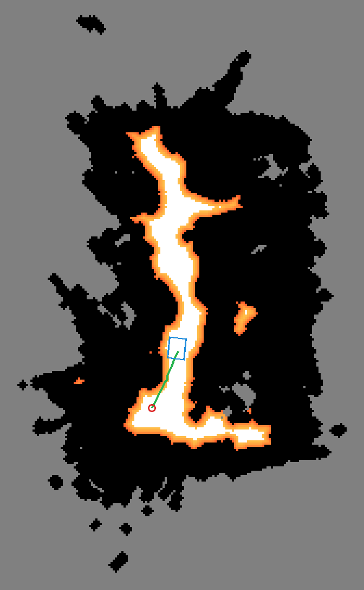

---


# 7. 按路径控制速度

到目标的路径已经算出。这一节由路径计算发给底盘的速度，跟踪失败后按顺序恢复，视觉跟丢时把速度改为零。

## 7.1 控制器

路径只是 `map` 里的一串位姿，车要按它行驶还需要每一时刻的速度。任务里的跟踪步骤 `FollowPath` 就是控制器：它由 TF 得到车当前的位姿，订阅 `/odom` 得到当前速度，读局部代价地图和路径，反复计算下一小段时间的速度，发布到 `/cmd_vel`，类型 `geometry_msgs/msg/Twist`。`linear.x` 是前后方向的线速度，单位 m/s，正为前进、负为倒车；`angular.z` 是绕竖直轴的角速度，单位 rad/s。车为前轮转向，不能原地转向，车头方向被障碍挡住时，控制器给出负的 `linear.x`，先倒车再调整方向。

下图是同一时刻的局部代价地图：白色为空闲，黑色为不可通行，蓝框是足迹，橙箭头是车头朝向。控制器只依据这块随车移动的图和路径决定这一刻的速度，不看整张地图。

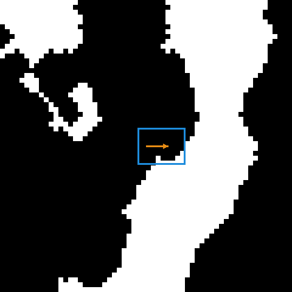

## 7.2 跟踪失败后的恢复

规划步骤找不到路径时，先清除全局代价地图再规划 1 次；跟踪步骤跟不上路径时，清除局部代价地图再跟踪 1 次。清除代价地图是把由 `/cloud_obstacles` 放进来的障碍抹掉，只留 `/map` 里的占用，因为刚看到的障碍可能是噪声，也可能已经离开。整次任务仍失败时，最多再做 6 轮恢复，每轮轮流执行一项：清除两张代价地图；以 0.08 m/s 倒退 0.25 m（`BackUp`）；等待 5 s（`Wait`），然后重新规划。恢复期间若收到新的目标点，直接转向新目标。车不能原地转向，所以恢复动作里没有原地旋转，靠倒退离开被堵住的位置。

## 7.3 视觉跟丢

控制器算出的速度不直接发给底盘。节点 `vision_vo_watchdog` 接在控制器和底盘之间：订阅 `/cmd_vel`，正常时原样转发到 `/cmd_vel_safe`，底盘订阅的是 `/cmd_vel_safe`。它同时订阅 `/odom_info_lite` 和 `/odom_vo`：`/odom_info_lite` 标明跟丢，或内点数连续 5 帧少于 10，或 `/odom_vo` 里的四元数无效，就判为跟丢。跟丢意味着当前图像已经无法与地图对上，车在地图上的位置不再可靠，此时向 `/cmd_vel_safe` 发全零速度使车停下，并调用 `/navigate_to_pose/_action/cancel_goal` 取消这次 `NavigateToPose` 任务。内点恢复后状态先记为 `recovering` 并恢复转发，下一帧仍正常则回到 `ok`。状态发布在 `/vision/vo_status`。

定位与导航的数据流到此完整。下图把第 5 节到第 7 节从左到右排开：定位给出 `/map` 和 `map→odom`，占用栅格和 `/cloud_obstacles` 进入两张代价地图，目标点和全局代价地图进入规划，路径、局部代价地图和 `/odom` 进入控制器，速度经看门狗到底盘；看门狗由 `/odom_info_lite` 判断跟丢，跟丢时发全零速度并取消任务。

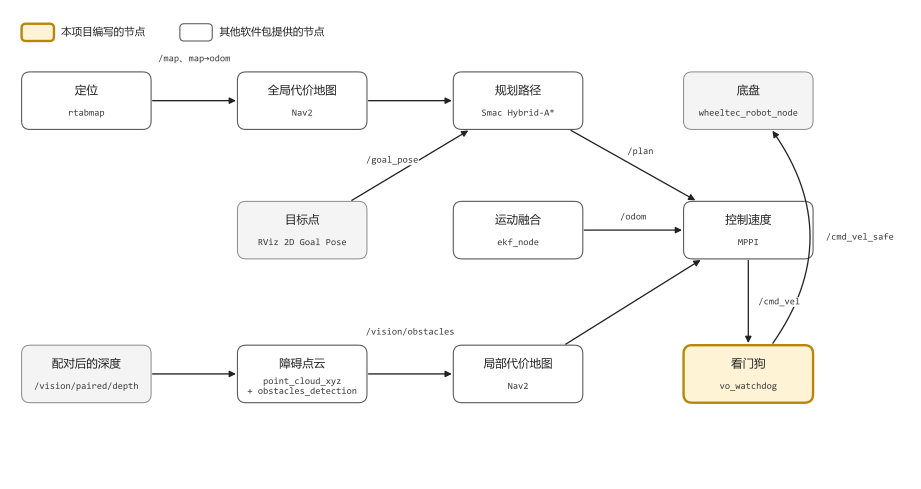

---


# 附录：实机查询

功能包在 `src/wheeltec_vision_nav`。建图，或定位与导航运行时，另开终端。下列命令在已加载覆盖安装的终端执行。部分话题只在对应启动运行之后才出现。工作空间是合并安装。

```bash
source /home/wheeltec/vision_ws/source_overlay.bash
```


## 消息类型

```bash
ros2 interface show sensor_msgs/msg/Image
ros2 interface show sensor_msgs/msg/CameraInfo
ros2 interface show rtabmap_msgs/msg/RGBDImage
ros2 interface show rtabmap_msgs/msg/OdomInfo
ros2 interface show nav_msgs/msg/Odometry
ros2 interface show nav_msgs/msg/OccupancyGrid
ros2 interface show geometry_msgs/msg/Twist
ros2 interface show geometry_msgs/msg/PoseStamped
```


## 图像与里程计

图像话题的可靠性为 best effort，查询时加 `--qos-reliability best_effort`。`/map` 的持久性为 transient_local，晚加入的订阅者仍能收到发布者保留的最后一张地图。`/vision/paired/...` 是 1.3 合成之前已经配对好的两路图像，两路的时间戳相同；合成后的 RGB-D 消息内两条图像的时间戳也相同。

```bash
ros2 topic echo --once /camera/infra1/image_rect_raw --qos-reliability best_effort --no-arr --field encoding
ros2 topic echo --once /camera/depth/image_rect_raw --qos-reliability best_effort --no-arr --field encoding
ros2 topic echo --once /vision/paired/infra1/image_rect_raw --qos-reliability best_effort --no-arr --field header
ros2 topic echo --once /vision/paired/depth/image_rect_raw --qos-reliability best_effort --no-arr --field header
ros2 topic echo --once /rtabmap/rgbd_image --qos-reliability best_effort --no-arr
ros2 topic echo --once /odom_vo --qos-reliability best_effort --no-arr
ros2 topic echo --once /odom --qos-reliability best_effort --no-arr
ros2 topic echo --once /odom_info_lite --qos-reliability best_effort --no-arr --field lost
ros2 topic echo --once /odom_info_lite --qos-reliability best_effort --no-arr --field inliers
ros2 topic echo --once /map --qos-durability transient_local --field info
```


## TF

`tf2_echo 父 子` 打印子坐标系相对父坐标系的平移和转动。`odom→base_footprint` 随 `/odom` 更新；`tf2_echo wheel_odom base_footprint` 得到的是轮速位姿，与 `/wheel/odom` 同向，`tf2_echo base_footprint wheel_odom` 是实际发布的逆变换。

```bash
ros2 run tf2_ros tf2_echo odom base_footprint
ros2 run tf2_ros tf2_echo map odom
ros2 run tf2_ros tf2_echo base_footprint camera_d435c_link
ros2 run tf2_ros tf2_echo base_footprint camera_infra1_optical_frame
ros2 run tf2_ros tf2_echo wheel_odom base_footprint
ros2 run tf2_ros tf2_echo base_footprint wheel_odom
```


## 参数

```bash
ros2 param get /vision_rgbd_odometry guess_frame_id
ros2 param get /vision_rgbd_odometry publish_tf
ros2 param get /vision_rtabmap database_path
ros2 param get /vision_rtabmap Mem/IncrementalMemory
ros2 param get /vision_rtabmap Grid/Sensor
ros2 param get /camera depth_module.emitter_on_off
ros2 param get /controller_server FollowPath.plugin
ros2 param get /controller_server FollowPath.vx_min
ros2 param get /planner_server GridBased.plugin
ros2 param get /bt_navigator default_nav_to_pose_bt_xml
ros2 topic echo --once /cmd_vel_safe
ros2 topic echo --once /vision/vo_status
```

`Mem/IncrementalMemory` 建图时为 true，定位时为 false。跟丢时 `/cmd_vel_safe` 为全零，`/vision/vo_status` 为 `lost`。`vx_min` 为负数，表示允许倒车。

```bash
ros2 topic echo --once /camera/infra1/metadata --qos-reliability best_effort
ros2 topic echo --once /camera/depth/metadata --qos-reliability best_effort
```

---


## 章节导航

[上一章：视觉跟随、巡线、KCF、AR 标签与网页视频](37-vision-applications.md) · [返回本篇](index.md) · [下一章：视觉建图与导航操作](39-visual-operation.md)