# 40. MID360 与 FAST-LIO 三维建图的运行过程


## 过程概要

MID360 用激光测出距离，再结合测量方向和设备标定得到雷达坐标系中的 `x、y、z`；内置 IMU 同时输出角速度和加速度。

Jetson 收到雷达的 UDP 数据后，Livox SDK2 和 `livox_ros_driver2` 将其解码并封装成 ROS 2 话题：`/livox/lidar` 和 `/livox/imu`。驱动只负责发布传感器数据，不负责建图。

FAST-LIO 订阅这两个话题，用 IMU 和点云估计机器人运动，把不同时间采集的点放到统一坐标系中并逐步累积成三维地图，最后发布里程计、轨迹、配准点云、地图和 TF，RViz2 再订阅这些结果进行显示。

```text
MID360 激光测距 + 内置 IMU
        │ 以太网 UDP：点云 56300，IMU 56400
        ▼
Livox SDK2：校验、解码、恢复点/时间/IMU
        ▼
livox_ros_driver2 节点
        ├── /livox/lidar  : livox_ros_driver2/msg/CustomMsg
        └── /livox/imu    : sensor_msgs/msg/Imu
                │ ROS 2 发布/订阅
                ▼
FAST-LIO /laser_mapping
        ├── IMU 预测和初始化
        ├── 按点时间去畸变
        ├── 外参变换、过滤和降采样
        ├── ikd-Tree 近邻搜索、平面拟合
        ├── 点到平面残差和迭代误差状态滤波更新
        └── 有效点写入局部三维地图
                ▼
        /Odometry、/path、/cloud_registered、/Laser_map、/tf
                ▼
              RViz2：当前点、轨迹和累计三维地图
```

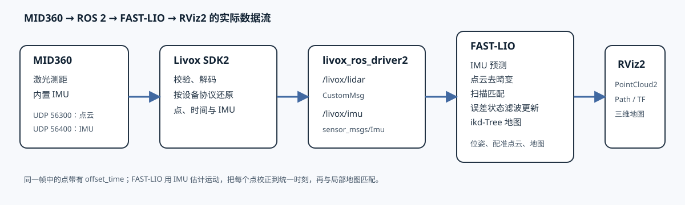


---

# 1. MID360 怎样从光返回中得到一个点

## 1.1 激光测距的基本过程

MID360 的激光器向某个方向发出短脉冲。脉冲碰到墙、地面或物体后，一部分能量返回接收器。设备记录发射和接收之间的时间差 `Δt`，利用光速 `c` 计算光线往返的距离：

$$
r = \frac{c\,\Delta t}{2}.
$$

除以 2 是因为光走了“从雷达到物体、再从物体返回雷达”两段路。真实设备还会做阈值判断、时间标定、温度和内部延迟补偿，所以教材中的公式用于理解原理，不等于重新实现 MID360 的测距固件。

返回信号的强弱会被记录为反射强度。在 ROS 2 的 `CustomPoint` 中，它对应 `reflectivity`。深色、倾斜或吸收性强的材料可能反射较弱；玻璃、镜面和很远的目标也可能产生少量、跳变或无效回波。因此“没有点”不一定说明网络或驱动故障，还可能是测量条件不适合。

## 1.2 距离和方向怎样形成 `x、y、z`

距离 `r` 只说明目标离雷达有多远，还要知道这条测量光线朝哪个方向。用水平角 `θ` 和俯仰角 `φ` 表示方向时，雷达坐标系中的点可以写成：

$$
x = r\cos\varphi\cos\theta,
\qquad
y = r\cos\varphi\sin\theta,
\qquad
z = r\sin\varphi.
$$

例如某次测量的距离为 `r=5 m`、水平角为 `θ=30°`、俯仰角为 `φ=10°`，则该点约为 `x=4.26 m`、`y=2.46 m`、`z=0.87 m`。真实 MID360 的每个点还会经过设备标定和坐标轴约定，数字示例只用于说明公式怎样把“距离 + 方向”变成三维坐标。

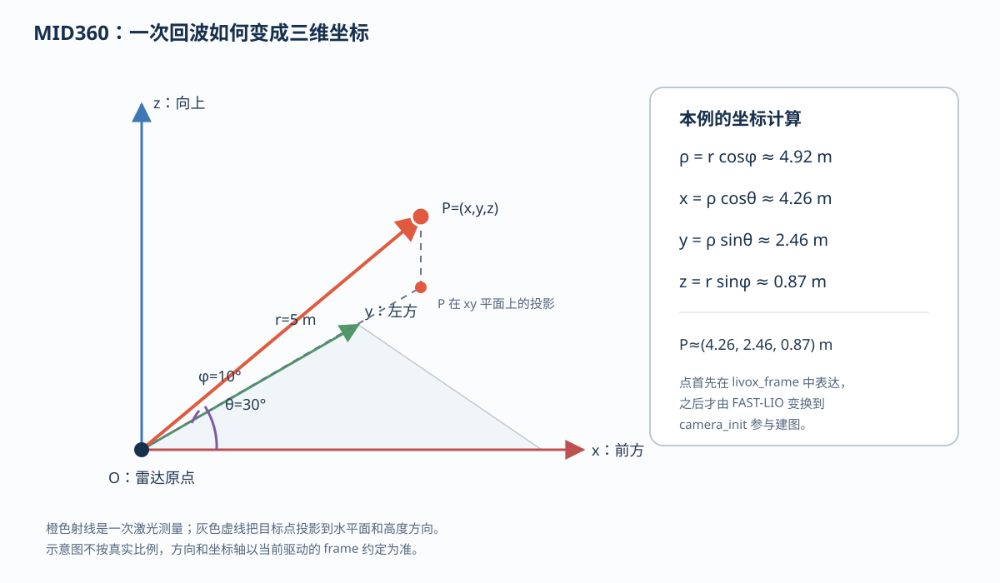

图中 `O` 是雷达坐标原点，`P` 是某一个被测目标点，橙色线段是测量距离 `r`。先把 `P` 投影到水平面，再用水平角 `θ` 分解出 `x、y`，最后用俯仰角 `φ` 得到高度 `z`。这张图只用于解释坐标关系，真实 MID360 的扫描方向由设备内部扫描时序和标定参数确定。

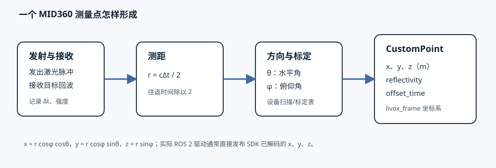

在 MID360 中，扫描不是一次只产生一个固定角度的“二维圈”。设备按照自身的非重复扫描模式连续发射脉冲，内部标定表把每个采样序号对应的方向换算出来。Livox SDK2 解析设备数据后通常直接交给驱动 `x、y、z`，所以 ROS 2 节点不需要再次从角度计算坐标。换句话说，ROS 2 消息里的 `x、y、z` 是“测距 + 扫描方向 + 设备标定”共同形成的结果。

同一帧中的点在不同时间采集。MID360 的点消息携带 `offset_time`，用来表示该点相对于本帧时间基准的偏移。它不是额外的空间坐标，但对于 FAST-LIO 的点云去畸变非常重要：机器人在一帧期间转动时，帧开始和帧结束的点并不来自同一个雷达姿态。

## 1.3 MID360 同时测量 IMU

MID360 里面还有一颗 IMU 芯片。它不发射激光，而是在每个采样时刻测量：

| 测量量 | 含义 | 常见单位 |
|---|---|---|
| `gyro_x/y/z` | 绕雷达自身三个轴的角速度 | `rad/s` |
| `acc_x/y/z` | 沿雷达自身三个轴的线加速度 | `g`（驱动封装为 ROS 2 消息时通常换算为 `m/s²`） |

例如雷达静止放在水平面上时，角速度应接近零，加速度主要反映重力方向；机器人转弯时，`gyro_z` 会明显变化。IMU 的一条原始记录是 6 个浮点数，它和激光点不是同一种数据：

```text
一次激光测量 → 距离、方向、反射强度 → 一个点
一次 IMU 采样  → 三轴角速度、三轴加速度 → 一条 IMU 记录
```

MID360 通过不同 UDP 端口发送两类数据：点云通常从 `56300` 发出，IMU 通常从 `56400` 发出。后面第 2 节会说明这两类原始记录怎样被放进 UDP 载荷，再由 SDK2 和 ROS 2 驱动分别变成 `/livox/lidar` 与 `/livox/imu`。

---

# 2. 从 UDP 网络包到 ROS 2 话题

## 2.1 一个测量点和一个 UDP 包不是同一层东西

前一节讲的“一个点”，指的是 MID360 对某个方向完成一次激光测量后得到的一条测量记录：它有距离、方向、反射强度和采样时刻。雷达不会把这条记录单独发成一个 UDP 包。为了提高网络传输效率，设备会把多条测量记录先放进一个二进制数据包，再通过以太网发送。

可以把三个层次先分开：

```text
一次激光回波
  → 一条原始测量记录
  → 多条记录组成一个 UDP 载荷
  → 多个 UDP 包被 SDK2 和驱动组合成一条 ROS 2 消息
```

所以，**一个 UDP 包通常不是一个点，也不是一帧完整点云，更不是一条 ROS 2 消息**。它可能只承载一小批点云数据，也可能承载一个或多个 IMU 采样；一帧 ROS 2 点云往往要等多个 UDP 包到达后才能组成。

## 2.2 一个 UDP 包里面有什么

从网络角度看，一个 UDP 包可以粗略拆成四层：

```text
以太网帧
  ├── 以太网头：源/目标 MAC
  ├── IP 头：源/目标 IP、协议号
  ├── UDP 头：源端口、目标端口、长度、校验和
  └── UDP 载荷：Livox/MID360 的设备协议二进制数据
       ├── 设备协议头：长度、数据类型、序号/计数、时间戳等
       └── 测量数据：点云记录或 IMU 记录
```

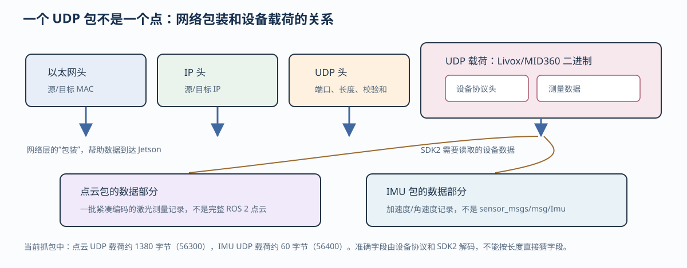

这里要注意：以太网头、IP 头和 UDP 头是网络传输所需的包装；ROS 2 节点真正关心的是 UDP 载荷。载荷本身仍然是按 Livox 协议编码的字节，不能直接当作下面这些 ROS 2 字段来读：

```text
还不能直接读成：x、y、z、reflectivity、offset_time
也不能直接读成：sensor_msgs/msg/Imu
```

设备协议载荷中通常会有用于解析的公共信息，例如数据类型、载荷长度、包计数或序号、设备时间戳等；后面才是按照数据类型编码的点云或 IMU 数据。点云数据的具体字段和压缩/编码方式由 MID360 协议和 SDK2 定义，不能只根据 UDP 载荷长度猜测每个字段的位置。SDK2 会依据协议头和数据类型解释这些字节，再把点恢复为坐标、强度和时间等上层字段。

对于本次抓到的两类包，可以这样理解：

| UDP 包 | 载荷中承载的内容 | SDK2 解码后的方向 |
|---|---|---|
| 点云包 | 设备协议头 + 一批紧凑编码的激光测量记录 | 形成点的坐标、反射强度、点内时间等，供 `/livox/lidar` 使用 |
| IMU 包 | 设备协议头 + 加速度/角速度采样记录 | 形成时间戳、角速度和线加速度，供 `/livox/imu` 使用 |

因此，前面公式中的 `r、θ、φ` 并不一定以三个浮点数原样出现在 UDP 包里；设备可能使用自己的定点数、二进制编码和标定索引。SDK2 完成协议解码和标定换算后，驱动才把结果写成 `CustomPoint.x/y/z`。

## 2.3 SDK2 怎样把 UDP 载荷解码成测量记录

教材工程中包含 Livox 官方 SDK2 源码。官方头文件 [`livox_lidar_def.h`](https://github.com/Livox-SDK/Livox-SDK2/blob/master/include/livox_lidar_def.h) 用 `#pragma pack(1)` 定义了网络载荷的结构。固定头部字段如下：

| 偏移 | 字节数 | SDK2 字段 | 作用 |
|---:|---:|---|---|
| 0 | 1 | `version` | 数据协议版本 |
| 1 | 2 | `length` | 整个 Livox 载荷长度 |
| 3 | 2 | `time_interval` | 本包点间时间间隔，SDK 注释单位为 `0.1 µs` |
| 5 | 2 | `dot_num` | 本包中的测量记录数量 |
| 7 | 2 | `udp_cnt` | UDP 数据计数 |
| 9 | 1 | `frame_cnt` | 帧计数 |
| 10 | 1 | `data_type` | 后续数据类型 |
| 11 | 1 | `time_type` | 时间戳类型 |
| 12 | 12 | `rsvd` | 保留字段 |
| 24 | 4 | `crc32` | 数据校验 |
| 28 | 8 | `timestamp` | 设备时间戳 |
| 36 | 可变 | `data` | 点云或 IMU 记录 |

当前驱动日志曾显示 `data_type: 1`，对应官方枚举中的高精度笛卡尔坐标。该记录在 SDK2 结构中是 14 字节：`x、y、z` 各为 `int32` 毫米，后面是 `reflectivity` 和 `tag` 各 1 字节。于是，本次抓包中一个 1380 字节的点云 UDP 载荷可以按下面方式核对：

```text
1380 - 36 = 1344 字节（测量数据区）
1344 / 14 = 96 个高精度笛卡尔点
```

IMU 记录在官方 SDK2 中是 6 个 `float`：`gyro_x、gyro_y、gyro_z、acc_x、acc_y、acc_z`，每条 24 字节。本次抓到的 60 字节 IMU 载荷可以同样核对：

```text
60 - 36 = 24 字节（测量数据区）
24 / 24 = 1 条 IMU 记录
```

这不是把一个 UDP 包误说成一个点，而是用官方结构说明：**一个点云包承载 96 个紧凑编码的点，一个 IMU 包承载 1 条六浮点 IMU 记录；之后驱动还要把很多个点云包组合成 `/livox/lidar` 的一帧消息。**

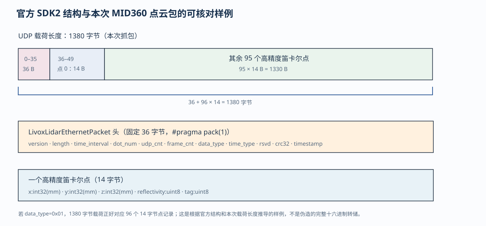

官方 SDK2 的快速示例也没有直接把网络字节当作 ROS 2 消息，而是先读取 `data->dot_num`、`data->data_type` 和 `data->length`，再依据 `data_type` 把 `data` 强制解释为对应的原始点结构。可参考 [Livox SDK2 quick start](https://github.com/Livox-SDK/Livox-SDK2/blob/master/samples/livox_lidar_quick_start/main.cpp)。

下面是从 Jetson 实际抓到的一帧点云 UDP 包。下面这一小段表格的偏移以 **Livox UDP 载荷的开头为 `0x0000`**，不是以太网帧的开头：

```text
偏移  实测十六进制                                  解释
0000  00 64 05 8e 12 60 00 b5 0d 00 01 00        version、length、time_interval、dot_num、udp_cnt、frame_cnt、data_type、time_type
000c  00 00 00 00 00 00 00 00 00 00 00 00        rsvd[12]
0018  00 00 f2 10                                  crc32
001c  b5 1f bb 03 00 00 00 00                    timestamp[8]
0024  00 00 00 00 00 00 00 00 00 00 00 00 00 00  第 0 个点记录（全零）
0032  00 00 00 00 00 00 00 00 00 00 00 00 00 00  第 1 个点记录（全零）
0040  00 00 00 00 00 00 00 00 00 00 00 00 00 00  第 2 个点记录（全零）
004e  05 fc ff ff 57 f9 ff ff be 09 00 00 04 00  点索引 3（第 4 条记录）：x/y/z、reflectivity、tag
```

这个包中 `length=0x0564=1380`、`time_interval=0x128e=4750`、`dot_num=0x0060=96`、`udp_cnt=0x0db5=3509`，`data_type=0x01` 表示高精度笛卡尔点。点记录使用小端序：点索引 3（第 4 条记录）的 `05 fc ff ff` 是 `x=-1019 mm`，`57 f9 ff ff` 是 `y=-1705 mm`，`be 09 00 00` 是 `z=2494 mm`，随后 `04` 是反射强度，`00` 是标签。前 3 条点记录为全零，说明这个包的第一个有效点从第 4 条记录开始；驱动封装成 ROS 2 消息时还会继续处理有效性和单位换算。

### 如何把 `tcpdump -XX` 的偏移对上

如果网卡没有 VLAN 标签、IPv4 头也没有可选字段，那么一帧点云包中的偏移可以先按下面的关系阅读：

```text
0x0000                 以太网头，14 字节
0x000e                 IPv4 头，20 字节
0x0022                 UDP 头，8 字节
0x002a                 Livox UDP 载荷开始
0x004e (= 0x002a+36)  第 0 个点记录开始
```

因此，针对本次 `UDP 载荷=1380` 字节的点云包，`tcpdump -XX` 中的实际字段如下：

```text
0x0000  3c 6d 66 c3 a7 92 e4 7a 2c 85 8a dd 08 00                  Ethernet（14 B）
0x000e  45 00 05 80 5c 6f 00 00 ff 11 d6 77 c0 a8 01 03 c0 a8 01 32  IPv4（总长度 1408 B）
0x0022  db ec db ed 05 6c c3 26                                  UDP（56300 → 56301，长度 1388 B）
0x002a  00 64 05 8e 12 60 00 b5 0d 00 01 00 ……                    Livox 头开始
0x004e  00 00 00 00 00 00 00 00 00 00 00 00 00 00                  第 0 个点记录（全零）
0x0078  05 fc ff ff 57 f9 ff ff be 09 00 00 04 00                  点索引 3（第 4 条记录），本包第一个非零点
```

`0x0000` 行中的 MAC 地址、`0x000e` 行中的 IP 地址和 `0x0022` 行中的 UDP 端口都来自这次实机抓包：源地址是 `192.168.1.3:56300`，目标地址是 `192.168.1.50:56301`。`0x0078` 的点记录按小端有符号整数还原后为 `x=-1.019 m`、`y=-1.705 m`、`z=2.494 m`，反射强度为 `4`，标签为 `0`。

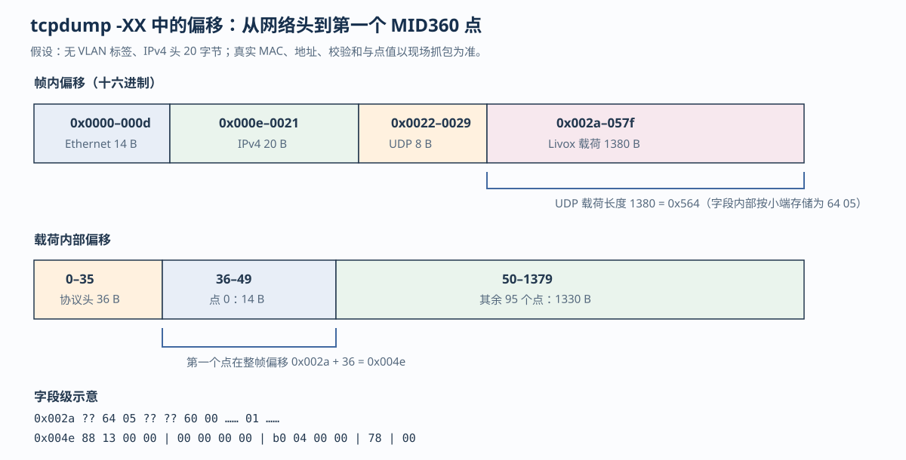


## 2.4 从雷达通信到 ROS 2 话题

### 先看雷达怎样把数据发给 Jetson

在讨论“怎样封装成 ROS 2 消息”之前，先把通信方向和端口看清楚。MID360 通过以太网 UDP 主动向主机发送数据：

| 数据 | MID360 发送端口 | Jetson 接收端口（当前配置） | 发送方向 |
|---|---:|---:|---|
| 点云 | `56300` | `56301` | MID360 → Jetson |
| IMU | `56400` | `56401` | MID360 → Jetson |
| 控制命令 | `56100` | 通常为 `56101` | Jetson ↔ MID360 |

官方通信过程图中的 PC，在本工程中就是 Jetson。图中点云端口和 IMU 端口的箭头表示雷达周期性向主机发送数据；此时传输的仍是 UDP 字节，还没有出现 `/livox/lidar` 或 `/livox/imu` 这样的 ROS 2 话题。

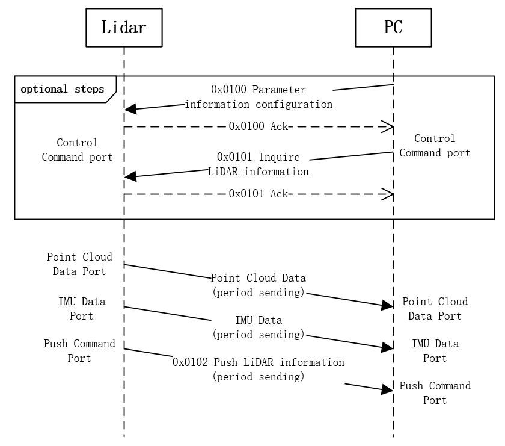

图源：[Livox Mid-360 通信协议](https://livox-wiki-en.readthedocs.io/en/latest/tutorials/new_product/mid360/livox_eth_protocol_mid360.html)。这张图解决的是“谁通过哪个端口把数据发给谁”，不是“ROS 2 节点怎样发布话题”。

### 再看 UDP 载荷怎样被解码

一帧以太网数据到达 Jetson 后，网络层只负责把 UDP 载荷交给接收程序。载荷内部仍是 Livox 协议的二进制字段：

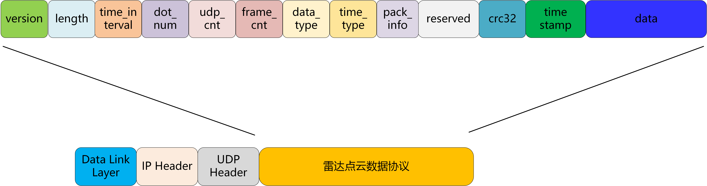

上图来自同一份官方协议。顶部是 Livox 载荷中的 `version`、`length`、`dot_num`、`data_type`、`timestamp` 和 `data` 等字段；底部表示整个载荷外面还有数据链路层、IP 和 UDP 头。它说明的是“UDP 包怎样组织”，不是 ROS 2 消息格式。

Jetson 上的 Livox SDK2 根据协议头完成以下解码：

1. 检查 `length`、`data_type`、计数、时间戳和 CRC；
2. 当 `data_type=0x01` 时，把 `data` 按 32 位笛卡尔点解释为 `x/y/z`、反射强度和标签；
3. 当 `data_type=0x00` 时，把 `data` 按六个浮点数解释为三轴角速度和三轴加速度；
4. 按设备单位和小端编码还原数值，并把解码结果通过 SDK2 回调交给 `livox_ros_driver2`。

### 最后由 ROS 2 驱动封装成话题

收到 SDK2 回调后，`livox_ros_driver2` 才开始做 ROS 2 层的封装：

```text
MID360 通过 UDP 发送
  ├── 56300：点云包
  └── 56400：IMU 包
          ↓
Jetson 网卡收到 UDP 载荷
          ↓
Livox SDK2 校验、拆包、解码
          ↓
livox_ros_driver2
  ├── 多个点云包 → 缓存/按帧组织 → /livox/lidar
  └── IMU 采样   → 填时间和坐标标识 → /livox/imu
```

驱动节点主要完成：

1. 接收 SDK2 解码后的点记录和 IMU 记录；
2. 将毫米、`g` 等设备单位换算成 ROS 2 消息使用的单位；
3. 为点云和 IMU 填写 `header.stamp`、`frame_id`、`offset_time` 等字段；
4. 按 `xfer_format` 参数发布 `CustomMsg` 或 `PointCloud2`；
5. 将 IMU 发布为 `sensor_msgs/msg/Imu`。

所以，真正连续的链路是：

```text
雷达通信
  → UDP 包
  → SDK2 解码为点记录/IMU 记录
  → livox_ros_driver2 封装 ROS 2 消息
  → /livox/lidar、/livox/imu
```

本次在 Jetson 上抓到的结果可放在这条链路中核对：

| 网络数据 | 源端口 | UDP 载荷 | SDK2 解码结果 | 驱动输出 |
|---|---:|---:|---|---|
| 点云包 | `56300` | 1380 字节 | 96 个 32 位笛卡尔点 | 组成 `/livox/lidar` |
| IMU 包 | `56400` | 60 字节 | 1 条六浮点 IMU 记录 | 发布到 `/livox/imu` |

当时的抓包统计为：

```text
100 packets captured
191 packets received by filter
0 packets dropped by kernel
```

这组数字只说明网络上收到了 UDP 数据，不代表 ROS 2 话题已经正确发布。要确认数据已经走到 ROS 2，需要在驱动启动后检查：

```bash
ros2 topic list -t
ros2 topic type /livox/lidar
ros2 topic type /livox/imu
ros2 topic hz /livox/lidar
ros2 topic hz /livox/imu
ros2 topic echo --once /livox/lidar
ros2 topic echo --once /livox/imu
```

其中，`tcpdump` 看到的是 UDP 原始字节，`ros2 topic echo` 看到的是驱动已经解码、换算并填写时间和坐标字段后的 ROS 2 消息。

---

# 3. ROS 2 驱动发布的两类话题

## 3.1 `/livox/lidar`：设备点消息

驱动当前发布的点云话题是：

```text
话题：/livox/lidar
类型：livox_ros_driver2/msg/CustomMsg
```

这里的消息类型由驱动启动文件里的 `xfer_format` 决定，不是由 MID360 UDP 包直接决定。官方驱动中，`msg_MID360_launch.py` 通常设为 `xfer_format=1`，发布自定义 `CustomMsg`；`rviz_MID360_launch.py` 通常设为 `xfer_format=0`，发布 `sensor_msgs/msg/PointCloud2`。因此，如果终端日志出现 `livox/lidar publish use PointCloud2 format`，应以实际命令核对，而不能照抄上面的类型：

```bash
ros2 topic type /livox/lidar
ros2 topic info /livox/lidar
```

本章后续算法示例采用 `msg_MID360_launch.py` 对应的 `CustomMsg` 链路；只启动 RViz2 观察点云时，使用 `PointCloud2` 也可以，但下游订阅端必须与所选格式匹配。

现场一次采样得到：

```text
header.frame_id: livox_frame
point_num: 19872
points: 19872
lidar_id: 192
```

`CustomPoint.msg` 的核心字段为：

```text
uint32 offset_time
float32 x
float32 y
float32 z
uint8 reflectivity
uint8 tag
uint8 line
```

把这次实测消息写成一条消息的结构如下（点数组很长，这里只保留前两个点）：

```yaml
header:
  stamp:
    sec: 1790564488
    nanosec: 579239626
  frame_id: livox_frame
timebase: 1790564488579239626
point_num: 19872
points:
  - offset_time: 0
    x: 2.9240000248
    y: -0.4589999914
    z: -0.0070000002
    reflectivity: 6
    tag: 0
    line: 0
  - offset_time: 4947
    x: 2.9130001068
    y: -0.4530000091
    z: -0.1040000021
    reflectivity: 12
    tag: 0
    line: 1
lidar_id: 192
```

这是在当前 Jetson 上执行 `ros2 topic echo --once /livox/lidar` 得到的真实消息片段；完整消息仍包含 `19872` 个点。每次采样的时间戳、点数和点坐标都会变化，不能把这组数值当成固定的设备常量。

字段的作用是：

| 字段 | 含义 |
|---|---|
| `offset_time` | 该点相对于本帧时间基准的偏移；下游算法可用它处理帧内运动 |
| `x、y、z` | 点在 `livox_frame` 中的位置，当前消息单位为米 |
| `reflectivity` | 回波反射强度 |
| `tag` | Livox 点状态/标记字段，具体编码以驱动消息定义为准 |
| `line` | Livox 消息中的设备通道字段；不能未经确认直接当作机械多线雷达的 `ring` |

检查完整消息而不是只看一行点：

```bash
ros2 topic type /livox/lidar
ros2 topic hz /livox/lidar
ros2 topic echo --once /livox/lidar
```

现场测得频率约为 `5.16 Hz`。这不是说 MID360 激光器每秒只测 5 次，而是当前驱动按一批点发布 ROS 2 帧的频率。设备的 UDP 包频率、SDK 的数据包频率和 ROS 2 消息频率是三个不同层次的量。

## 3.2 `/livox/imu`：IMU 消息

IMU 话题是：

```text
话题：/livox/imu
类型：sensor_msgs/msg/Imu
frame_id：livox_frame
```

现场测得频率约为 `199.8 Hz`，当前 Jetson 实测的一条消息如下：

```yaml
header:
  stamp:
    sec: 1790564611
    nanosec: 666184716
  frame_id: livox_frame
orientation:
  x: 0.0
  y: 0.0
  z: 0.0
  w: 1.0
angular_velocity:
  x: -0.0073961746
  y: -0.0022363239
  z: -0.0172859132
linear_acceleration:
  x: 0.0107902493
  y: 0.0000751116
  z: 0.9989482164
```

这条消息不能直接读成“驱动已经给出了完整姿态”。当前 `orientation` 是单位四元数，驱动没有在这个字段中提供可供本项目直接使用的稳定姿态解算；驱动主要提供角速度、线加速度和时间戳，后续算法再根据这些数据估计姿态。

此外，`linear_acceleration` 数值的单位必须和当前驱动实现、标定参数以及下游算法配置一起核对。消息字段名称不能替代单位验证。可用下面的命令连续观察静止时的数值和时间戳：

```bash
ros2 topic hz /livox/imu
ros2 topic echo --once /livox/imu
```

---

## 3.3 点云话题怎样变成 RViz2 里的画面

目前先不运行 FAST-LIO，只观察雷达驱动输出的原始点云。驱动把 SDK2 解码出的点，封装成 ROS 2 的 `/livox/lidar` 话题；RViz2 再订阅这个话题，把消息中的每个点画出来：

```text
MID360 测量
  → SDK2 解码出 x、y、z 和反射强度
  → livox_ros_driver2 发布 /livox/lidar
  → RViz2 订阅话题
  → 读取每个点的坐标
  → 在三维窗口中绘制
```

当前用于直接观察的启动文件把 `/livox/lidar` 发布为标准消息：

```text
话题：/livox/lidar
类型：sensor_msgs/msg/PointCloud2
```

可以先确认实际类型和更新频率：

```bash
ros2 topic type /livox/lidar
ros2 topic hz /livox/lidar
ros2 topic echo --once /livox/lidar
```

### 消息里有什么

`PointCloud2` 不是一张图片，而是一批点。消息会告诉 RViz2：点有多少个、每个点的字段在哪里，以及这些字段的实际字节数据。最重要的是 `x、y、z`：

```yaml
header:
  frame_id: livox_frame
height: 1
width: 96
fields:
  - name: x
  - name: y
  - name: z
data: [ ... ]
```

例如其中一个点是：

```text
x = 4.26
y = 2.46
z = 0.87
```

RViz2 就把它画在雷达坐标系中的 `(4.26, 2.46, 0.87)` 位置。RViz2 不会重新计算距离和角度，也不会把点云变成地图，它只是读取驱动已经算好的坐标并绘制。

### 数据怎样持续更新

驱动不会只发布一次消息，而是不断接收新的 UDP 数据并持续发布新的 `/livox/lidar` 消息：

```text
第 1 批点 → /livox/lidar → RViz2 显示
第 2 批点 → /livox/lidar → RViz2 刷新
第 3 批点 → /livox/lidar → RViz2 再刷新
             ……
```

因此，直接观察时看到的是“当前雷达扫描到的点”。RViz2 通常会用新消息更新显示内容，并不会自动把机器人走过的所有点累积成地图。当前还没有 FAST-LIO，所以此时没有配准点云、运动轨迹或累计地图。

### 这些点属于哪个坐标系

`header.frame_id` 只是说明这些坐标使用哪一个参考坐标系。当前消息中的坐标通常属于 `livox_frame`，可以把它理解为“固定在雷达上的坐标系”：雷达原点是坐标原点，三个坐标轴方向由设备坐标约定决定。

如果 RViz2 的 **Fixed Frame** 也设置为 `livox_frame`，就可以直接显示，不需要额外的 TF：

```text
消息坐标系：livox_frame
RViz2 Fixed Frame：livox_frame
```

如果把 Fixed Frame 改成 `map` 或 `camera_init`，RViz2 就需要相应的 TF 才能把点从 `livox_frame` 转换过去。当前原始点云观察阶段没有 FAST-LIO，因此不要把这幅图称为全局地图；它只是雷达坐标系下的一批实时点云。

启动直接观察：

```bash
ros2 launch livox_ros_driver2 rviz_MID360_launch.py
```

下面两张是本机通过 RViz2 观察到的 MID360 原始点云。两张图只是视角和显示缩放不同，不是两种不同的传感器数据。

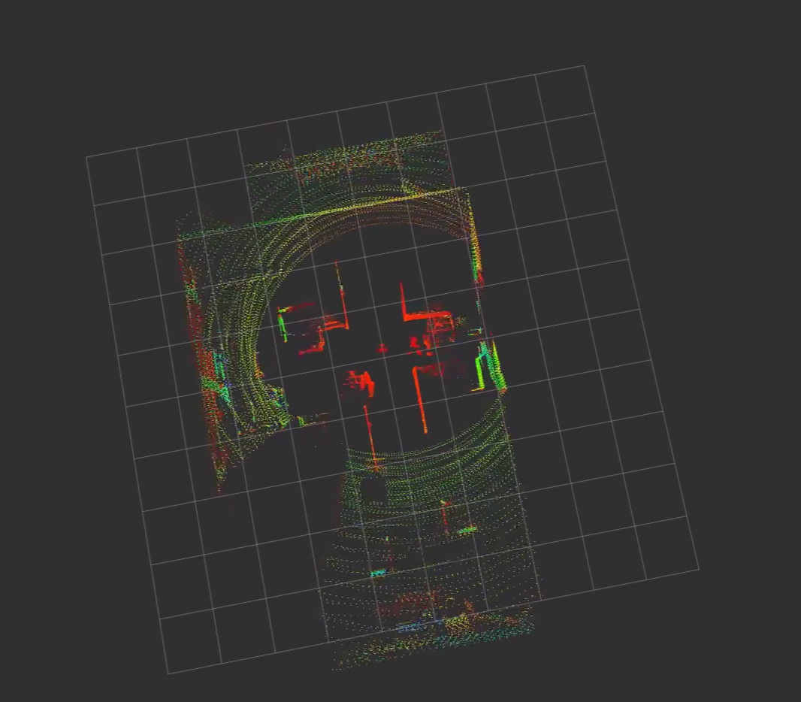

*图 40-1　本机 MID360 点云观测图（视角一）。*

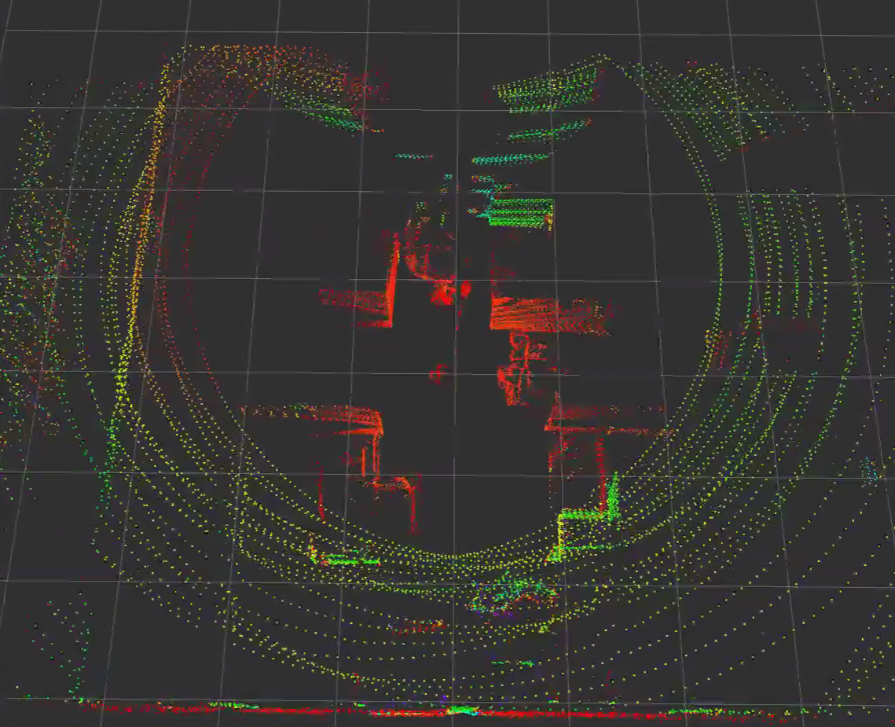

*图 40-2　本机 MID360 点云观测图（视角二）。*

为了把点云中的形状和实际环境对应起来，下面给出同一场地的实景参考图。实景图不是 ROS 2 消息，也不会被驱动直接使用。

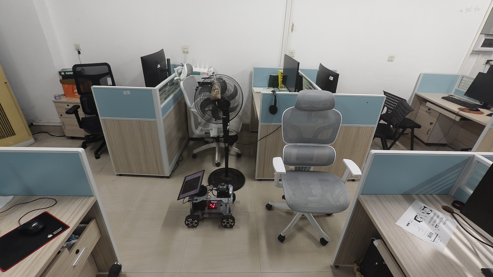

*图 40-3　点云观测场地的实景参考。*

---

# 4. ROS 2 话题怎样交给 FAST-LIO

第 3 节已经说明了驱动发布的两个输入：点云话题 `/livox/lidar` 和 IMU 话题 `/livox/imu`。下一步不是让 FAST-LIO 再去访问雷达或 SDK，而是让 FAST-LIO 作为 ROS 2 节点订阅这两个话题。ROS 2 的中间件负责把发布者发出的消息送到 `/laser_mapping` 节点的订阅回调。

```text
livox_ros_driver2
  ├── 发布 /livox/lidar : CustomMsg 或 PointCloud2
  └── 发布 /livox/imu   : sensor_msgs/msg/Imu
              │ ROS 2/DDS 话题传输
              ▼
FAST-LIO /laser_mapping
  ├── 点云回调：取得 x、y、z、offset_time
  └── IMU 回调：取得角速度、加速度、时间戳
```

FAST-LIO 能否正常工作，首先取决于这两个订阅接口是否对得上：

| FAST-LIO 输入 | 它从消息中读取什么 | 后续用途 |
|---|---|---|
| `/livox/lidar` | `x/y/z`、`offset_time`、`header.stamp`、`frame_id` | 点云去畸变、扫描匹配和地图更新 |
| `/livox/imu` | 三轴角速度、三轴加速度、时间戳、`frame_id` | 初始化、运动预测和姿态更新 |

这里有两个容易混淆的边界：

1. `livox_ros_driver2` 负责把设备协议变成 ROS 2 消息；它不做点云配准和建图。
2. FAST-LIO 只订阅 ROS 2 消息；它不应该直接读取 MID360 UDP 包，也不应该绕过 `livox_ros_driver2` 调用 SDK2。

在当前工程中，启动 FAST-LIO 后可以用下面的命令确认这条连接是否真的建立：

```bash
ros2 node info /laser_mapping
ros2 topic info /livox/lidar --verbose
ros2 topic info /livox/imu --verbose
```

`ros2 node info /laser_mapping` 的 `Subscriptions` 列表中应能看到它订阅的输入。若驱动发布的是 `PointCloud2`，而 FAST-LIO 配置或程序只接受 `CustomMsg`，即使两个话题名字相同，消息类型也不匹配，算法仍然收不到有效输入。

当消息类型、时间戳和坐标标识都匹配后，FAST-LIO 才按下面的顺序开始处理：

```text
ROS 2 点云消息 + ROS 2 IMU 消息
  → FAST-LIO 时间排序和 IMU 初始化
  → IMU 预测
  → 按 offset_time 对点云去畸变
  → 雷达/机体外参变换
  → 点云与局部地图匹配
  → 输出位姿、轨迹和地图
```

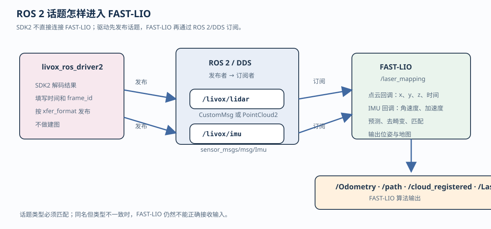

下面只保留消息发送和接收的关键部分，头文件、类定义、QoS 和发布者/订阅者的初始化代码省略。左侧是 `livox_ros_driver2` 发布，右侧是 FAST-LIO 节点订阅并通过回调接收。

**发布者：`livox_ros_driver2`**

```cpp
// 点云已经由 SDK2 解码并填入 lidar_msg
lidar_pub_->publish(lidar_msg);   // 发布到 /livox/lidar

// IMU 已经由 SDK2 解码并填入 imu_msg
imu_pub_->publish(imu_msg);       // 发布到 /livox/imu
```

**订阅者：FAST-LIO 的 `/laser_mapping`**

```cpp
// 初始化时建立两个订阅，收到消息后分别调用回调
lidar_sub_ = create_subscription<CustomMsg>(
  "/livox/lidar", qos,
  [this](const CustomMsg::SharedPtr msg) {
    if (msg->points.empty()) {
      return;
    }
    const auto &p = msg->points.front();
    // 读取 p.x、p.y、p.z、p.offset_time 和 msg->header.stamp
    lidar_buffer_.push(msg);
  });

imu_sub_ = create_subscription<sensor_msgs::msg::Imu>(
  "/livox/imu", qos,
  [this](const sensor_msgs::msg::Imu::SharedPtr msg) {
    // 读取 angular_velocity、linear_acceleration 和时间戳
    imu_buffer_.push(msg);
  });
```

`publish()` 把消息交给 ROS 2 中间件，订阅者收到消息后才执行对应的回调函数。回调函数不是再次访问网口，也不是再次调用 SDK2，而是读取驱动已经封装好的字段；真实 FAST-LIO 还会在回调后继续进行缓存、时间排序和状态估计。

如果驱动启动文件设置 `xfer_format=0`，`/livox/lidar` 的类型会变成 `sensor_msgs/msg/PointCloud2`，订阅者就必须把上面点云订阅的类型替换为 `sensor_msgs::msg::PointCloud2`，再使用 PointCloud2 的字段迭代器读取 `x/y/z`。话题名相同并不代表消息类型相同。


# 5. FAST-LIO 怎样把点云和 IMU 变成三维地图

第 3.3 节看到的只是“当前雷达看到的点”。这些点都在雷达自己的 `livox_frame` 坐标系中，下一批点到来后画面就会刷新；它们还没有被放到同一个房间坐标系中。第 4 节说明了 `/livox/lidar` 和 `/livox/imu` 怎样送到 `/laser_mapping`。本节继续往下追踪：FAST-LIO 收到一批点云后，怎样利用 IMU 推算运动、修正点云时间、把点换到建图坐标系，再用周围环境的几何形状修正自己的位姿，最后发布地图和轨迹。

可以先把一帧数据的完整过程记成一句话：

```text
点云告诉算法“看到了什么”，IMU 告诉算法“这一小段时间怎样运动”；
FAST-LIO 把两者结合起来，估计当前位姿，再把点放到同一个参考坐标系中。
```

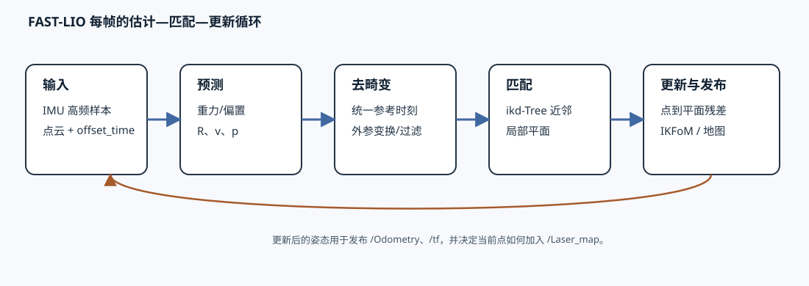

上图中的“预测”来自 IMU，“匹配”来自点云和局部地图的几何关系，“更新”把两种信息合在一起。算法完成一轮更新后，再处理下一批点云；它不是把点不加判断地堆在一起。

官方实现和论文可作为源码对照：[`hku-mars/FAST_LIO`](https://github.com/hku-mars/FAST_LIO) 中的 `src/laserMapping.cpp` 展示了 ROS 2/ROS 接口、IMU 预测、地图匹配和发布流程；算法思想可参考 [FAST-LIO2 论文](https://arxiv.org/abs/2107.06829)。本章的代码片段是按当前工程流程整理的教学伪代码，不替代具体版本的完整源码。

## 5.1 总流程：两组输入怎样变成位姿、路径和地图

这一节先只看数据流，不展开公式和单帧内部的几何匹配。FAST-LIO 的目标，是把 MID360 连续输出的点云和 IMU 数据，转换成机器人当前位姿、已经走过的轨迹以及累积的三维地图。

```text
MID360 驱动节点
  ├── /livox/lidar : 点云
  └── /livox/imu   : 角速度、加速度和时间戳
          │
          ▼
FAST-LIO /laser_mapping
  1. 接收并缓存两组数据
  2. 按时间戳整理点云和 IMU
  3. 用 IMU 估计短时间运动
  4. 按点的采样时刻补偿运动（去畸变）
  5. 把点云与已有地图进行几何匹配
  6. 修正位姿并更新地图
          │
          ├── /Odometry        当前位姿
          ├── /path             已经走过的轨迹
          ├── /cloud_registered 当前帧配准后的点云
          ├── /Laser_map        累积三维地图
          └── /tf               坐标变换
```

可以把它概括成一条主线：

```text
/livox/lidar + /livox/imu
          ↓
时间戳整理与数据缓存
          ↓
IMU 运动预测
          ↓
点云去畸变
          ↓
点云与已有地图匹配
          ↓
位姿修正与地图更新
          ↓
/Odometry、/path、/cloud_registered、/Laser_map、/tf
```

这里的“路径”不是 Nav2 规划出来的未来路线，而是 FAST-LIO 根据连续位姿记录的“机器人已经怎样移动”。“地图”也不是雷达直接给出的图片，而是算法利用每一时刻的位姿，把多帧点云放到同一个参考坐标系后逐步累积出的三维点集合。

本节只回答“输入经过哪些大步骤、输出是什么”。后面的 5.3—5.7 再分别解释 IMU 预测、点云去畸变、坐标变换、地图匹配和位姿修正；其中 `P0`、`P1` 的小车示意图属于这些内部计算的例子，不是总流程图。

本章先记住三套坐标的分工，后面再看变换公式：

```text
livox_frame   点最初所在的雷达坐标系
body          随机器人一起运动的机体坐标系
camera_init   FAST-LIO 启动时建立的局部建图参考坐标系
```

雷达测到的点先属于 `livox_frame`；FAST-LIO 估计出机器人在 `camera_init` 中的位置后，才能把这个点放到地图中的正确位置。

接下来按四个问题展开：

1. FAST-LIO 从两个 ROS 2 话题读到了哪些数据；
2. 它怎样把消息整理成可以计算的时间序列和点；
3. 它怎样用 IMU 和点云共同算出当前位姿；
4. 它怎样把连续位姿变成 `/path`，把变换后的点变成 `/Laser_map`。

## 5.2 先看 FAST-LIO 收到什么

当前 `/laser_mapping` 节点订阅：

```text
/livox/lidar  : livox_ros_driver2/msg/CustomMsg
/livox/imu    : sensor_msgs/msg/Imu
```

这两个话题到达 `/laser_mapping` 后，首先不会立刻变成地图，而是先被放进算法自己的缓存：

```text
/livox/lidar
  → 读取每个点的 x、y、z、offset_time
  → 按点云时间基准恢复每个点的采样时刻
  → 放入 lidar 缓存

/livox/imu
  → 读取角速度、加速度和 header.stamp
  → 按时间先后放入 IMU 缓存
```

当一批点云的时间范围和对应的 IMU 数据准备好后，FAST-LIO 才开始这一轮计算。也就是说，算法真正使用的不是“两个话题的名字”，而是已经按时间对齐的点、每个点的采样时刻，以及同一时间段内的 IMU 样本。


用一句话说，FAST-LIO 不是把 `/livox/lidar` 原样转发出去，而是先维护一个内部状态：

```text
当前状态 = 机器人位置 + 姿态 + 速度 + IMU 偏置
内部地图 = 已经放到同一个坐标系中的一批三维点
```

它每收到一批点云，就用 IMU 预测状态，用点云和内部地图比较，再修正状态，并根据修正后的状态发布结果。

这一节只先确认“算法拿到什么”。输出结果放在本章最后统一解释，避免还没有讲算法就先看到一串陌生的话题名。

### FAST-LIO 到底在估计什么

FAST-LIO 的核心不是“把点云画出来”，而是反复回答一个问题：**机器人现在位于哪里、朝向哪里？** 点云提供环境几何约束，IMU 提供连续运动预测，两者在每一帧中互相校正。

算法内部可以把状态写成：

$$
\mathbf{x}=\left(\mathbf{R},\mathbf{p},\mathbf{v},\mathbf{b}_g,\mathbf{b}_a,\mathbf{g}\right)
$$

其中：

| 状态量 | 含义 | 后面怎样使用 |
|---|---|---|
| `R` | 机器人姿态，表示车体坐标轴相对 `camera_init` 怎么转 | 把雷达测到的点转到建图坐标 |
| `p` | 机器人在 `camera_init` 中的位置 | 把当前点云放到地图的正确位置 |
| `v` | 机器人速度 | 根据 IMU 推算下一时刻的位置 |
| `b_g` | 陀螺仪偏置 | 修正角速度读数 |
| `b_a` | 加速度计偏置 | 修正加速度读数 |
| `g` | 重力方向和大小 | 把 IMU 的加速度放到正确的参考系 |

每次处理一帧点云时，算法执行同一个闭环：

```text
上一时刻状态 x(k)
       │
       ├─ IMU 积分：得到预测状态 x(k|k-1)
       │
       ├─ 用预测位姿把当前点放进 camera_init
       │
       ├─ 在 ikd-Tree 中找近邻，拟合墙面/地面
       │
       ├─ 计算“点离平面有多远”的残差
       │
       ├─ 误差状态卡尔曼滤波：修正 R、p、v 和偏置
       │
       └─ 用修正后的状态更新地图和输出话题
```

这里的“预测”和“修正”分别来自两类数据：

- **预测**：IMU 高频输出角速度和加速度，告诉算法机器人刚刚怎样运动；
- **修正**：点云与已有地图中的平面是否重合，告诉算法预测结果偏了多少。

如果只有 IMU，位置和姿态会随着时间漂移；如果只有点云，快速运动时难以知道一帧内部的连续运动。FAST-LIO 把 IMU 作为运动模型，把点云几何关系作为观测模型，这就是它的基本算法结构。后面的 5.3—5.7 分别展开这几步。

## 5.3 第一步：先用 IMU 推算这一小段运动

启动后先让机器人静止几秒。FAST-LIO 利用这段数据估计重力方向和陀螺仪、加速度计的初始偏置。日志中的：

```text
IMU Initial Done
```

表示初始化阶段完成，不表示已经完成建图。IMU 不是在告诉算法“机器人在房间的绝对位置”，而是在高频地告诉算法“这几毫秒内转了多少、加速度怎样变化”。

先不用公式，可以把 IMU 的一次计算理解成每隔 `Δt` 秒做三件事：

```text
1. 角速度 × 时间 → 这段时间转了多少角度
2. 加速度 × 时间 → 速度增加了多少
3. 速度 × 时间   → 位置增加了多少
```

但是，IMU 的读数不是完全理想的。陀螺仪和加速度计都有固定偏差，还会混入随机噪声，所以算法先做一个近似修正：

```text
修正角速度 = IMU读到的角速度 - 陀螺仪偏置 - 角速度噪声
修正加速度 = IMU读到的加速度 - 加速度计偏置 - 加速度噪声
```

用符号写就是：

$$
\omega = \omega_m-b_g-n_g,
\qquad
a = a_m-b_a-n_a.
$$

接下来，算法维护三个状态：

| 符号 | 它表示什么 | 直观理解 |
|---|---|---|
| `R` | 姿态 | 机器人当前朝向，决定“前后左右”朝哪里 |
| `v` | 速度 | 机器人当前移动得多快、朝哪个方向移动 |
| `p` | 位置 | 机器人在 `camera_init` 中位于哪里 |

还需要一个重力向量 `g`。因为加速度计测到的加速度需要先根据当前姿态转到建图坐标系，所以公式中会出现 `R_k a`。

对第 `k` 次和第 `k+1` 次 IMU 采样之间的很短时间 `Δt`，可以这样理解：

$$
R_{k+1}=R_k\operatorname{Exp}(\omega\Delta t)
$$

意思是：在原来的朝向 `R_k` 上，再组合一个由角速度产生的小旋转。这里的“乘”不是“朝向乘以一个角度”，而是**两个旋转矩阵相乘**；`Exp` 把角速度产生的转角转换成一个旋转矩阵。旋转矩阵代表的是“怎样改变一个方向”，而多个“改变方向的操作”必须通过变换组合来连接。

二维情况下可以直观地理解：机器人原来朝向 `30°`，这一小段时间又向左转 `10°`。把“转 `30°`”和“再转 `10°`”这两个旋转变换组合起来，结果就是朝向 `40°`。在三维空间中，旋转轴可能不同，不能只把角度直接相加，所以使用旋转矩阵相乘来完成同样的“先保持原朝向、再叠加小转动”的操作。

$$
v_{k+1}=v_k+(R_k a+g)\Delta t
$$

意思是：原来的速度，加上这段时间产生的速度变化。

$$
p_{k+1}=p_k+v_k\Delta t+\frac{1}{2}(R_k a+g)\Delta t^2
$$

意思是：原来的位置，加上“原速度走过的距离”，再加上“这段加速度带来的额外距离”。

把上面三条离散公式写成连续时间形式，就是：

$$
\dot{R}=R[\omega]_{\times},\qquad
\dot{p}=v,\qquad
\dot{v}=Ra+g.
$$

`[ω]×` 是由三轴角速度组成的反对称矩阵，用来表示“绕哪个轴、以多快的速度旋转”。实际程序不会一次把很长时间的运动直接算完，而是按相邻 IMU 时间戳分成许多很短的小段，逐段积分。这样才能得到 `R(t_i)`、`p(t_i)`，供点云中不同采样时刻的点使用。

由于传感器有噪声，FAST-LIO 还会维护预测的不确定度。若把误差状态记作 `δx`，协方差记作 `P`，IMU 传播可以概括为：

$$
\hat{x}_{k+1}=f(\hat{x}_k,u_k),\qquad
P_{k+1}=F_kP_kF_k^{\mathsf T}+Q_k.
$$

其中 `u_k` 是当前 IMU 样本，`F_k` 是运动模型的线性化矩阵，`Q_k` 是 IMU 噪声带来的过程噪声。初学时不必手算 `F_k`，但要知道：FAST-LIO 传递的不只是一个位置数值，还传递了“这个预测有多不确定”，后面点云观测会据此修正它。

### 一个简单的数值例子

假设两个 IMU 样本间隔为 `Δt=0.01 s`，修正后的角速度为 `0.2 rad/s`，则这 `0.01 s` 内大约转过：

```text
0.2 × 0.01 = 0.002 rad
```

如果转弯前机器人速度约为 `1.0 m/s`，那么这 `0.01 s` 内仅由原速度带来的位移约为：

```text
1.0 × 0.01 = 0.01 m
```

如果修正后的加速度还会带来 `0.5 m/s²` 的速度变化，那么速度大约增加：

```text
0.5 × 0.01 = 0.005 m/s
```

FAST-LIO 就是用这种很短时间、连续重复的计算，得到机器人在每个点采样时刻附近的暂时姿态和位置。IMU 频率高，适合提供连续的短时预测；但只对 IMU 积分会产生漂移，所以这一步得到的只是“预测值”，后面还要用点云与地图的几何关系修正它。

这一阶段可以用下面的简化伪代码表示：

```cpp
for (const auto &imu : imu_buffer) {
  // 从消息中读取角速度和加速度
  omega = imu.angular_velocity - gyro_bias;
  accel = imu.linear_acceleration - accel_bias;

  // 在相邻 IMU 时间戳之间推进姿态、速度和位置
  state = propagate(state, omega, accel, imu.dt);
}
```

这里的 `propagate()` 是对上面离散公式的程序实现，真实源码还会维护协方差、噪声和状态向量。

**这一步算出的东西有什么用？**

它得到的是每个 IMU 时刻的“暂时位姿”：姿态 `R(t)`、速度 `v(t)`、位置 `p(t)`，以及这些预测的不确定度。它还不是最终的 `/Odometry`，因为只靠 IMU 积分会慢慢漂移。下一步用它来回答一个关键问题：点云中的每个点是在机器人什么姿态下采到的？同时，它还作为后面点云匹配的初始位姿。

## 5.4 第二步：按每个点的时间去畸变

这一节只解决一个问题：**同一帧点云里的点不是同一时刻测到的，怎样把它们放回同一个时刻？**

### 先看一个具体场景

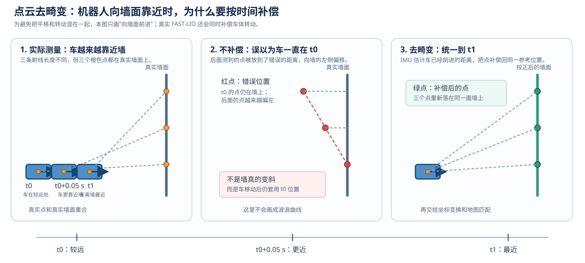

*图 40-6　使用 `offset_time` 和 IMU 运动预测进行点云去畸变。*

图中采用一个便于看清几何关系的简化场景：假设 MID360 用 `0.1 s` 扫完一帧，机器人在这段时间内**向前靠近墙面**，车头方向暂时不变。第一幅是实际测量，三个时刻的雷达射线都落在同一面直墙上；第二幅是假设机器人没有移动后的错误叠加，后面测到的点被放到了墙的左侧；第三幅是使用 IMU 补偿后的结果，点重新落在直墙上。

读图时不要把图中的几个车体理解成多台车：它们表示**同一台车在三个时刻的位置**。橙色圆点是雷达，灰色直线是真实墙面，红点是错误叠加的位置，绿点是补偿后的结果。

三个时刻可以理解为：

```text
帧开始 t0       中间时刻 t0+0.05 s       帧结束 t1
车在这里            车更靠近墙              车离墙最近
第一个点             中间点                 最后一个点
```

这些点都属于同一帧，但它们是在不同的机器人位置下测到的。机器人越靠近墙，雷达到墙的距离就越短。如果直接把它们当成“机器人始终停在 `t0`”，后面测到的点就会被放到错误的位置，点会偏离真实墙面。这里的“畸变”不是雷达把距离测错了，而是机器人运动让一帧中的点处在了不同的参考位置。

真实机器人还可能同时转动。例如 `0.1 s` 内车头从 `0°` 转到 `9°`，IMU 也会记录这段角度变化；FAST-LIO 会把平移和转动一起补偿。为了避免图中线条混在一起，下面的图只画“向墙靠近”这一种运动。

每个点都带有一个 `offset_time`。它表示“这个点比本帧时间基准晚了多久”：

$$
\text{点的采样时刻 }t_i
 =\text{本帧开始时刻 }t_0
 +\text{该点的 }offset\_time_i。
$$

例如，`offset_time=0` 的点接近帧开始时采集，`offset_time=0.05 s` 的点是在开始后 `0.05 s` 采集的。它是时间信息，不是 `x、y、z` 坐标，也不是距离。

### FAST-LIO 怎样修正

FAST-LIO 同时收到了 MID360 的 IMU 数据。IMU 告诉算法机器人在这段时间内转了多少、移动得大致有多快。算法按下面四步处理：

1. 从点的 `offset_time` 算出这个点真正的采样时刻；
2. 用 IMU 估计机器人在这个时刻的姿态和位置；
3. 把这个点从“它被测到时的机器人位置”换算到一个统一参考时刻，通常取帧末或当前时刻；
4. 对这一帧的所有点重复上述过程。

如果 `T_{WB}(t)` 表示时刻 `t` 的车体到 `camera_init` 变换，`T_{BL}` 表示雷达到车体的固定外参，那么一个点在参考时刻 `t_r` 的去畸变表达可以写成：

$$
p_i^{B(t_r)}
=T_{WB}^{-1}(t_r)\,T_{WB}(t_i)\,T_{BL}\,p_i^L.
$$

从右往左读这条式子：`p_i^L` 是点在雷达坐标中的原始位置；`T_BL` 把它放到车体；`T_WB(t_i)` 把它放到点被采集时的建图坐标；最后乘 `T_WB^{-1}(t_r)`，把它改写成统一参考时刻的车体坐标。平移和转动都包含在这个变换中。

所以，“去畸变”可以直接理解为：**点没有重新测量，距离也没有被修改，只是根据 IMU 记录的运动，把早一点测到的点在空间中补偿到同一个时刻。**

```text
点云中的一个点
  → 读取 offset_time，知道它何时采集
  → 用 IMU 找到该时刻的机器人姿态
  → 把点变换到统一参考时刻
  → 得到去畸变后的点
```

**这一步交给下一步什么？**

输出仍然是一批带有 `x、y、z` 的点，但它们已经尽量处在同一时刻的几何关系中。下一节把这些点从 `livox_frame` 雷达坐标换到 FAST-LIO 使用的机体和建图坐标；再下一节才拿它们与局部地图匹配。如果 `offset_time` 的单位解释错、时间戳不连续或 IMU 没有同步，去畸变就会出错，后面的地图会弯曲、重影或跳变。

如果想把它对应到程序逻辑，可以只记住下面三行（这是示意，不是可直接编译的完整函数）：

```cpp
for (point : scan) {
  time = scan_start + point.offset_time; // 这个点何时采集
  point = compensate_with_imu(point, time, reference_time);
}
```

## 5.5 第三步：把雷达坐标换到算法坐标

5.4 去畸变之后，点的距离和方向已经校正好了，但它仍然只是“**相对于雷达的位置**”。例如：

```text
(x, y, z) = (2.0, 0, 0)
```

只表示“目标在雷达前方 2 m”，并不表示目标在房间坐标的 `x=2 m`。机器人一移动，雷达原点也跟着移动；如果每一帧都直接使用这个数，来自不同时间的墙面点就不能重合。

这一步的任务只有一句话：**把每个点从‘相对雷达的位置’，换算成‘相对建图起点的位置’。** 中间要经过两次变换：

```text
点在 livox_frame 中的位置
  --固定安装关系（雷达装在车体哪里）-->
点在 body 中的位置
  --当前位姿（车此刻走到哪里）-->
点在 camera_init 中的位置
```

这里的三个名字可以这样理解：

| 坐标系 |   |              是否随车移动   |
|---|---|---|
| `livox_frame` |以雷达为原点，描述点在雷达前后左右的位置 | 会，雷达装在车上 |
| `body` | 以车体为原点，描述点相对车体的位置 | 会，车体在运动 |
| `camera_init` | FAST-LIO 启动时建立的固定建图参考 | 不随车移动 |

所以，回答“雷达是不是自己建立了一套坐标”时要分两层看：MID360 确实有自己的**传感器坐标系**，设备和驱动约定了轴的方向，驱动把它写进消息的 `header.frame_id`（当前常见名称是 `livox_frame`）；但雷达不会自己知道房间的全局位置，也不会单独建立 FAST-LIO 的地图坐标。固定的 `camera_init` 是 FAST-LIO 启动时建立的，车体当前位姿也是 FAST-LIO 估计出来的。

### 第一次变换：先处理雷达装在车上的位置

雷达不一定正好安装在车体原点，也不一定和车头完全同向。例如雷达比车体原点靠前 `0.2 m`。那么雷达测到前方 `2.0 m` 的点，对车体来说就是前方约 `2.2 m` 的点。

这一步只描述**安装关系**，车辆还没有因为行驶而改变这段关系。程序用 `extrinsic_R` 表示雷达和车体的安装角度，用 `extrinsic_T` 表示安装位置。用教学中的方向写成：

$$
p_{body}=R_{ext}p_{lidar}+t_{ext}.
$$

`R_ext` 负责“转方向”，`t_ext` 负责“加上雷达离车体原点的距离”。当前 FAST-LIO 源码对外参矩阵的存储方向要以实际版本为准；这里先记住它表达的是同一件事：**雷达和车体之间是一段固定关系**。

### 第二次变换：再处理车此刻走到了哪里

`camera_init` 可以看成建图开始时放在地面上的一把固定尺子。FAST-LIO 用 IMU 预测和点云匹配得到车体此刻的姿态和位置，再把 `body` 中的点放到这把固定尺子上：

$$
p_{init}=R(t)p_{body}+t(t).
$$

其中，`p_body` 是点相对于车体的位置，`R(t)` 表示车体当前朝向，`t(t)` 表示车体当前在 `camera_init` 中的位置，`p_init` 则是该点在建图坐标系中的位置。
这条公式可以直接读成“先按照车体当前朝向旋转这个点，再加上车体当前的位置”，从而把车体坐标中的点放到固定的建图坐标中。

这里的 `R(t)` 和 `t(t)` 不是雷达安装参数，而是“车在时刻 `t` 走到哪里、朝向哪里”的估计。

用上一节“向墙面前进”的例子看最清楚。假设雷达与车体同向，先忽略安装偏移：

```text
t0：车在 x=0，雷达测到墙距 2.2 m
    → 墙在 camera_init 中约为 x=0+2.2=2.2 m

t1：车向墙前进了 0.5 m，雷达测到墙距 1.7 m
    → 墙在 camera_init 中约为 x=0.5+1.7=2.2 m
```

两次测量的雷达距离不同，但经过“当前车的位置 + 雷达测到的相对距离”换算后，都落在同一个 `x=2.2 m` 附近，所以可以叠成一面墙。这就是坐标变换对建图的实际作用，不是把点重新测量一次。

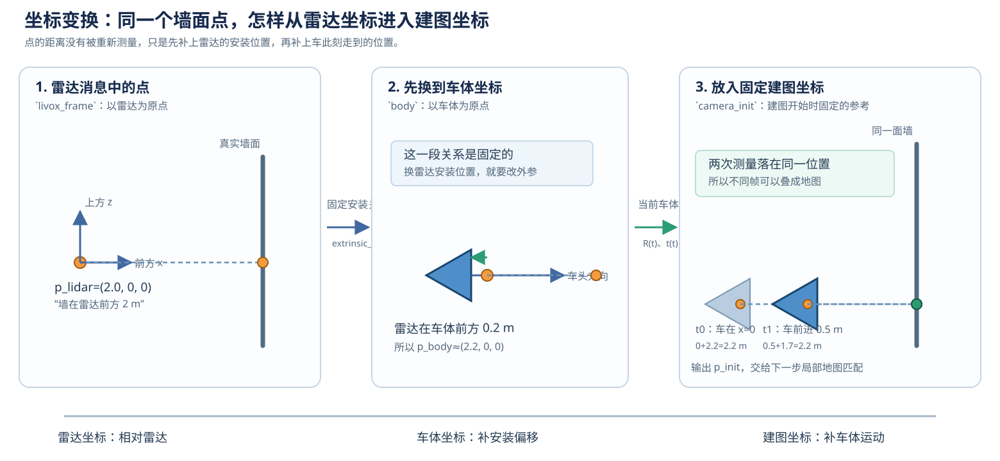

*图 40-7　同一个墙面点先经过固定安装关系，再根据车的当前位姿放入固定的 `camera_init`。*

**这一步交给下一步什么？**

输出是已经位于 `camera_init` 中的点 `p_init`。5.6 不再拿“雷达前方 2 m”去查地图，而是拿“这个点在固定建图坐标中的位置”去找邻近墙面或地面。若外参或当前位姿错了，点就会整体偏移、墙面变厚或出现双层；消息本身仍可能正常发布，所以必须同时检查坐标关系。

更换 MID360 的安装位置或角度时，重点重新检查 `extrinsic_R`、`extrinsic_T` 和消息 `frame_id`。这段外参通常写在 `mid360.yaml` 中，不等于系统一定已经自动发布了同名 ROS 2 TF；它可能由 FAST-LIO 在算法内部使用。

## 5.6 第四步：过滤点，并在局部地图中找对应位置

这一节先记住一个目的：**FAST-LIO 要为当前扫描中的每个有效点，在旧地图里找到它可能对应的墙面、地面或其他表面。** 这一步还没有修正机器人位姿，只是在准备“当前点应该和地图中的哪一块进行比较”。

当前 `mid360.yaml` 中可以看到类似以下参数：

```yaml
lidar_type: 1
scan_line: 4
blind: 0.5
timestamp_unit: 3
point_filter_num: 3
```

其中：

- `blind: 0.5` 表示 FAST-LIO 忽略雷达附近 0.5 m 内的点，是距离过滤，不是把某个方位角屏蔽掉；
- `point_filter_num` 控制输入点的抽取/降采样程度，具体效果要结合当前源码和版本确认；
- `timestamp_unit` 决定 `offset_time` 的解释方式，不能在更换驱动后沿用而不检查；
- `scan_line` 是当前实现需要的点组织参数，Livox 的 `line` 字段不能不经核对就等同于机械雷达的线号。

FAST-LIO 使用增量 KD 树（常见实现名为 `ikd-Tree`）维护局部地图。新点先在地图中搜索空间邻域；地图不必每次整张重建，新增和删除局部点即可更新，使实时匹配保持较低开销。

可以把 5.6 的处理过程先看成下面这条线：

```text
当前点 p_i
   ↓ 过滤无效点和过近点
放到 camera_init 中
   ↓ 在 ikd-Tree 中搜索附近的历史点
找到一组邻居 q_i
   ↓ 判断邻居是否近似属于同一平面
输出“当前点—历史平面”的对应关系
```

### 这一步到底做什么

算法不会把当前点和地图中所有点逐一比较。它使用 `ikd-Tree` 这个快速空间索引，在当前点附近找少量历史点。可以把它理解成“先在地图中找到当前点可能对应的那一小块墙面或地面”。

对每个点，FAST-LIO 做四件事：

```text
1. 删除距离雷达太近、无效或明显异常的点；
2. 用当前的预测位姿，把点放到 camera_init 地图坐标中；
3. 在 ikd-Tree 中找附近的历史地图点；
4. 判断这些邻居是否大致落在同一面墙或地面上。
```

如果邻居点排列得比较平整，就保留这组“当前点—历史表面”的对应关系；如果邻居跨过墙角、过于分散或只是噪声，就丢掉这次对应关系。开发者不需要在节点外手算协方差矩阵，FAST-LIO 会在内部用邻居点的分布判断“附近的地图点是否像一小块平面”；下面的公式用于说明这个判断方法。

可以用接近实际逻辑的伪代码表示：

```cpp
for (point : current_scan) {
  if (too_close_or_invalid(point)) continue;

  point_in_map = predicted_pose * point;
  neighbors = ikd_tree.nearest_points(point_in_map);

  if (neighbors_look_like_one_surface(neighbors)) {
    correspondences.push_back(point_in_map, neighbors);
  }
}
```

### 计算过程：怎样判断邻居是否属于同一个平面

假设 `ikd-Tree` 为当前点找到 `K` 个邻居：

$$
\mathcal{N}_i=\{q_{i1},q_{i2},\ldots,q_{iK}\}.
$$

先计算邻居的中心点：

$$
\bar q_i=\frac{1}{K}\sum_{j=1}^{K}q_{ij}.
$$

再计算这些邻居相对于中心点的协方差矩阵：

$$
C_i=\frac{1}{K}\sum_{j=1}^{K}
(q_{ij}-\bar q_i)(q_{ij}-\bar q_i)^{\mathsf T}.
$$

对 `C_i` 做特征值分解。若最小特征值明显小于另外两个特征值，说明邻居点主要分布在一个平面上，可以把最小特征值对应的单位特征向量作为平面法向量 `n_i`。平面方程为：

$$
n_i^{\mathsf T}x+d_i=0,
\qquad
d_i=-n_i^{\mathsf T}\bar q_i.
$$

如果邻居跨过墙角、分布过于分散或主要是噪声，程序就丢弃这组对应关系。这样传给 5.7 的信息就是“当前点对应历史地图中的哪一个平面，以及这个平面的方向”。

**这一步算出的东西有什么用？**

它交给 5.7 的不是一张图片，而是许多组对应关系：当前点属于地图中的哪一小块表面，以及这块表面的方向。下一步就利用这些对应关系判断当前位姿偏了多少。

## 5.7 第五步：用点到平面的误差修正当前位姿

5.6 已经为许多当前点找到了对应的历史平面。5.7 要解决的问题是：**当前点没有完全落在对应平面上时，机器人当前的位置和姿态应该怎样修正？** 修正后的状态会交给 5.8，用来发布里程计、轨迹和地图。

### 先看实际处理流程

```text
上一时刻状态
  ↓
IMU 预测当前位姿
  ↓
用预测位姿把当前点放入 camera_init
  ↓
与 5.6 得到的历史平面比较
  ↓
计算每个点离平面的有符号距离
  ↓
汇总许多点的误差，求位置和姿态的小修正
  ↓
再次变换和匹配，直到误差足够小或达到迭代次数
  ↓
得到当前修正后的状态
```

例如，历史地图中的墙面在 `x=2.00 m`，当前点按照 IMU 预测位姿变换后位于 `x=2.03 m`。如果墙面的法向沿 `x` 轴，这个点沿法向偏离了约 `3 cm`。如果墙面上的大量点都向同一方向偏，算法会修正机器人的位姿；它修正的是“车当前在哪里”，不是把墙面改到 `2.03 m`。

这一步使用的是“IMU 预测 + 点云几何观测 + 迭代误差状态卡尔曼滤波”。IMU 提供连续的初始猜测，历史平面提供几何约束，滤波器根据两者的不确定程度计算本轮应该修正多少。

### 再看计算过程

#### 1. 把当前点变换到建图坐标系

设当前点已经从雷达坐标系经过外参变换，并使用 IMU 预测的当前位姿放入 `camera_init`，记为 `p_i^W`。5.6 拟合出的历史平面上取一点 `q_i`，法向量为 `n_i`。

#### 2. 计算点到平面的残差

点到平面的有符号距离写成：

$$
r_i=n_i^{\mathsf T}(p_i^W-q_i).
$$

`p_i^W-q_i` 是当前点到平面参考点的向量，和法向量 `n_i` 做内积后，只保留垂直于平面的偏差。`|r_i|` 越小，说明当前点越贴近平面；正负号表示它在平面的哪一侧。

#### 3. 用许多残差估计位姿误差

对一批对应点，把残差在当前预测状态附近做一阶线性化：

$$
r\approx H\,\delta x+n.
$$

`δx` 是待求的状态小修正，包含位置、姿态以及滤波器中的速度和 IMU 偏置误差；`H` 描述这些状态变化会怎样改变点到平面的残差；`n` 是点云匹配噪声。

#### 4. 用迭代误差状态卡尔曼滤波求修正量

FAST-LIO 用当前状态协方差 `P` 和匹配噪声 `R_m` 计算卡尔曼增益：

$$
K=P H^{\mathsf T}(H P H^{\mathsf T}+R_m)^{-1}.
$$

再根据残差求状态修正量：

$$
\delta x=-K r.
$$

可以这样理解这些符号：

- `P` 表示 IMU 预测有多不确定；
- `R_m` 表示点云平面匹配有多噪声；
- `K` 决定本次更新更相信 IMU 预测还是点云观测；
- `δx` 是对位置、姿态、速度和偏置做的小修正。

#### 5. 更新状态并重复检查

把修正量施加到当前状态：

$$
\hat{x}\leftarrow\hat{x}\boxplus\delta x.
$$

这里的 `\boxplus` 表示按状态类型更新：位置、速度和偏置做加法，姿态使用小角度旋转更新。更新后，程序用新的状态重新变换点云、查找平面并计算残差；这就是“迭代”。残差足够小或达到设定迭代次数后，接受这一帧状态。

因此，5.7 的最终输出不是一个抽象的“匹配分数”，而是当前机器人在 `camera_init` 中更可靠的位置、姿态、速度和 IMU 偏置估计。5.8 会用它生成 `/Odometry`、追加 `/path`、变换当前点云并更新 `/Laser_map`。

## 5.8 第六步：修正后的位姿怎样形成路径和地图

5.7 得到的是当前这一刻的修正状态：机器人在 `camera_init` 中的位置、姿态、速度和 IMU 偏置。接下来要把这个状态用于两件事：记录机器人已经走过的路线，并把当前点云放到地图中。

### `/path` 是怎样得到的

FAST-LIO 每处理一批点云，就得到一个带时间戳的当前位姿 `P_k`。节点把这个位姿封装成 `geometry_msgs/msg/PoseStamped`，按时间顺序追加到 `nav_msgs/msg/Path`：

```yaml
header:
  frame_id: camera_init
poses:
  - header: {stamp: t_0, frame_id: camera_init}
    pose: P_0
  - header: {stamp: t_1, frame_id: camera_init}
    pose: P_1
  - header: {stamp: t_2, frame_id: camera_init}
    pose: P_2
```

RViz2 把这些位姿的位置按时间连接起来，就显示出轨迹。因此 `/path` 表示“FAST-LIO 估计机器人已经走过哪里”，不是雷达自己规划出的路线，也不是 Nav2 的未来路径。Nav2 后面生成的规划路径虽然也可能使用 `nav_msgs/msg/Path`，但它表示的是“从当前位置到目标点准备怎么走”。

```text
修正位姿 P0 → P1 → P2 → P3
       按时间连接
            ↓
          /path（历史轨迹）
```

### `/Laser_map` 是怎样得到的

每一帧点云经过 5.5 的坐标变换后，都已经位于固定的 `camera_init` 中。FAST-LIO 对其中通过有效性检查的点进行降采样，并加入 `ikd-Tree` 局部地图；下一帧到来时，新点就可以和这些历史点比较。

```text
第 0 帧点云 + 位姿 P0 ─┐
第 1 帧点云 + 位姿 P1 ─┼─→ 统一放到 camera_init → 累积为 /Laser_map
第 2 帧点云 + 位姿 P2 ─┘
```

用简化形式表示，地图是有效点的累积：

$$
M_{k+1}=M_k\cup\{p_i^{init}\mid p_i^{init}\text{ 通过有效性检查}\}.
$$

它不是一张由雷达直接生成的 PNG 图片，而是一组已经放进同一个三维坐标系、可以继续搜索的点。`/cloud_registered` 是当前一帧变换后的点，`/Laser_map` 是多帧点逐步累积后的结果。

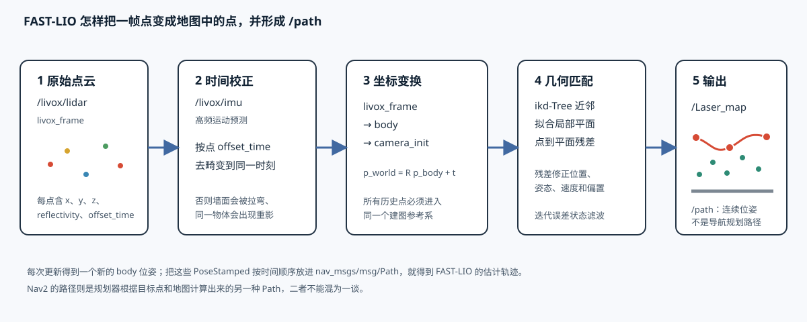

*图 40-9　不同时间的点云先使用各自位姿变换，再叠加成地图；*

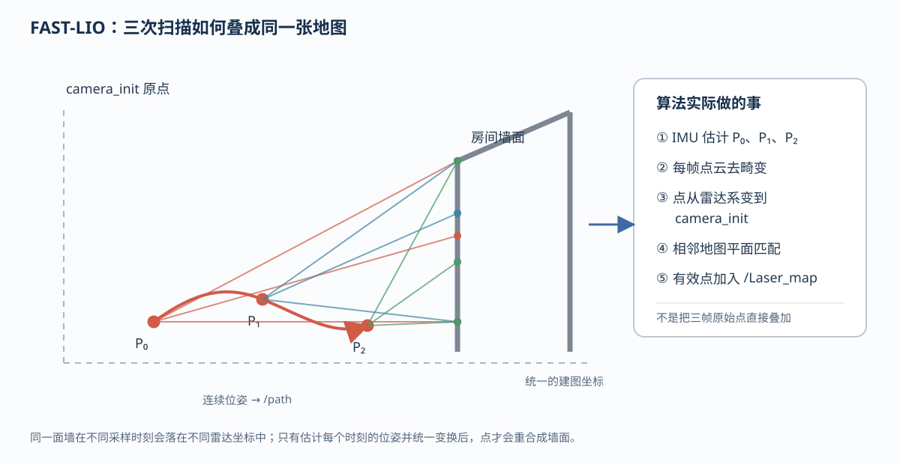

### 把状态发布成 ROS 2 结果

同一次状态估计会被节点用不同消息表达出来：

| 输出 | 由什么计算得到 | 作用 |
|---|---|---|
| `/Odometry` | IMU 预测再经过点云匹配修正后的当前状态 | 表示机器人当前的位置、姿态和速度 |
| `/path` | 连续多个 `/Odometry` 的位置按时间连接 | 表示 FAST-LIO 估计出的历史轨迹，不是未来导航路线 |
| `/cloud_registered` | 当前点云使用修正后的位姿变换到 `camera_init` | 查看当前帧在建图坐标系中的位置 |
| `/cloud_registered_body` | 当前点保留在 `body` 坐标系 | 查看车体坐标下的当前点云 |
| `/cloud_effected` | 经过筛选并真正参与匹配的点 | 查看哪些点被用于状态更新 |
| `/Laser_map` | 多帧点云变换到同一坐标系后累积 | 三维地图点云 |
| `/tf` | 当前状态中的坐标关系 | 让 RViz2 和其他节点知道坐标如何转换 |
| `/map_save` | `std_srvs/srv/Trigger` 服务 | 接收保存请求，不是持续发布的地图话题 |

例如机器人向前移动一小段后，FAST-LIO 可能同时产生以下结果：

```text
/Odometry：当前位置从 P0 更新到 P1
/path：在历史轨迹后面追加 P1
/cloud_registered：当前帧点被放到 P1 对应的位置
/Laser_map：把当前有效点加入已有地图
/tf：更新 camera_init → body
```

下面两张是本次实机运行 FAST-LIO 后的 RViz2 截图。左侧 Displays 面板同时勾选了 `Odometry`、`Path`、`CloudRegistered`、`CloudEffected` 和 `CloudMap`，顶部显示 `Fixed Frame: camera_init`；这说明画面不只是雷达原始点，而是已经经过 FAST-LIO 位姿估计和点云配准后的输出。

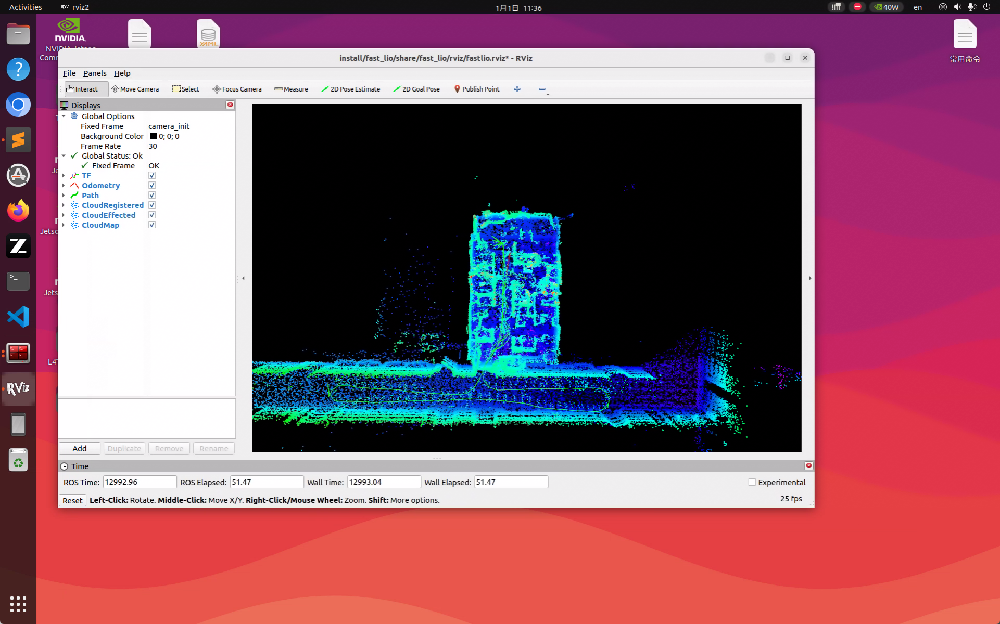

*图 40-10　FAST-LIO 运行后的 RViz2 建图结果（视角一）。* 图中彩色点云是 RViz2 的颜色映射，`CloudMap` 表示累积地图，`CloudRegistered` 表示当前配准点云。

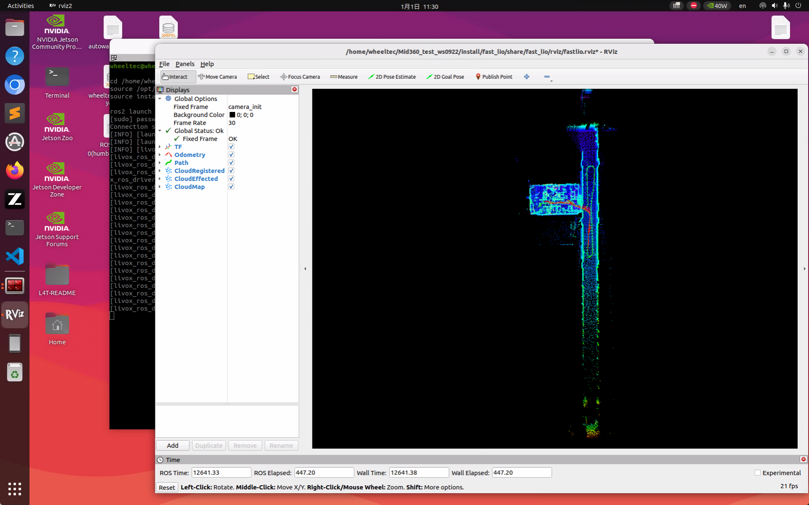

*图 40-11　FAST-LIO 运行后的 RViz2 建图结果（视角二）。* 两张图的视角不同，但都使用 `camera_init` 作为 Fixed Frame；窗口中显示的形状来自 `/Laser_map`、`/cloud_registered` 等话题。

### 参数调整后重新运行 FAST-LIO

如果修改了 FAST-LIO 参数并且已经重新编译，正在运行的 FAST-LIO 进程仍然使用启动时加载的旧参数。必须重启 FAST-LIO，雷达驱动则保持原来的终端继续运行。

操作顺序如下：

1. 雷达驱动终端保持运行，不要再次启动驱动；
2. 在当前 FAST-LIO/RViz2 终端按 `Ctrl+C`，结束旧的 FAST-LIO 和 RViz2；
3. 在同一个终端重新加载工作空间并启动：

```bash
cd ~/wheeltec_ros2_mid360
source /opt/ros/humble/setup.bash
source install/setup.bash
ros2 launch fast_lio mapping.launch.py config_file:=mid360.yaml rviz:=true
```

本次调整后的参数为：

| 参数 | 调整后的值 | 作用 |
|---|---:|---|
| `point_filter_num` | `2` | 减少输入点的抽取，保留更多点参与处理 |
| `filter_size_surf` | `0.2 m` | 控制参与平面匹配的点云体素尺寸 |
| `filter_size_map` | `0.2 m` | 控制累积地图的点云体素尺寸 |
| `dense_publish_en` | `false` | 不额外发布高密度点云，降低显示和传输负担 |
| RViz2 点云累积时间 | `2 s` | 只影响 RViz2 的显示历史长度 |
| RViz2 点显示大小 | `2 pixels` | 只影响 RViz2 中的点的显示大小 |

其中，前四项影响 FAST-LIO 的点云筛选、匹配或发布；后两项只改变 RViz2 的显示效果，不会改变算法已经计算出的位姿和地图。启动后，应缓慢推动车辆重新走过相同区域，观察墙面厚度、边缘重合情况和零散点是否改善。若墙面变薄、边缘更连续且孤立点减少，说明这组参数更适合当前场景；仍需结合实际 `/Odometry`、`/cloud_registered` 和 `/Laser_map` 检查，不能只凭颜色判断精度。

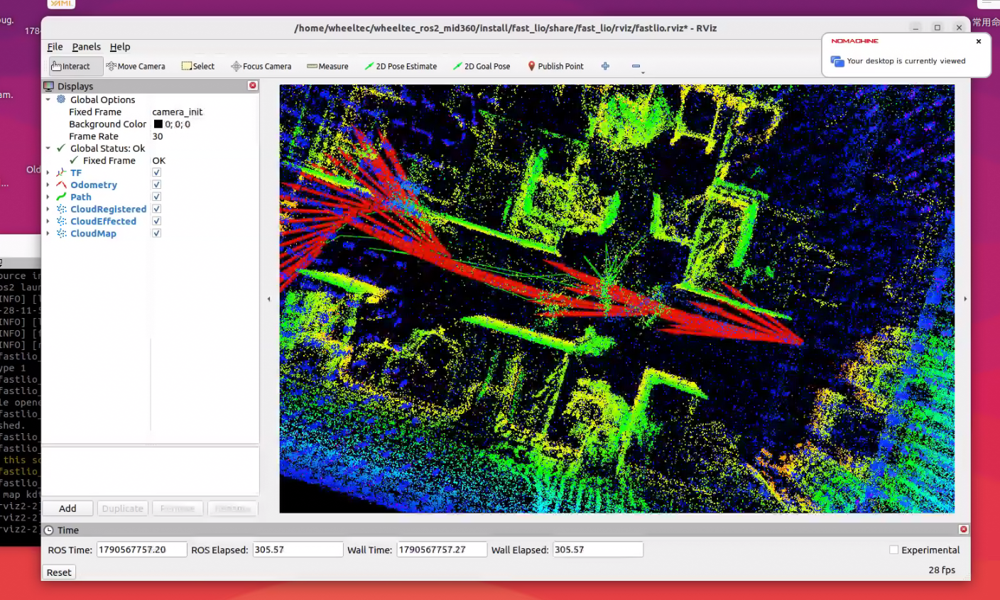

*图 40-12　调整 FAST-LIO 点云过滤和地图体素参数后重新运行得到的 RViz2 画面。* 画面中的 `CloudRegistered`、`CloudEffected` 和 `CloudMap` 仍然来自 ROS 2 话题；参数变化主要体现在点云密度、墙面连续性和显示负担上。

## 5.9 为什么要用 Launch 文件组织节点

到这里，运行链路中的节点职责已经分别出现了：驱动节点从 UDP 数据发布 `/livox/lidar` 和 `/livox/imu`；FAST-LIO 的 `/laser_mapping` 节点订阅这两个话题，完成 IMU 预测、点云配准和地图更新；RViz2 节点再订阅 `/Odometry`、`/path`、`/cloud_registered`、`/Laser_map` 和 `/tf` 来显示结果。

如果每次都手动启动这些程序，至少要分别打开终端、加载两个工作空间、输入参数，还要保证驱动先于 FAST-LIO、FAST-LIO 先于 RViz2。节点一多，很容易漏启动、重复启动，或者把同一雷达交给两个驱动节点。因此 ROS 2 提供了 **Launch 文件**：把一组节点、参数、配置文件和启动顺序写在一个启动描述中，执行一次命令就能建立这套运行系统。

Launch 文件不是一个新的传感器节点，也不负责点云算法。它更像一张“启动清单”：

```text
Launch 文件
  ├── 创建 /livox_lidar_publisher，并加载 MID360 配置
  ├── 创建 /laser_mapping，并加载 mid360.yaml
  └── 可选创建 /rviz，并加载 fastlio.rviz
```

本工程有两个不同用途的启动文件：

```text
src/livox_ros_driver2/launch_ROS2/msg_MID360_launch.py
  └── /livox_lidar_publisher

src/FAST_LIO_ROS2/launch/mapping.launch.py
  ├── /laser_mapping
  └── /rviz（rviz:=true 时）
```

它们启动的节点和连接关系如下：

| 节点 | 主要任务 | 订阅 | 发布或提供 |
|---|---|---|---|
| `/livox_lidar_publisher` | 调用 SDK2，解析 MID360 数据并封装 ROS 2 消息 | 设备数据和参数 | `/livox/lidar`、`/livox/imu` |
| `/laser_mapping` | IMU 初始化、去畸变、扫描匹配和地图维护 | `/livox/lidar`、`/livox/imu` | `/Odometry`、`/path`、`/cloud_registered`、`/cloud_registered_body`、`/cloud_effected`、`/Laser_map`、`/tf`；`/map_save` 服务 |
| `/rviz` | 读取消息并绘制点云、轨迹和坐标 | 点云、轨迹、里程计和 TF | 图形界面中的可视化对象 |

一个 Launch 文件可以启动多个节点；一个节点也可以同时订阅多个话题、发布多个话题和提供服务。节点之间的数据仍然通过 ROS 2 话题交换，Launch 只负责把节点和参数按预定方式启动起来。

当前两种启动方式的输出目的不同，最终以 `ros2 topic type /livox/lidar` 的实测结果为准：

| 启动文件 | 现场日志中的点云形式 | 主要用途 |
|---|---|---|
| `msg_MID360_launch.py` | `livox_ros_driver2/msg/CustomMsg` | 给 FAST-LIO 读取点、时间和 Livox 字段 |
| `rviz_MID360_launch.py` | `sensor_msgs/msg/PointCloud2` | 直接用 RViz2 观察原始点云；该启动文件也会启动一个驱动节点 |

两种形式来自同一个设备数据，但消息接口不同。不要在 FAST-LIO 订阅 `CustomMsg` 的配置下，未经检查就把 PointCloud2 版本当作同一种输入；如果更换启动文件，应同时检查 FAST-LIO 的订阅类型或增加明确的转换节点。也不要同时启动 `msg_MID360_launch.py` 和 `rviz_MID360_launch.py` 来“增加显示效果”，因为它们都可能启动雷达驱动，造成同一设备被重复打开。
