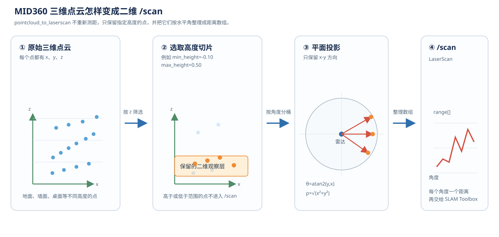

---
status: draft
---

# 41. MID360 三维点云怎样用于二维建图

第 40 章讲的是：MID360 的点云和内置 IMU 进入 FAST-LIO 后，怎样得到三维位姿、轨迹和三维点云地图。本章讨论另一条实际运行链路：**不把 FAST-LIO 的三维地图直接交给 Nav2，而是把 MID360 的原始三维点云先转换成二维 `LaserScan`，再交给 SLAM Toolbox 建立二维栅格地图。**

当前整合工程位于：

```text
/home/wheeltec/wheeltec_ros2_mid360
```

二维建图入口是：

```bash
cd /home/wheeltec/wheeltec_ros2_mid360
./start_2d_mapping.sh
```

它启动的不是 FAST-LIO，而是 `slam_toolbox` 的异步建图节点。完整数据流是：

```text
MID360 激光测距
      ↓ 以太网 UDP
Livox SDK2 + livox_ros_driver2
      ↓
/livox/lidar : sensor_msgs/msg/PointCloud2
      ↓
pointcloud_to_laserscan
      ↓ 选取高度、投影到水平面、整理角度和距离
/scan : sensor_msgs/msg/LaserScan
      +
/odom_combined 与 TF
      ↓
SLAM Toolbox / async_slam_toolbox_node
      ↓
/map : nav_msgs/msg/OccupancyGrid
```

本章最重要的一句话是：**三维雷达提供的是“空间中的许多三维点”，二维建图算法需要的是“机器人周围各个水平角度上的距离”；中间的 `pointcloud_to_laserscan` 节点负责完成这次数据格式和几何含义的转换。**



*图 41-1　MID360 点云先按高度筛选，再投影到水平面并整理为 `/scan`。这一步只生成二维观测，不负责建图和定位。*

---

# 1. 先分清三维点云、二维扫描和二维地图

## 1.1 三种数据分别表示什么

这三种数据经常在同一张 RViz2 窗口里出现，但它们不是同一个东西：

| 数据 | 表示什么 | 当前工程中的例子 |
|---|---|---|
| 三维点云 | 空间中许多测量点，每个点有 `x、y、z` | `/livox/lidar` |
| 二维扫描 | 机器人在水平面上每个角度方向的距离 | `/scan` |
| 二维地图 | 把环境划分成栅格后，每个格子是空闲、占用或未知 | `/map` |

三者的生成关系是：

```text
三维点云
  只保留某个高度范围
      ↓
二维 LaserScan
  表示某一时刻周围各方向的距离
      ↓
SLAM Toolbox 连续比较多次扫描
      ↓
二维 OccupancyGrid 地图
```

因此，MID360 不会因为自己是三维雷达，就自动发布二维地图；它只是提供了比二维雷达更丰富的原始测量。二维地图仍然要由 SLAM Toolbox 根据连续的 `/scan`、里程计和 TF 计算出来。

## 1.2 为什么要把三维雷达变成二维数据

Nav2 的常规室内导航通常在地面平面上规划。对于轮式小车，最关心的是：

```text
车在地面上能不能通过？
前方某个方向有没有墙或障碍物？
机器人在二维地图中的位置是什么？
```

这时不一定需要把所有三维点都交给二维 SLAM。可以先从点云中取出接近车体高度的一层：

```text
保留：可能与车体碰撞的墙、柱子和低矮障碍
过滤：屋顶、过高的悬空物、过低的地面噪声
```

这是一种“3D 感知、2D 建图”的方案。三维雷达仍然在测量三维空间，只是为了匹配二维算法，在接口处把信息压缩成二维扫描。

---

# 2. 当前工程怎样组织这条二维建图链

## 2.1 启动文件在哪里

二维建图启动文件是：

```text
/home/wheeltec/wheeltec_ros2_mid360/src/wheeltec_mid360_bringup/launch/mid360_2d_mapping.launch.py
```

对应的安装入口是：

```text
/home/wheeltec/wheeltec_ros2_mid360/install/wheeltec_mid360_bringup/share/wheeltec_mid360_bringup/launch/mid360_2d_mapping.launch.py
```

`install` 中的文件由 `--symlink-install` 建立链接，实际内容仍然来自 `src` 目录。

脚本 `start_2d_mapping.sh` 做的事情很简单：

```bash
source /opt/ros/humble/setup.bash
source /home/wheeltec/wheeltec_ros2_mid360/install/setup.bash
ros2 launch wheeltec_mid360_bringup mid360_2d_mapping.launch.py
```

也可以不使用脚本，直接启动：

```bash
cd /home/wheeltec/wheeltec_ros2_mid360
source /opt/ros/humble/setup.bash
source install/setup.bash
ros2 launch wheeltec_mid360_bringup mid360_2d_mapping.launch.py
```

## 2.2 一个 launch 文件里启动了哪些节点

当前 `mid360_2d_mapping.launch.py` 主要组织四类程序：

```text
mid360_2d_mapping.launch.py
  ├── turn_on_wheeltec_robot
  │     └── 底盘串口、轮速里程计和 robot_localization EKF
  ├── mid360_scan.launch.py
  │     ├── livox_ros_driver2
  │     ├── pointcloud_to_laserscan
  │     └── static_transform_publisher
  ├── slam_toolbox
  │     └── async_slam_toolbox_node
  └── rviz2
```

`mid360_scan.launch.py` 位于：

```text
/home/wheeltec/wheeltec_ros2_mid360/src/wheeltec_mid360_bringup/launch/mid360_scan.launch.py
```

它专门负责 MID360 驱动、三维点云到二维扫描的转换，以及雷达到车体的静态 TF。这样做的好处是：二维建图使用的点云转换链路可以单独检查，不必把 FAST-LIO 和 Nav2 同时启动起来。

## 2.3 这条链路没有使用 FAST-LIO

要特别区分两个启动入口：

```text
./start_mapping.sh
  → MID360 + FAST-LIO + RViz2
  → 用于三维建图

./start_2d_mapping.sh
  → MID360 + pointcloud_to_laserscan + SLAM Toolbox + RViz2
  → 用于二维建图
```

二维建图入口不订阅 FAST-LIO 的 `/Laser_map`，也不使用 FAST-LIO 发布的 `camera_init → body` 作为二维 SLAM 的输入。两个入口都可能启动 MID360 驱动、RViz2 和底盘节点，因此不能在没有确认的情况下同时运行，否则可能出现重复节点、重复 TF 或同一个雷达被两个驱动实例打开。

---

# 3. MID360 点云怎样变成 `/scan`

## 3.1 先让驱动发布标准 PointCloud2

二维转换节点需要能够读取点的 `x、y、z`，所以当前 `mid360_scan.launch.py` 将 Livox 驱动设置为标准点云格式：

```python
driver = Node(
    package="livox_ros_driver2",
    executable="livox_ros_driver2_node",
    parameters=[{
        "xfer_format": 0,
        "publish_freq": 10.0,
        "frame_id": "livox_frame",
    }],
)
```

在 Livox 驱动中：

```text
xfer_format = 0  → sensor_msgs/msg/PointCloud2
xfer_format = 1  → livox_ros_driver2/msg/CustomMsg
```

所以这条二维链路中的输入应该检查为：

```text
/livox/lidar : sensor_msgs/msg/PointCloud2
```

而第 40 章的 FAST-LIO 入口通常使用 `CustomMsg`，因为它需要直接读取 Livox 点中的 `offset_time` 等字段进行去畸变。两种格式都来自同一个 MID360 驱动，但服务的下游节点不同，不能混着理解。

可以这样确认实际格式：

```bash
ros2 topic type /livox/lidar
ros2 topic info /livox/lidar --verbose
ros2 topic hz /livox/lidar
```

如果当前二维入口正常，第一条命令应看到：

```text
sensor_msgs/msg/PointCloud2
```

## 3.2 高度筛选：从三维中选出一层

`pointcloud_to_laserscan` 首先读取每个点的三维坐标。当前启动文件中设置了：

```text
min_height = -0.10 m
max_height =  0.50 m
```

它只保留满足下面条件的点：

$$
z_{min}le z_ile z_{max}.
$$

这里的 `z_i` 是点在转换目标坐标系中的高度。当前 `target_frame` 设置为 `livox_frame`，因此它首先可以理解为“相对于 MID360 坐标原点的高度范围”。如果雷达安装高度、俯仰角或车体坐标发生改变，原来的高度范围不一定仍然适合。

这个范围不是随便填写的：

- 范围太低，可能只剩地面点，墙面会断裂；
- 范围太高，可能把桌面、悬空物或车顶结构投影成障碍；
- 范围太窄，点太少，`/scan` 会出现很多无穷远值；
- 范围太宽，三维空间中不同高度的物体会重叠到同一个二维角度。

因此，高度筛选是“把三维问题交给二维算法”时最重要的取舍之一。

## 3.3 把保留的点投影到水平面

对通过高度筛选的点 `p_i=(x_i,y_i,z_i)`，转换节点暂时不使用 `z_i` 参与二维距离，而是计算它在水平面上的极坐标：

$$
	heta_i=operatorname{atan2}(y_i,x_i),
$$

$$

ho_i=sqrt{x_i^2+y_i^2}.
$$

其中：

- `θ_i` 是这个点相对于雷达前方的水平角；
- `ρ_i` 是点在水平面上的距离；
- `z_i` 只用于前面的高度筛选。

例如，保留了一个点：

```text
x = 2.0 m
y = 2.0 m
z = 0.2 m
```

那么：

```text
水平角 θ = atan2(2.0, 2.0) = 45°
水平距离 ρ = √(2.0² + 2.0²) ≈ 2.83 m
```

它会成为 `/scan` 中约 `45°` 方向、距离约 `2.83 m` 的一次观测。这个点的三维高度 `0.2 m` 不会出现在 `LaserScan` 的距离数组里，因为二维算法只保留水平距离。

## 3.4 同一个角度有多个点时怎么办

`LaserScan` 不是把所有点原样塞进去，而是先把角度划分成许多小格子。当前参数是：

```text
angle_min       = -π
angle_max       =  π
angle_increment = 0.0087 rad
```

对于每个点，可以计算它落在哪个角度格子：

$$
k_i=leftlfloorrac{	heta_i-	heta_{min}}
{Delta	heta}
ight
floor.
$$

同一个角度格子里可能有多个高度相近的点。转换节点通常保留距离最近的点：

$$
	ext{ranges}[k]=min(
ho_i),qquad iin	ext{第 }k	ext{ 个角度格子}.
$$

保留最近点的原因是：从雷达出发，最近的物体通常是首先会挡住车体的物体。若某个角度格子没有有效点，当前配置 `use_inf: true` 会把它发布为无穷远，而不是伪造一个障碍物。

## 3.5 `/scan` 消息中究竟有什么

生成的 `/scan` 类型是：

```text
sensor_msgs/msg/LaserScan
```

一条消息可以抽象成：

```yaml
header:
  stamp: ...
  frame_id: livox_frame
angle_min: -3.14159
angle_max: 3.14159
angle_increment: 0.0087
range_min: 0.30
range_max: 30.0
ranges: [ ... ]
intensities: [ ... ]
```

其中 `ranges[k]` 表示第 `k` 个角度格子测得的距离。它不再包含原始点的三维高度，也不包含 FAST-LIO 所需的每点 `offset_time`。所以 `/scan` 是给二维 SLAM 使用的“整理后的观测”，不是 MID360 原始数据的完整替代品。

可以用下面的命令看一条实际消息：

```bash
ros2 topic echo --once /scan
```

再检查发布频率：

```bash
ros2 topic hz /scan
```

当前配置目标约为 `10 Hz`，但实际频率取决于雷达数据、网络、点云转换处理速度和 ROS 2 调度。

---

# 4. 二维 SLAM 还需要里程计、TF 和时间

## 4.1 只有 `/scan` 不能完成连续建图

一条 `/scan` 只说明“这一时刻雷达看到了什么”。SLAM Toolbox 还要知道：

```text
这条扫描是在什么时刻采集的？
雷达相对于车体装在哪里？
机器人从上一帧到这一帧大概移动了多少？
```

因此，二维建图的输入不是单独的 `/scan`，而是：

```text
/scan
/odom_combined 或对应的里程计信息
map → odom_combined → base_footprint → livox_frame
```

当前工程使用的坐标关系可以画成：

```text
map
 │  SLAM Toolbox 根据扫描匹配发布
 ▼
odom_combined
 │  底盘 robot_localization EKF 发布
 ▼
base_footprint
 │  MID360 安装关系，由静态 TF 发布器发布
 ▼
livox_frame
```

## 4.2 这些 TF 分别由谁提供

在 `mid360_2d_mapping.launch.py` 中：

- `turn_on_wheeltec_robot` 启动底盘、轮速里程计和 `robot_localization` 的导航 EKF；
- EKF 的输出被使用为 `/odom_combined`，并提供连续的 `odom_combined → base_footprint`；
- `mid360_scan.launch.py` 用 `static_transform_publisher` 发布 `base_footprint → livox_frame`；
- SLAM Toolbox 根据扫描和地图匹配发布 `map → odom_combined`。

三段关系不能由多个节点重复发布。若底盘、SLAM 或手动命令同时发布同一段 TF，RViz2 里可能看到地图跳动，SLAM 也可能无法稳定匹配。

## 4.3 `base_footprint → livox_frame` 不是随便填的

当前启动文件里的雷达外参仍是临时值：

```text
lidar_x     = 0.0
lidar_y     = 0.0
lidar_z     = 0.30
lidar_roll  = 0.0
lidar_pitch = 0.0
lidar_yaw   = 0.0
```

它表达的是：雷达相对于车体原点位于 `x=0、y=0、z=0.30 m`，并且暂时假定没有安装角度偏差。真实安装后，应测量雷达相对于 `base_footprint` 的平移和旋转，再通过 launch 参数传入：

```bash
ros2 launch wheeltec_mid360_bringup mid360_2d_mapping.launch.py \
  lidar_x:=... lidar_y:=... lidar_z:=... \
  lidar_roll:=... lidar_pitch:=... lidar_yaw:=...
```

如果这个 TF 错了，`/scan` 话题仍可能正常发布，但 SLAM Toolbox 会把扫描放到错误的车体位置，表现为墙面变厚、重影、转弯时地图错位或回到起点不能闭合。

## 4.4 这一条二维链路直接使用 MID360 IMU 吗

在当前 `mid360_2d_mapping.launch.py` 中，SLAM Toolbox 直接订阅的是 `/scan`，不是 `/livox/imu`。MID360 驱动仍然会发布自己的 `/livox/imu`，但它没有被这个二维 SLAM 节点直接使用。

当前二维链路的运动先验主要来自：

```text
底盘编码器
    ↓
底盘里程计
    ↓
robot_localization EKF
    ↓
/odom_combined 与 odom_combined → base_footprint
```

如果以后要把 MID360 IMU 也融合进二维定位，需要另外配置 `robot_localization` 或其他融合节点，明确它订阅哪个 IMU 话题、使用哪个坐标系以及是否已经融合过同一份数据。不能仅因为驱动发布了 `/livox/imu`，就认为 SLAM Toolbox 已经使用了它。

---

# 5. SLAM Toolbox 怎样用 `/scan` 形成二维地图

## 5.1 当前使用的算法和参数

当前启动文件中的算法节点是：

```python
package="slam_toolbox"
executable="async_slam_toolbox_node"
```

参数文件位于：

```text
/home/wheeltec/wheeltec_ros2_mid360/src/wheeltec_mid360_bringup/config/mid360_slam_toolbox.yaml
```

关键配置是：

```yaml
mode: mapping
scan_topic: /scan
map_frame: map
odom_frame: odom_combined
base_frame: base_footprint
resolution: 0.05
do_loop_closing: true
minimum_travel_distance: 0.10
minimum_travel_heading: 0.10
```

`async_slam_toolbox_node` 的“异步”主要表示：扫描到达后，节点可以在自己的处理线程中进行匹配和优化，不必让底盘停下来等待每一次计算完成。它仍然需要扫描的时间戳、TF 和里程计能够连续对应。

## 5.2 第一帧怎样建立参考

启动后，SLAM Toolbox 还没有完整的地图。它会把第一批有效 `/scan` 作为初始观测，并把开始位置附近建立为 `map` 的参考区域。此时可以把机器人初始位姿理解为：

```text
map 原点 ≈ 建图开始时机器人所在位置
```

这里的 `map` 不是 MID360 自己建立的坐标系，而是 SLAM Toolbox 为二维地图建立的全局参考坐标。地图一旦开始生成，后续扫描都要转换到这个参考中。

## 5.3 每来一帧扫描做什么

连续运行时，每帧 `/scan` 大致经历下面的过程：

```text
收到当前 /scan
      ↓
读取 header.stamp 和 frame_id
      ↓
用 TF 找到当前 livox_frame 相对 base_footprint 的位置
      ↓
用 /odom_combined 预测机器人从上一帧移动了多少
      ↓
把当前扫描与局部地图进行扫描匹配
      ↓
得到当前机器人在 map 中的位姿
      ↓
更新 /map，并更新 map → odom_combined
```

“扫描匹配”可以用一个直观例子理解：如果上一帧看到一面墙，当前帧也看到同一面墙，SLAM Toolbox 会尝试调整当前机器人的位置和角度，使两次扫描中的墙尽量重合。底盘里程计提供搜索的初始位置，雷达扫描提供环境几何约束。

## 5.4 `/map` 是怎样形成的

二维地图通常使用占用栅格表示。每个栅格保存一种状态：

```text
空闲：雷达射线从机器人到障碍物之间经过的区域
占用：射线终点附近被测到障碍物的区域
未知：没有被可靠观测到的区域
```

对一条距离为 `r` 的扫描射线，可以近似理解为：

```text
雷达原点 ─────────────→ 障碍物点
       沿途栅格设为空闲     终点附近栅格设为占用
```

每一帧扫描都先利用当前位姿放到 `map` 坐标中，再更新相应栅格。多帧扫描叠加后，墙体、房间和通道逐渐形成二维地图。若机器人位姿估计不正确，同一面墙的多次观测不能重合，就会出现厚墙、双墙或弯曲墙。

## 5.5 回环闭合做了什么

机器人绕房间走一圈后，理论上应该回到建图起点附近。仅依靠里程计时，起点和终点通常会有累计误差；SLAM Toolbox 可以把当前扫描和过去的扫描进行回环匹配，并对一段历史轨迹做优化。

所以回到起点附近不是为了“让程序知道任务结束”，而是为了提供一次很强的几何约束：

```text
走过一圈
  ↓
当前扫描重新看到起点附近的墙
  ↓
识别为同一位置
  ↓
优化历史位姿和地图
  ↓
减小累计漂移
```

回环闭合不是任何环境都能成功。长走廊、重复货架、空旷区域或扫描中有大量移动物体时，匹配约束会变弱，仍需要检查地图是否真实闭合。

---

# 6. 输出什么，RViz2 为什么能显示

## 6.1 主要话题

在二维建图过程中，建议重点检查下面这些接口：

| 话题 | 消息类型 | 作用 |
|---|---|---|
| `/livox/lidar` | `sensor_msgs/msg/PointCloud2` | MID360 原始三维点云 |
| `/livox/imu` | `sensor_msgs/msg/Imu` | MID360 IMU，当前二维 SLAM 不直接订阅 |
| `/scan` | `sensor_msgs/msg/LaserScan` | 从三维点云投影出的二维扫描 |
| `/odom_combined` | 通常为 `nav_msgs/msg/Odometry` | 底盘/EKF 的连续运动估计 |
| `/map` | `nav_msgs/msg/OccupancyGrid` | SLAM Toolbox 生成的二维栅格地图 |
| `/map_metadata` | `nav_msgs/msg/MapMetaData` | 地图分辨率、宽高和原点等信息 |
| `/tf` | `tf2_msgs/msg/TFMessage` | 动态 TF，如 `map → odom_combined` |
| `/tf_static` | `tf2_msgs/msg/TFMessage` | 静态 TF，如 `base_footprint → livox_frame` |

## 6.2 RViz2 显示的是话题，不是直接读取雷达内部画面

RViz2 显示二维地图时，主要订阅：

```text
/map
/scan
/tf
/tf_static
/odom_combined 或 /path
```

它首先按照 TF 把 `/scan` 中每个距离和角度转换到 Fixed Frame，通常是 `map`，然后把这些点绘制到地图坐标中。`/map` 中的栅格颜色也只是 OccupancyGrid 的可视化结果，不是雷达直接传来的图片。

如果 RViz2 中能看到 `/scan`，但看不到 `/map`，说明点云转换可能正常，SLAM Toolbox 或其参数仍有问题；如果 `/map` 存在但 `/scan` 不跟随墙面，优先检查时间戳和 TF。

## 6.3 保存地图

当前工程的保存脚本是：

```bash
cd /home/wheeltec/wheeltec_ros2_mid360
./save_2d_map.sh
```

它调用：

```bash
ros2 run nav2_map_server map_saver_cli
```

地图通常保存到：

```text
/home/wheeltec/wheeltec_ros2_mid360/maps/online/
```

输出包括：

```text
*.pgm   栅格图像
*.yaml  地图分辨率、原点和阈值等配置
```

保存的地图可以给后续 Nav2 的地图服务器和 AMCL 使用，但在启用自动运动前，仍要用实时 `/scan` 叠加检查。

---

# 7. 这条二维建图链路的关键参数和精度

## 7.1 5 cm 分辨率不等于 5 cm 真实精度

当前 SLAM Toolbox 使用：

```yaml
resolution: 0.05
```

这表示一个栅格的边长是 `5 cm`。它决定地图保存时的空间量化间隔，不保证墙的位置误差一定小于 `5 cm`。实际误差还取决于：

- MID360 的测量噪声和点云密度；
- 三维点云转二维时的高度范围；
- 雷达安装外参；
- 编码器里程计和 EKF 的连续性；
- 扫描时间戳和 TF 是否同步；
- 环境中是否有足够的墙面和角点；
- 回环闭合是否成功。

对于平整室内地面和结构明显的房间，这条链路通常可以满足普通轮式小车二维导航；它不应直接被当作测量建筑尺寸或厘米级测绘的结果。

## 7.2 高度范围决定二维地图看到了什么

当前值：

```text
min_height = -0.10 m
max_height =  0.50 m
```

如果雷达安装位置变化，或者安装角度有俯仰，原本的高度切片就会在环境中倾斜。此时即使点云本身正常，二维地图也可能把地面、桌面或悬空物错误地当成墙。

调参时不要只看地图黑不黑，而要同时在 RViz2 中显示原始 `/livox/lidar` 和 `/scan`：

```text
原始点云：确认空间中确实有测量点
/scan：确认留下的是适合车体碰撞判断的那一层
/map：确认连续扫描能重合
```

## 7.3 运动速度和时间戳

当前转换节点设置：

```text
publish_freq = 10.0 Hz
scan_time    = 0.1 s
```

这不表示每帧中的所有点都在同一时刻测得。MID360 是非重复扫描雷达，一帧内部的点也有各自的采样时刻，但当前 `pointcloud_to_laserscan` 主要负责把它们整理成一条二维扫描，不像 FAST-LIO 那样使用每点 `offset_time` 做严格去畸变。

因此：

- 小车移动过快时，二维 `/scan` 可能出现轻微形变；
- 转弯过快时，墙面可能变厚或出现重影；
- 时间基准不一致时，SLAM 可能跳变或拒绝扫描。

如果需要更严格地处理扫描期间的运动，应先由 FAST-LIO 或其他激光惯性算法完成去畸变，再设计适配的二维投影链路；不能假设普通点云转扫描节点自动完成了 FAST-LIO 的全部工作。

---


