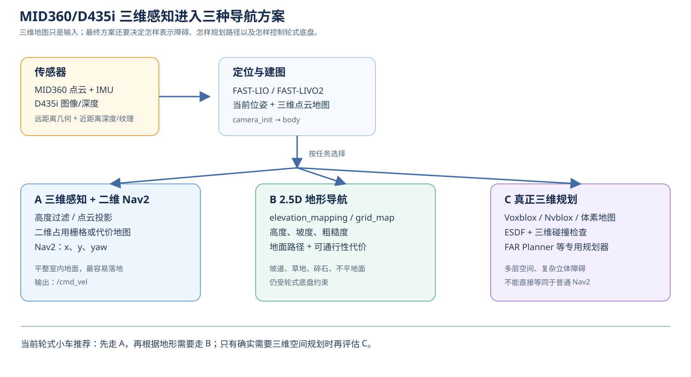
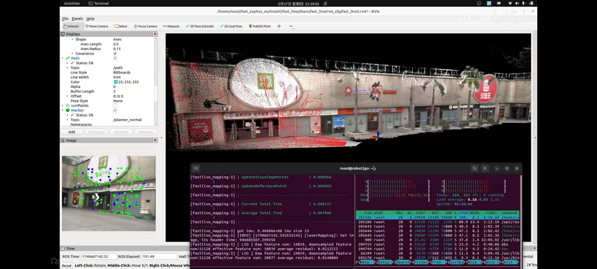
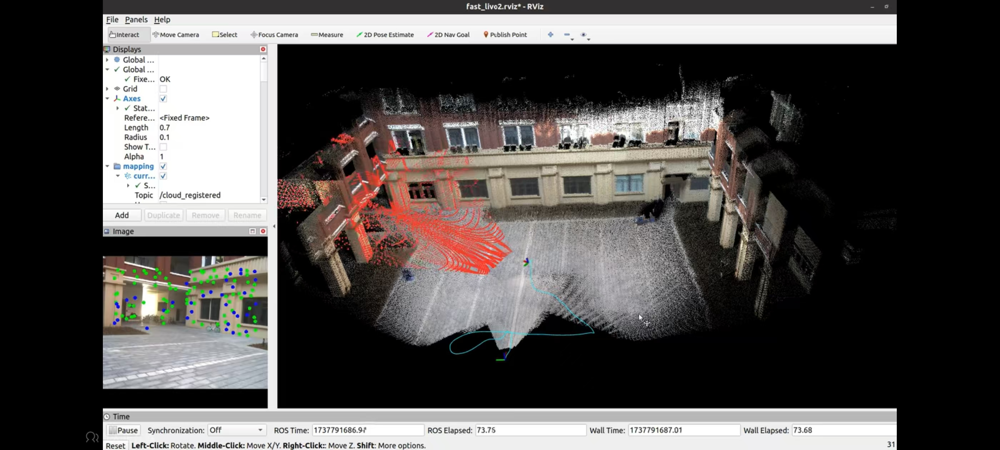

# MID360 三维导航方案调研

前面的 FAST-LIO 和 FAST-LIVO2 主要解决两件事：估计机器人当前位姿，以及把传感器数据放到共同坐标系中形成地图。**有了三维地图，不等于已经完成导航。** 导航还需要把地图变成可碰撞检查的数据，接收目标点，搜索一条可行路径，再将路径转换为底盘速度。

对于普通轮式小车，最常见、也最容易落地的方案不是在三维空间中任意飞行式规划，而是：

```text
三维传感器和三维定位
  → 提取小车真正会碰到的障碍物和地面信息
  → 二维或 2.5D 地图
  → 路径规划和速度控制
```

因此，本调研把相关方法分成三层：三维感知后使用二维 Nav2、带高度和坡度的 2.5D 地形导航，以及真正使用体素或距离场进行三维路径规划。



*图 41-1　同一套 MID360/D435i 三维感知数据，可以根据地面和任务需求进入二维、2.5D 或真正三维的导航分支。*

## 1. 先分清“建图”“定位”和“导航”

在我们的系统中，三者并不是同一个节点完成的：

| 工作 | 要回答的问题 | 典型结果 |
|---|---|---|
| 建图 | 周围环境的墙、地面和障碍物在哪里 | `/Laser_map`、点云地图、体素地图 |
| 定位 | 机器人现在位于地图中的哪里 | 位姿、里程计、`TF`、`/path` |
| 导航 | 从当前点到目标点怎样走，并如何控制底盘 | 规划路径、局部轨迹、`/cmd_vel` |

FAST-LIO 或 FAST-LIVO2 主要提供前两项。它们估计 `camera_init → body`，并发布三维点云、轨迹和当前位姿；它们不会自动接收一个目标点，也不会替 Nav2 产生 `/cmd_vel`。所以，FAST-LIVO2 的 RViz2 画面即使很漂亮，也只能说明定位和建图链路在工作，不能单独证明机器人已经具备自主导航能力。

## 2. 三种导航层次

### 2.1 三维感知，二维导航

这是室内轮式小车最常用的方案。MID360 或 D435i 先提供三维点云，处理节点再做高度筛选和投影：

```text
点云 (x, y, z)
  → 删除地面点
  → 保留小车碰撞高度内的点
  → 将剩余点投影为 (x, y)
  → 二维占用栅格或局部代价地图
  → Nav2 规划 x、y、yaw
```

例如，车高约 `0.5 m` 时，可以把离地面很近的点作为地面，把位于 `0.05～0.7 m` 范围内的点作为可能碰撞的障碍物。高于车顶、不会碰到车体的点，可以不加入底盘的碰撞层，但仍可以保留在三维地图中。

这种方案的优点是可以直接使用 Nav2 的 `planner_server`、`controller_server`、代价地图和恢复行为。缺点是地图中的高度信息在投影时被压缩了，不能很好地表达悬空障碍、陡坡和多层地面。

### 2.2 2.5D 地形导航

2.5D 不是把环境完全压成一张黑白平面，而是对每个水平位置保存一个或多个地形属性：

```text
(x, y) → 高度 z、坡度、粗糙度、可通行性和不确定度
```

规划器仍然主要在地面上寻找路径，但会避开过陡、过高、过于粗糙或不确定度过大的区域。它很适合：

- 室外地面和草地；
- 缓坡、斜坡和台阶附近；
- 地面不完全平整的仓库或园区；
- 需要判断“这条路虽然没有障碍，但车能不能开上去”的任务。

经典工作是 Fankhauser 等人的 **Robot-Centric Elevation Mapping with Uncertainty Estimates**。相关 ROS 工具通常以 `grid_map` 或 `elevation_mapping` 表达高程、方差和派生地形信息。

对轮式小车来说，2.5D 往往是三维导航的实用折中：保留高度和地形代价，但不要求规划器在空中或楼梯空间中任意搜索 `z`。

### 2.3 真正三维导航

真正三维导航把环境表示成体素、TSDF、ESDF 或其他三维空间结构，规划器直接在三维空间中搜索。状态可能包含：

```text
(x, y, z, yaw)
```

在需要考虑车体姿态的地形上，还可能包含：

```text
(x, y, z, roll, pitch, yaw)
```

这类方法适合：

- 多层空间、地下空间和复杂立体障碍；
- 需要跨越明显高度变化的地面机器人；
- 悬空通道、立体停车场或大型工业场景；
- 机器人自身能够可靠控制高度和俯仰姿态的系统。

对于普通差速轮式小车，真正的三维规划并不会因为“地图是三维的”就自动变得合理。规划器还必须知道车轮接触地面的约束、最大坡度、最小离地间隙、车体碰撞模型和控制器能否跟踪带高度变化的轨迹。

## 3. 相关论文和开源系统

### 3.1 Elevation Mapping：用高程描述地面

**论文：** Robot-Centric Elevation Mapping with Uncertainty Estimates，Fankhauser、Bloesch、Hutter，ICRA 2014。

它把传感器观测融合成机器人周围的高程网格，并为高度保存不确定度。后续节点可以由高程差计算坡度和粗糙度，再生成可通行性代价。

```text
三维点云
  → 高程网格
  → 坡度/粗糙度/不确定度
  → 可通行性代价
  → 地面路径规划
```

参考实现：[`ANYbotics/elevation_mapping`](https://github.com/ANYbotics/elevation_mapping) 和 [`ANYbotics/grid_map`](https://github.com/ANYbotics/grid_map)。这些项目的原始使用场景包含腿式机器人，但高程地图本身并不限定机器人必须是腿式；轮式小车同样可以使用，只需重新定义轮式底盘的坡度和粗糙度阈值。

### 3.2 Voxblox：用 ESDF 表示离障碍物的距离

**论文：** Voxblox: Incremental 3D Euclidean Signed Distance Fields for On-Board MAV Planning，Oleynikova 等，IROS 2017。

Voxblox 的核心不是某一条底盘路径，而是维护一个可以查询的三维距离场。规划器可以快速判断一个候选位置离障碍物还有多远，并利用距离梯度生成较平滑的轨迹。

参考实现：[`ethz-asl/voxblox`](https://github.com/ethz-asl/voxblox)。论文示例主要面向飞行器，但 TSDF/ESDF 这种三维地图表达同样可以作为地面机器人的碰撞查询基础。

### 3.3 Nvblox：Jetson/ROS 2 上的三维重建组件

Nvblox 是 NVIDIA 提供的 GPU 加速三维重建和距离场系统，能够将深度相机或激光雷达观测转换为 TSDF、ESDF、网格和障碍物信息。它更像是“导航前的三维地图与碰撞数据层”，而不是一个完整的轮式三维规划器。

参考实现：[`nvidia-isaac/nvblox`](https://github.com/nvidia-isaac/nvblox)。在 ROS 2 系统中，它可以将三维障碍物处理结果提供给 Nav2 的代价地图，形成：

```text
三维重建/距离场
  → 二维代价地图或局部障碍层
  → Nav2 规划和控制
```

这条路线和 Jetson 平台比较匹配，也适合把 MID360 的远距离几何信息与 D435i 的近距离深度信息结合起来。

### 3.4 FAR Planner：面向未知复杂环境的三维激光导航

可以检索论文 **FAR Planner: Fast, Robust, and Versatile 3D LiDAR Based Autonomous Navigation in Complex and Unknown Environments**。它面向使用三维激光雷达的移动机器人，在未知环境中进行障碍物感知、碰撞检查、路径搜索和轨迹生成，比“只把点云投影成 `/scan`”更接近完整的三维激光导航。

它值得参考的地方是：地图不是最终目的，三维点云要继续参与可见性判断、碰撞检查和局部规划。移植时仍需要根据轮式底盘重新实现运动约束和速度控制，不能直接把论文中的规划器当作可执行的 `/cmd_vel` 节点。

### 3.5 TARE Planner：三维探索和移动规划

可以检索 **TARE Planner: A Hierarchical Framework for Efficiently Exploring Complex 3D Environments**。它关注大范围未知三维环境中的探索：选择值得前往的区域，规划到探索目标的路线，并减少重复覆盖。

它与普通 Nav2 的差别在于，目标不只是用户给出的一个二维坐标，而是还要回答“下一块未知区域在哪里”。因此它更适合自主探索、地下空间和大范围户外场景，而不是简单的室内点到点导航。

## 4. MID360、D435i 与这些方案怎样组合

MID360 和 D435i 的作用并不完全相同：

| 设备 | 更擅长提供什么 | 在组合系统中的作用 |
|---|---|---|
| MID360 | 远距离、较大范围的三维几何和反射信息 | 建图、定位、远距离障碍物和结构感知 |
| D435i | 近距离深度、彩色图像和相机视角信息 | 近距离障碍、纹理、彩色信息和补充深度 |
| FAST-LIO | 点云 + IMU 的定位与建图 | 三维位姿、轨迹和点云地图 |
| FAST-LIVO2 | 点云 + IMU + 图像的融合定位与建图 | 使用视觉约束改善状态估计并关联图像信息 |
| Nav2 或专用规划器 | 目标到路径再到速度 | 导航任务和底盘控制 |

推荐的数据流可以写成：

```text
MID360 点云 ─┐
             ├→ FAST-LIO/FAST-LIVO2 → 当前位姿 + 三维地图
D435i 图像 ──┘                         │
                                      ├→ 二维障碍投影 → Nav2
                                      ├→ 高程/可通行性 → 2.5D 规划
                                      └→ ESDF/体素地图 → 专用三维规划
```

这里要注意，FAST-LIVO2 的彩色三维地图主要用于定位、建图和观察；它不会自动决定“哪些点是轮子会撞到的障碍”。导航前还要进行地面分割、障碍物高度筛选、动态物体处理和机器人碰撞模型匹配。

### 4.1 FAST-LIVO2 比 FAST-LIO 多了什么

当前工程使用的是 **FAST-LIO**：输入为 MID360 点云和 IMU，不包含相机。除了 FAST-LIO，还可以把 MID360 与 Intel RealSense D435i 组合，使用 **FAST-LIVO2**（Fast LiDAR-Inertial-Visual Odometry）。它在 FAST-LIO 的激光雷达—IMU 估计基础上，再加入相机图像约束，因此属于“激光雷达 + IMU + 相机”的紧耦合里程计与建图方法。

FAST-LIO 主要用两类信息：

```text
MID360 点云：周围的几何形状
MID360 IMU：机器人短时间内怎样运动
```

FAST-LIVO2 再加入一条视觉数据链：

```text
D435i 彩色图像/相机内参：图像中的纹理、边缘和亮度变化
```

因此它每一帧不只比较“点是否落在墙面上”，还可以比较“同一个空间点投影到相机后，图像外观是否一致”。在墙面、柱子等几何结构较少，但画面有明显纹理的区域，视觉约束可以帮助维持短时位姿；在光照变化大、画面模糊或没有纹理时，激光雷达的几何约束仍然是主要支撑。

| 方法 | 主要输入 | 主要观测 | 适合的场景 |
|---|---|---|---|
| FAST-LIO | MID360 点云 + IMU | 点到局部平面的几何残差 | 只安装雷达和 IMU，结构化环境 |
| FAST-LIVO2 | MID360 点云 + IMU + D435i 图像 | 点到平面残差 + 图像光度残差 | 既有几何结构又有纹理，需要更丰富的三维/彩色结果 |

这里的“视觉”不是把 D435i 的画面直接贴到 RViz2 上，而是把三维地图点按照相机内参和雷达—相机外参投影到图像中，再用图像信息参与状态更新。D435i 的深度流是否直接作为 FAST-LIVO2 输入，要以具体版本的驱动接口为准；不能看到设备有深度图，就默认算法已经使用了深度图。

### 4.2 FAST-LIVO2 的计算主线

FAST-LIVO2 与 FAST-LIO 的前半段相同：先用 IMU 预测状态，按点的时间去畸变，再把 MID360 点变换到统一的建图坐标。区别在于，点云与地图匹配后，还会把地图中的三维点投影到 D435i 图像：

```text
MID360 点云 + IMU + D435i 图像
          │
          ├─ IMU 传播：预测 R、p、v、偏置
          ├─ 点云去畸变和雷达/机体外参变换
          ├─ LiDAR：近邻搜索 → 局部平面 → 点到平面残差
          ├─ Camera：三维点投影到像素 → 比较图像灰度/颜色
          └─ 合并两类残差 → 迭代误差状态卡尔曼滤波
                         │
                 修正当前位姿和地图
```

雷达部分仍可以写成：

$$
r_i^{L}=n_i^{\mathsf T}(p_i^W-q_i).
$$

对一个已经位于建图坐标中的地图点 `P_j^W`，相机投影可以简化写成：

$$
\begin{bmatrix}u_j\\v_j\\1\end{bmatrix}
\sim K\,T_{CW}\begin{bmatrix}P_j^W\\1\end{bmatrix},
$$

其中 `K` 是 D435i 的相机内参矩阵，`T_CW` 表示建图坐标到相机坐标的变换，`(u_j,v_j)` 是预测的像素位置。若相机在该位置观察到的图像灰度是 `I(u_j,v_j)`，参考图像中对应位置的灰度是 `I_ref`，则视觉光度残差可以用下面的教学形式表示：

$$
r_j^{V}=I(u_j,v_j)-I_{ref}(u_j,v_j).
$$

实际算法还会考虑图像梯度、曝光变化、图像金字塔和有效像素筛选；上式只用于说明“视觉观测如何变成可以参与滤波的数值”。两类观测合在一起：

$$
r=\begin{bmatrix}r^{L}\\r^{V}\end{bmatrix},
\qquad
H=\begin{bmatrix}H^{L}\\H^{V}\end{bmatrix}.
$$

随后仍然使用误差状态卡尔曼更新：

$$
K=P H^{\mathsf T}(H P H^{\mathsf T}+R)^{-1},
\qquad
\delta x=-K r.
$$

所以 FAST-LIVO2 不是“先用 FAST-LIO 建图，再把相机图片贴上去”，而是在同一轮状态估计中同时使用几何残差和视觉残差。最终的位姿、轨迹和点云地图仍然要经过统一坐标系变换后发布。

### 4.3 MID360 + D435i 需要额外准备什么

如果以后要在本工程中尝试 FAST-LIVO2，除了安装两个设备，还要重新确认以下接口和标定参数：

1. **图像话题**：D435i 的彩色图像话题名、编码、分辨率和发布频率；
2. **相机内参**：焦距、主点和畸变参数，通常通过 `CameraInfo` 提供；
3. **雷达—相机外参**：雷达坐标与相机坐标之间的旋转和平移 `T_CL`；
4. **IMU 选择**：明确使用 MID360 IMU、D435i IMU，还是经过校准后的统一 IMU，不能未经时间同步就把两颗 IMU 的数据混在一起；
5. **时间同步**：点云、IMU 和图像的时间戳要处于同一时间基准，并检查相机曝光延迟；
6. **计算资源**：图像解码、特征/光度残差和点云匹配会增加 Jetson 的 CPU、GPU、内存和带宽负担。

因此，FAST-LIVO2 的移植重点不只是“把一个 launch 文件名改掉”，而是要同时对上：

```text
MID360 点云字段和时间
+ D435i 图像编码和 CameraInfo
+ 雷达—相机—IMU 外参
+ 三类数据的时间同步
+ FAST-LIVO2 版本要求的话题和参数
```

下面两张图是 FAST-LIVO2 与 D435i 组合运行时的示例画面。图中的点云和相机画面/视觉特征同时出现，符合视觉—激光融合系统的典型显示方式；是否真的将图像作为滤波观测使用，还要以节点订阅列表、参数和运行日志为准。它们是调研参考，不代表当前 `Mid360_test_ws0922` 已经运行 FAST-LIVO2。



*图 41-2　FAST-LIVO2 融合 D435i 图像后的 RViz2 示例：点云、轨迹和图像中的视觉特征同时显示。*



*图 41-3　FAST-LIVO2 融合 D435i 的 RViz2 示例：当前配准点云、历史点云和相机画面共同用于观察融合效果。*

调研阶段可以先把 FAST-LIVO2 看成 FAST-LIO 的扩展方向：FAST-LIO 负责验证 MID360 点云、IMU、时间和坐标链路；等这条链路稳定后，再增加 D435i 图像、内参、外参和同步，逐步验证视觉残差是否真正进入算法，而不是一开始同时修改驱动、坐标和建图算法。

进一步阅读可参考 [FAST-LIVO2 官方仓库](https://github.com/hku-mars/FAST-LIVO2)。实际移植时应以所选版本的 README、配置文件、消息接口和相机驱动要求为准。

## 5. 对本项目的三条可选路线

### 路线 A：三维感知 + Nav2 二维导航

这是当前最推荐的第一阶段方案：

```text
MID360 + IMU
  → FAST-LIO
  → 点云高度过滤/地面剔除
  → 二维占用栅格或 Nav2 obstacle layer
  → Nav2 planner_server
  → Nav2 controller_server
  → /cmd_vel
```

如果加入 D435i，可以让深度相机负责近距离盲区，让 MID360 负责更远和更完整的几何结构。这个方案保留了三维传感器的优势，但不需要修改 Nav2 的核心规划模型。

### 路线 B：高程地图 + 2.5D 可通行性导航

当小车需要在坡道、草地、碎石地面或不平整地面行驶时，采用：

```text
FAST-LIO/FAST-LIVO2 位姿
  + MID360/D435i 三维点云
  → elevation_mapping/grid_map
  → 高度、坡度、粗糙度和可通行性
  → 轮式约束下的地面路径规划
  → 底盘控制
```

这条路线需要新增的不是单纯的地图显示，而是底盘通过性模型，例如最大坡度、最大台阶高度、最小离地间隙和车体宽度。

### 路线 C：三维体素/ESDF + 专用三维规划器

只有当任务确实需要跨越明显的高度变化，或需要在复杂立体空间中规划时，才考虑这条路线：

```text
FAST-LIO/FAST-LIVO2
  → Voxblox/Nvblox/其他三维体素地图
  → 3D 碰撞检查和距离场
  → FAR Planner、采样式或动力学约束规划器
  → 专用轨迹跟踪控制器
```

Nav2 可以继续承担任务管理、目标接口或部分二维控制工作，但不能把普通 `planner_server` 当成任意三维空间规划器。真正的三维规划器还需要解决轨迹高度、车体姿态、碰撞模型和底盘控制接口的问题。

## 6. 结合当前工程的推荐实施顺序

不要一开始同时更换算法、传感器和导航接口。可以按以下顺序逐层验证：

1. 保持当前 FAST-LIO，确认 MID360 点云、内置 IMU、时间戳、外参和 `camera_init → body` 正常；
2. 将 `/Laser_map` 或实时点云做地面分割和高度过滤，先生成二维障碍物话题；
3. 补齐 Nav2 所需的 `map → odom → base_link` 关系，并验证 `/cmd_vel` 能让底盘执行；
4. 加入 D435i，先只验证图像、深度、`CameraInfo` 和近距离障碍物，不立即改动主定位链；
5. 再评估 FAST-LIVO2，重新标定雷达—相机—IMU 外参并验证三类数据的时间同步；
6. 如果平面投影无法表达实际地形，再加入 `elevation_mapping/grid_map`，形成 2.5D 可通行性代价；
7. 只有确实需要跨越三维空间时，才引入 Nvblox/Voxblox 和专用三维规划器。

每次更换算法都要重新确认四条接口：

```text
输入话题和消息类型
时间戳与同步方式
坐标系和外参
输出路径如何转换为底盘可执行的速度
```

## 7. 调研结论

对于当前轮式小车，最现实的技术路线是：

```text
MID360 + D435i：三维感知
FAST-LIO/FAST-LIVO2：三维定位和建图
高度过滤或高程地图：提取地面与可通行性
Nav2：二维路径规划和速度控制
```

这可以概括为：**三维感知，二维或 2.5D 导航。**

真正三维导航并不是把 RViz2 中的点云直接交给 Nav2，而是要增加三维地图表达、碰撞检查、运动约束、专用规划器和轨迹控制器。FAR Planner、TARE Planner、Voxblox/Nvblox 和 Elevation Mapping 分别代表了三维激光导航、三维探索、三维距离场和高程地形建模等方向，可以作为后续算法移植和方案选型的参考。

## 参考资料与检索入口

- [FAST-LIO 官方仓库](https://github.com/hku-mars/FAST_LIO)：MID360 点云和 IMU 的激光惯性定位与建图。
- [FAST-LIVO2 官方仓库](https://github.com/hku-mars/FAST-LIVO2)：激光、IMU 与视觉融合的定位和建图。
- [Robot-Centric Elevation Mapping with Uncertainty Estimates](https://ieeexplore.ieee.org/document/6942650)：高程地图与不确定度。
- [ANYbotics/elevation_mapping](https://github.com/ANYbotics/elevation_mapping)：高程地图参考实现。
- [ANYbotics/grid_map](https://github.com/ANYbotics/grid_map)：二维网格中保存高度、坡度和其他地形层。
- [Voxblox](https://github.com/ethz-asl/voxblox)：增量 TSDF/ESDF 三维地图。
- [NVIDIA Isaac ROS Nvblox](https://github.com/nvidia-isaac/nvblox)：Jetson/ROS 2 方向的 GPU 三维重建与距离场。
- FAR Planner、TARE Planner：可用论文标题检索其三维激光导航和三维探索实现；实际移植前应以对应版本的源码、许可证和输入输出接口为准。
