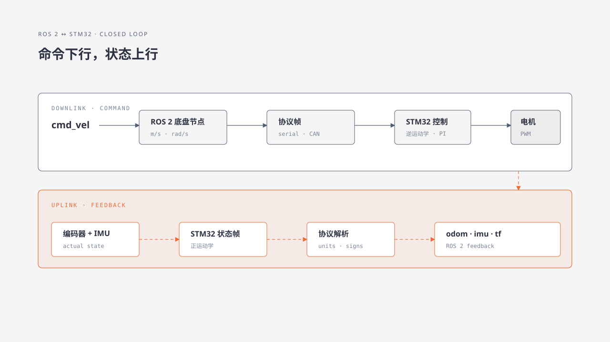

# 37. ROS 2 与 STM32 联调

## 37.1 学习目标

沿着 `cmd_vel` 到电机、再从编码器/IMU 回到 ROS 2 的完整链路设置检查点，定位通信和单位转换问题。

## 37.2 适用范围

使用 `turn_on_wheeltec_robot` 与串口底盘协议的 ROS 2 机器人。CAN 驱动可沿用同样的边界检查。

## 37.3 操作前检查

- STM32 固件已通过架空验收并可回滚。
- 串口设备别名和权限稳定。
- ROS 2 底盘节点源码与固件协议版本匹配。

## 37.4 工作原理

每个箭头都是独立边界。最常见错误是端口不对、协议版本不对、mm/s 与 m/s 漏换、角速度缩放、字节序和坐标符号。

## 37.5 操作步骤

1. 使用 udev 属性确认底盘设备别名指向当前 USB 转串口芯片。
2. 关闭电机使能，启动底盘节点，观察串口打开和接收日志。
3. 发布零速，抓取下行帧并核对帧头、长度、校验和单位。
4. 发布小正 X 速度，比较 `cmd_vel`、下行整数、OLED 目标和各轮目标。
5. 使能后短时运行，比较编码器实际、上行帧和 ROS 里程计。
6. 手动转动机器人，核对 IMU 轴、上行原始值和 ROS 单位。
7. 断开通信，验证 STM32 超时失能；恢复后仍从零速开始。

ROS 侧不知道从哪个 Launch 和 C++ 回调开始追踪时，先完成 [`turn_on_wheeltec_robot` 源码与启动链导读](../04-ros2-development/turn-on-wheeltec-robot-source-walkthrough.md)，再把 `cmd_vel`、串口下行、上行解析、里程计和 IMU 逐项对应到本章检查点。

## 37.6 验收标准

- 设备别名在重插后稳定。
- ROS 速度和协议整数的缩放可手算复核。
- OLED、轮速、里程计和 IMU 符号一致。
- 停止、节点退出和通信断开都能让底盘安全停机。
- 记录中包含 ROS 包版本、固件版本和抓帧证据。

## 37.7 故障排查

| 现象 | 边界 |
|---|---|
| `cmd_vel` 有值但无下行帧 | ROS 节点订阅、端口或 Control 函数 |
| 下行正确但 OLED 不变 | 线缆、波特率、帧校验或固件协议 |
| 电机动作正确但 odom 错 | 上行解析、编码器方向、正运动学或单位 |
| IMU 方向错 | 板载轴定义、固件重映射或 ROS frame_id |
| 断开主控后继续运动 | 通信超时和失能逻辑缺失，停止测试 |

!!! note "教材代码资源"
    本节使用的代码入口见[教材代码资源附录](../appendices/d-public-source-reference.md)。

## 章节导航

[上一章：修改、编译、烧录与回滚固件](36-build-flash-rollback.md) · [返回本篇](index.md) · [下一章：仿真与 Gazebo](../07-advanced-applications/38-gazebo-simulation.md)
