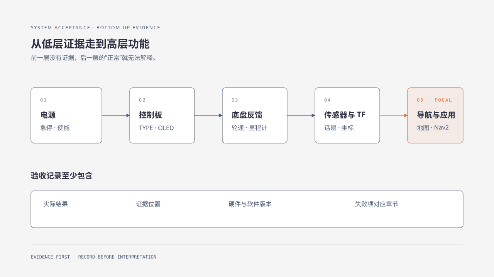

# 46. 全系统验收清单

## 46.1 学习目标

用同一张清单确认机器人从供电到应用的完整链路。每项都填写观察结果和证据；没有证据的“正常”不算验收通过。

## 46.2 适用范围

交付、升级、维修和更换主控/固件后的 WHEELTEC 机器人。

## 46.3 操作前检查

- 运动区域清空，急停可触及。
- 第 6 章配置表、版本、固件和地图记录齐全。
- 关闭不参加验收的高级应用。

## 46.4 工作原理

系统验收沿数据链从低到高进行：电源 → 底盘控制板 → 运动控制 → 反馈 → 主控通信 → 传感器 → TF → 建图/定位 → Nav2 → 应用。低层未通过时，高层结果没有解释力。

## 46.5 操作步骤

逐项填写：

| 层级 | 检查项目 | 通过条件 | 实际结果 | 证据 |
|---|---|---|---|---|
| 电源 | 电池、变压、急停、使能 | 电压稳定，停止可靠 |  |  |
| 控制板 | TYPE、OLED、自检 | 型号正确，无 `TYPE X` |  |  |
| 底盘 | 前后、转向/横移、停止 | 方向正确，松手归零 |  |  |
| 反馈 | 编码器、里程计、IMU | 频率稳定，符号合理 |  |  |
| 通信 | 串口/CAN、设备别名 | 重插后稳定，协议匹配 |  |  |
| 雷达 | 扫描/点云 | 频率、距离、坐标正确 |  |  |
| 相机 | 图像与 `camera_info` | 尺寸、编码、频率正确 |  |  |
| TF | `map→odom→base_link→sensor` | 无断链/冲突 |  |  |
| 建图定位 | 地图加载与初始位姿 | 扫描贴合，短程不跳 |  |  |
| Nav2 | 目标、取消、障碍 | 到达/取消/失败可停 |  |  |
| 应用 | 跟随、视觉、语音等 | 丢失/退出有安全停止 |  |  |

每次升级、搬运或拆装后至少重复电源、控制板、底盘、反馈、通信和传感器检查。

## 46.6 验收标准

- 所有适用行有实际结果和证据。
- 失败项指向一个具体章节，而不是写“系统异常”。
- 验收记录包含日期、硬件、ROS、源码和固件版本。
- 机器人停止、急停和通信超时经过实际测试。

可以直接使用[全系统验收记录表](system-acceptance-checklist.md)保存结果。

## 46.7 故障排查

| 失败位置 | 返回章节 |
|---|---|
| 电源/开关/接线 | 第二篇第 7–8 章 |
| TYPE/OLED/电机 | 第二篇第 10 章、第八篇第 42–43 章 |
| 编码器/PI/纠偏 | 第三篇第 16–17 章、第六篇第 35 章 |
| ROS 设备/参数 | 第四篇第 18–23 章 |
| 雷达/TF/地图 | 第五篇第 25–28 章 |
| 视觉/应用 | 第五篇第 30–32 章、第七篇 |
| 升级/恢复 | 本篇第 44–45 章 |

## 章节导航

[上一章：日志、备份、升级与恢复](45-logs-backup-upgrade-recovery.md) · [返回本篇](index.md)
