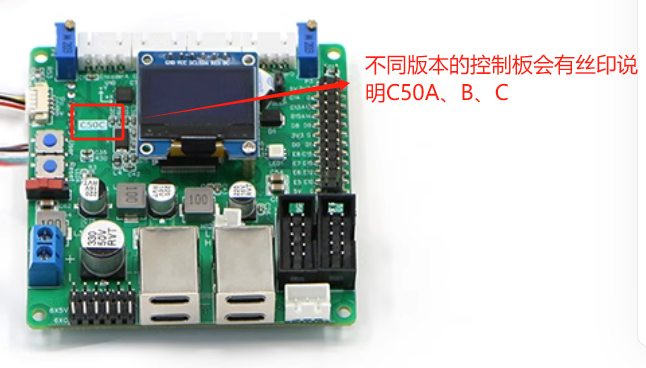
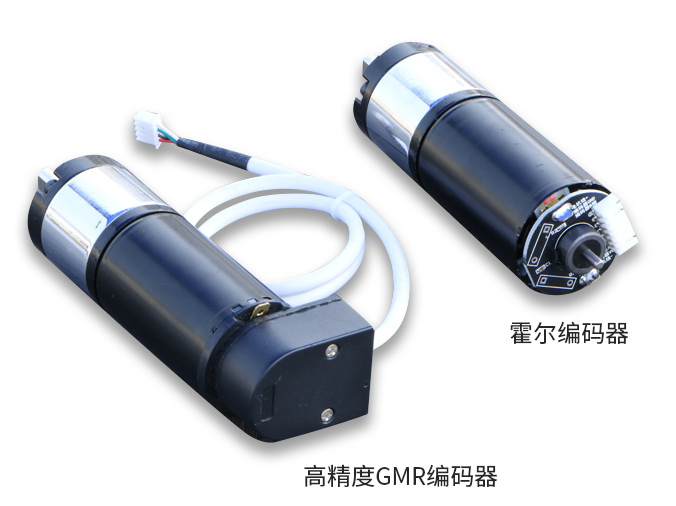

# 49. R680 硬件、接线与 OLED 状态

## 49.1 学习目标

识别 R680 的底盘形式、C50 系列控制板、编码器和主要线束，并能从OLED显示屏读取电压、车型、自检、控制模式及电机目标/反馈。完成本章后，读者可以根据实机丝印、接口和记录选择对应接线图。

## 49.2 适用范围

R680 可能使用两类转速反馈器件。GMR编码器利用磁阻随磁场变化的特性检测转动；霍尔效应编码器利用霍尔元件检测磁场变化。两者都能输出转动脉冲，但供电、接线、脉冲特性和配套固件可能不同。

| 硬件 | 本章处理方式 |
|---|---|
| C50C | 常见控制板版本，按实机硬件继续核对 |
| C50A、C50B | 旧版维护，只使用对应源码、原理图和接线资料 |
| GMR 编码器 | 常见标配，不能与霍尔版固件混用 |
| 霍尔编码器 | 特殊版本，必须确认电机和排线 |
| 阿克曼、差速、四轮两驱、四驱、麦轮、全向轮 | 各有独立轮号或转向接线 |

R680 有多个销售批次。选择接线图或固件时先核对实机丝印和随货记录，文件日期只作为辅助信息。

## 49.3 操作前检查

!!! danger "断电确认线束"
    电机驱动器和电池支路电流较大。检查或重插电机、编码器、驱动器、急停和控制板接头前必须断电，并保存原接线照片。

1. 完成第 6–8 章配置、接线和上电基线。
2. 确认急停位置、使能开关和电源开关。
3. 拍下控制板正反面、OLED、电机标签和编码器接头。
4. 记录电池标签。“高于 20 V”的控制条件只适用于对应 R680 批次。

## 49.4 工作原理

R680 的 ROS 主控负责上层程序，C50 系列 STM32 控制板负责车型选择、遥控/ROS 命令、电机闭环、惯性测量单元、里程计、自检和 OLED。电机功率由外部驱动板放大，编码器反馈回控制板。

OLED 是底盘层的诊断窗口。典型显示包括：

- 第一行：TYPE 和 IMU 零偏信息；
- 中间各行：不同电机的目标值与编码器实际值；
- 舵机/滑轨车型还会显示转向相关数据；
- 最后一行：控制模式、使能和电池电压。

显示 `TYPE X` 时，自检可能已经禁止电机输出。此时继续发送 ROS 或遥控命令没有诊断价值，应回到底盘硬件层。

## 49.5 操作步骤

### 1. 区分 C50A、C50B 和 C50C

对照时同时看丝印、主芯片、接口布局和版本标记。外壳、线色或购买年份只能辅助判断。把结果写入第 10 章配置表。

### 2. 区分编码器版本

观察电机尾部、编码器板和排线。霍尔编码器版本可能需要专用源码与测试固件，不能仅通过接头数量判断。

### 3. 确认车型接线资料

按机械结构选择：

- 阿克曼：除电机和编码器外，还要确认舵机，以及闭环车型的滑轨电位器。
- 差速/四轮两驱：确认主动轮数量和左右电机编号。
- 四驱：四个普通轮均驱动，不具备横移。
- 麦轮：确认滚子方向与 A/B/C/D 电机编号。
- 全向轮：确认轮组数量、角度和对应电机。

顺着电池、集线器、驱动板、控制板、电机和编码器逐条核对。不同车型资料里相同接口的物理位置可能一致，但轮号含义不一定相同。

### 4. 读取 OLED 基线

先让使能处于安全状态，上电后记录完整屏幕。随后逐项测试：

1. 改变急停/使能，观察最后一行状态是否同步。
2. 低速遥控，观察控制模式与目标值。
3. 架空轮子短时动作，比较各电机目标值和实际值。
4. 停止后检查目标与实际是否回落。
5. 出现 TYPE 异常时保存照片，不立即转车型电位器。

### 5. 建立 R680 硬件记录

| 项目 | 实机记录 |
|---|---|
| 底盘形式 |  |
| 控制板/硬件版本 |  |
| 编码器类型 |  |
| 电机/驱动器数量 |  |
| 急停与使能 |  |
| TYPE 正常值 |  |
| 舵机/滑轨反馈 |  |
| 电池允许范围 |  |
| 原接线照片目录 |  |

## 49.6 验收标准

- 控制板和编码器版本有实物证据。
- 已选中与机械结构匹配的接线资料。
- OLED 的 TYPE、模式、使能、电压和电机反馈含义可解释。
- 急停和使能变化与 OLED 一致。
- 各轮目标与实际值能对应到正确轮号。
- 异常时能判断应查遥控输入、车型、自检、驱动或编码器哪一层。

## 49.7 故障排查

| 现象 | 优先检查 |
|---|---|
| OLED 不亮 | 控制板供电、电源开关、线束和保险 |
| `TYPE X` | 固件/车型、编码器接线、电机接线和电压 |
| 模式不随遥控改变 | 接收机、配对、接口和控制优先级 |
| 有目标值、实际值为 0 | 编码器、电机、驱动器或排线 |
| 阿克曼舵机持续抖动 | 转向反馈、电位器、舵机接线和零位 |
| 某轮方向与其他轮不符 | 电机/编码器方向或轮号映射 |

## 章节导航

[上一章：语音、多模态 AI 与 OpenClaw](../08-advanced-applications/48-voice-ai-openclaw.md) · [返回本篇](index.md) · [下一章：R680 底盘调试、源码与固件维护](50-r680-debug-source-firmware.md)
